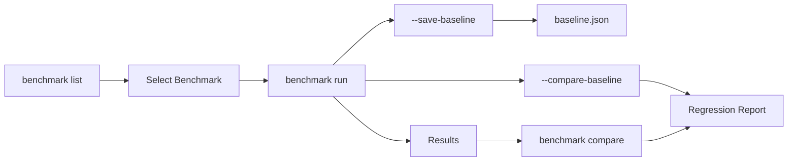

# Benchmark Commands

Performance testing commands for measuring and comparing Truthound operations.

## Overview

| Command | Description | Primary Use Case |
|---------|-------------|------------------|
| [`run`](run.md) | Run performance benchmarks | Performance testing |
| [`list`](list.md) | List available benchmarks | Discovery |
| [`compare`](compare.md) | Compare benchmark results | Regression detection |

## What are Benchmarks?

Benchmarks measure the performance of Truthound operations:

- **Profiling benchmarks** - Measure data profiling speed
- **Validation benchmarks** - Measure validation throughput
- **I/O benchmarks** - Measure read/write performance
- **Regression detection** - Compare against baselines

## Benchmark Suites

| Suite | Description | Use Case |
|-------|-------------|----------|
| `quick` | Fast verification tests | Quick checks |
| `ci` | CI/CD optimized | Automated pipelines |
| `full` | Complete benchmark suite | Comprehensive testing |
| `profiling` | Profiling-related benchmarks | Profile performance |
| `validation` | Validation-related benchmarks | Validator performance |

## Data Size Presets

| Size | Description | Approximate Rows |
|------|-------------|------------------|
| `tiny` | Very small dataset | ~1,000 |
| `small` | Small dataset | ~10,000 |
| `medium` | Medium dataset (default) | ~100,000 |
| `large` | Large dataset | ~1,000,000 |
| `xlarge` | Very large dataset | ~10,000,000 |

## Workflow



## Quick Examples

### Run Benchmarks

```bash
# Run specific benchmark
truthound benchmark run profile --size medium

# Run benchmark suite
truthound benchmark run --suite quick

# Custom row count
truthound benchmark run check --rows 1000000
```

### List Benchmarks

```bash
# List all benchmarks
truthound benchmark list

# JSON output
truthound benchmark list --format json
```

### Compare Results

```bash
# Compare two benchmark results
truthound benchmark compare baseline.json current.json

# Custom threshold
truthound benchmark compare old.json new.json --threshold 5.0
```

## CI/CD Integration

### GitHub Actions

```yaml
jobs:
  benchmark:
    runs-on: ubuntu-latest
    steps:
      - uses: actions/checkout@v4

      - name: Run Benchmarks
        run: |
          truthound benchmark run --suite ci \
            -o benchmark_results.json \
            --format json

      - name: Compare with Baseline
        run: |
          truthound benchmark compare \
            benchmarks/baseline.json \
            benchmark_results.json \
            --threshold 10.0

      - name: Upload Results
        uses: actions/upload-artifact@v4
        with:
          name: benchmark-results
          path: benchmark_results.json
```

### Baseline Management

```bash
# Save new baseline
truthound benchmark run --suite ci --save-baseline

# Compare against saved baseline
truthound benchmark run --suite ci --compare-baseline
```

## Performance Metrics

| Metric | Description |
|--------|-------------|
| `execution_time` | Total execution time (seconds) |
| `throughput` | Records processed per second |
| `memory_peak` | Peak memory usage (MB) |
| `iterations` | Number of benchmark iterations |

## Use Cases

### 1. Performance Testing

```bash
# Comprehensive performance test
truthound benchmark run --suite full --iterations 10 -o results.json
```

### 2. Regression Detection

```bash
# Before changes
truthound benchmark run --suite ci --save-baseline

# After changes
truthound benchmark run --suite ci --compare-baseline
```

### 3. Size Scaling Analysis

```bash
# Test different data sizes
for size in tiny small medium large; do
  truthound benchmark run profile --size $size -o "results_${size}.json"
done
```

### 4. CI/CD Pipeline

```bash
# Quick CI check
truthound benchmark run --suite ci --compare-baseline --threshold 15.0
```

## Command Reference

- [run](run.md) - Run performance benchmarks
- [list](list.md) - List available benchmarks
- [compare](compare.md) - Compare benchmark results

## See Also

- [Performance Guide](../../guides/performance.md)
- [CI/CD Integration](../../guides/ci-cd.md)
