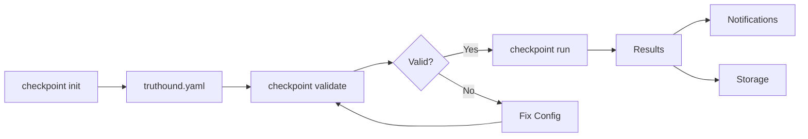

# Checkpoint Commands

CI/CD pipeline integration commands for automated data quality validation.

## Overview

| Command | Description | Primary Use Case |
|---------|-------------|------------------|
| [`run`](run.md) | Run validation checkpoint | CI/CD pipeline execution |
| [`list`](list.md) | List available checkpoints | Configuration discovery |
| [`validate`](validate.md) | Validate configuration file | Config verification |
| [`init`](init.md) | Initialize sample config | Quick setup |

## What is a Checkpoint?

A checkpoint is a reusable validation configuration that defines:

- **Data assets**: Files or data sources to validate
- **Validators**: Rules to apply
- **Notifications**: Where to send results (Slack, webhooks, GitHub)
- **Storage**: Where to persist results

## Workflow



### 1. Initialize Configuration

```bash
truthound checkpoint init -o truthound.yaml
```

### 2. Validate Configuration

```bash
truthound checkpoint validate truthound.yaml --strict
```

### 3. Run Checkpoint

```bash
truthound checkpoint run my_checkpoint --config truthound.yaml --strict
```

## Configuration File

Checkpoint configuration can be YAML or JSON:

```yaml
# truthound.yaml
checkpoints:
- name: daily_data_validation
  data_source: data/production.csv
  validators:
  - 'null'
  - duplicate
  - range
  - regex
  validator_config:
    regex:
      patterns:
        email: ^[\w.+-]+@[\w-]+\.[\w.-]+$
        product_code: ^[A-Z]{2,4}[-_][0-9]{3,6}$
        phone: ^(\+\d{1,3}[-.\s]?)?\(?\d{3}\)?[-.\s]?\d{3}[-.\s]?\d{4}$
    range:
      columns:
        age:
          min_value: 0
          max_value: 150
        price:
          min_value: 0
  min_severity: medium
  auto_schema: true
  tags:
    environment: production
    team: data-platform
  actions:
  - type: store_result
    store_path: ./truthound_results
    partition_by: date
  - type: update_docs
    site_path: ./truthound_docs
    include_history: true
  - type: slack
    webhook_url: https://hooks.slack.com/services/YOUR/WEBHOOK/URL
    notify_on: failure
    channel: '#data-quality'
  triggers:
  - type: schedule
    interval_hours: 24
    run_on_weekdays: [0, 1, 2, 3, 4]

- name: hourly_metrics_check
  data_source: data/metrics.parquet
  validators:
  - 'null'
  - range
  validator_config:
    range:
      columns:
        value:
          min_value: 0
          max_value: 100
        count:
          min_value: 0
  actions:
  - type: webhook
    url: https://api.example.com/data-quality/events
    auth_type: bearer
    auth_credentials:
      token: ${API_TOKEN}
  triggers:
  - type: cron
    expression: 0 * * * *
```

## Environment Variables

Use environment variables for sensitive data:

```yaml
actions:
- type: slack
  webhook_url: ${SLACK_WEBHOOK_URL}
  notify_on: failure

- type: webhook
  url: ${WEBHOOK_URL}
  auth_type: bearer
  auth_credentials:
    token: ${API_TOKEN}
```

## CI/CD Integration

### GitHub Actions

```yaml
name: Data Quality Check

on:
  push:
    paths:
      - 'data/**'
  schedule:
    - cron: '0 6 * * *'

jobs:
  validate:
    runs-on: ubuntu-latest
    steps:
      - uses: actions/checkout@v4

      - name: Setup Python
        uses: actions/setup-python@v5
        with:
          python-version: '3.11'

      - name: Install Truthound
        run: pip install truthound

      - name: Validate Config
        run: truthound checkpoint validate truthound.yaml --strict

      - name: Run Checkpoint
        run: |
          truthound checkpoint run daily_data_validation \
            --config truthound.yaml \
            --strict \
            --github-summary
        env:
          SLACK_WEBHOOK_URL: ${{ secrets.SLACK_WEBHOOK_URL }}
```

### GitLab CI

```yaml
data-quality:
  stage: test
  script:
    - pip install truthound
    - truthound checkpoint validate truthound.yaml --strict
    - truthound checkpoint run daily_data_validation --config truthound.yaml --strict
  artifacts:
    when: on_failure
    paths:
      - .truthound/results/
```

### Jenkins

```groovy
pipeline {
    agent any
    stages {
        stage('Data Quality') {
            steps {
                sh 'pip install truthound'
                sh 'truthound checkpoint validate truthound.yaml --strict'
                sh 'truthound checkpoint run daily_data_validation --config truthound.yaml --strict'
            }
        }
    }
    post {
        failure {
            archiveArtifacts artifacts: '.truthound/results/**'
        }
    }
}
```

## Notification Providers

| Provider | Configuration | Description |
|----------|---------------|-------------|
| Slack | `webhook_url` | Slack incoming webhook |
| Webhook | `url`, `headers` | Generic HTTP webhook |
| GitHub | `--github-summary` | GitHub Actions job summary |
| Email | `smtp`, `to` | Email notifications |
| PagerDuty | `routing_key` | PagerDuty alerts |
| Teams | `webhook_url` | Microsoft Teams |
| Discord | `webhook_url` | Discord webhook |
| Telegram | `bot_token`, `chat_id` | Telegram bot |

## Storage Backends

| Backend | Configuration | Description |
|---------|---------------|-------------|
| Filesystem | `path` | Local directory |
| S3 | `bucket`, `prefix` | AWS S3 |
| GCS | `bucket`, `prefix` | Google Cloud Storage |
| Azure Blob | `container`, `prefix` | Azure Blob Storage |

## Next Steps

- [run](run.md) - Run validation checkpoint
- [list](list.md) - List available checkpoints
- [validate](validate.md) - Validate configuration
- [init](init.md) - Initialize configuration

## See Also

- [CI/CD Integration Guide](../../guides/ci-cd.md)
- [Storage Backends](../../guides/stores.md)
- [Notification Configuration](../../guides/notifications.md)
