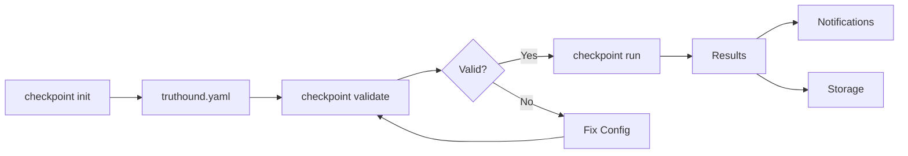

# Checkpoint Commands

CI/CD pipeline integration commands for automated data quality validation.

## Overview

| Command | Description | Primary Use Case |
|---------|-------------|------------------|
| [`run`](run.md) | Run validation checkpoint | CI/CD pipeline execution |
| [`list`](list.md) | List available checkpoints | Configuration discovery |
| [`validate`](validate.md) | Validate configuration file | Config verification |
| [`init`](init.md) | Initialize sample config | Quick setup |

## What is a Checkpoint?

A checkpoint is a reusable validation configuration that defines:

- **Data assets**: Files or data sources to validate
- **Validators**: Rules to apply
- **Notifications**: Where to send results (Slack, webhooks, GitHub)
- **Storage**: Where to persist results

## Workflow



### 1. Initialize Configuration

```bash
truthound checkpoint init -o truthound.yaml
```

### 2. Validate Configuration

```bash
truthound checkpoint validate truthound.yaml --strict
```

### 3. Run Checkpoint

```bash
truthound checkpoint run my_checkpoint --config truthound.yaml --strict
```

## Configuration File

Checkpoint configuration can be YAML or JSON:

```yaml
# truthound.yaml
name: data_quality_pipeline
version: "1.0"

checkpoints:
  daily_validation:
    description: "Daily data quality check"
    data_assets:
      - name: customers
        path: data/customers.csv
      - name: orders
        path: data/orders.csv

    validators:
      - type: not_null
        columns: [id, email]
        severity: critical
      - type: unique
        columns: [id]
      - type: range
        column: age
        min_value: 0
        max_value: 150

    notifications:
      slack:
        webhook_url: ${SLACK_WEBHOOK_URL}
        on_failure: true
        on_success: false

      webhook:
        url: https://api.example.com/webhook
        on_failure: true

    store:
      path: .truthound/results
      retention_days: 30

  weekly_drift_check:
    description: "Weekly drift detection"
    data_assets:
      - name: baseline
        path: baseline/data.csv
      - name: current
        path: data/current.csv

    compare:
      baseline: baseline
      current: current
      method: psi
      threshold: 0.1
```

## Environment Variables

Use environment variables for sensitive data:

```yaml
notifications:
  slack:
    webhook_url: ${SLACK_WEBHOOK_URL}
  webhook:
    url: ${WEBHOOK_URL}
    headers:
      Authorization: Bearer ${API_TOKEN}
```

## CI/CD Integration

### GitHub Actions

```yaml
name: Data Quality Check

on:
  push:
    paths:
      - 'data/**'
  schedule:
    - cron: '0 6 * * *'

jobs:
  validate:
    runs-on: ubuntu-latest
    steps:
      - uses: actions/checkout@v4

      - name: Setup Python
        uses: actions/setup-python@v5
        with:
          python-version: '3.11'

      - name: Install Truthound
        run: pip install truthound

      - name: Validate Config
        run: truthound checkpoint validate truthound.yaml --strict

      - name: Run Checkpoint
        run: |
          truthound checkpoint run daily_validation \
            --config truthound.yaml \
            --strict \
            --github-summary
        env:
          SLACK_WEBHOOK_URL: ${{ secrets.SLACK_WEBHOOK_URL }}
```

### GitLab CI

```yaml
data-quality:
  stage: test
  script:
    - pip install truthound
    - truthound checkpoint validate truthound.yaml --strict
    - truthound checkpoint run daily_validation --config truthound.yaml --strict
  artifacts:
    when: on_failure
    paths:
      - .truthound/results/
```

### Jenkins

```groovy
pipeline {
    agent any
    stages {
        stage('Data Quality') {
            steps {
                sh 'pip install truthound'
                sh 'truthound checkpoint validate truthound.yaml --strict'
                sh 'truthound checkpoint run daily_validation --config truthound.yaml --strict'
            }
        }
    }
    post {
        failure {
            archiveArtifacts artifacts: '.truthound/results/**'
        }
    }
}
```

## Notification Providers

| Provider | Configuration | Description |
|----------|---------------|-------------|
| Slack | `webhook_url` | Slack incoming webhook |
| Webhook | `url`, `headers` | Generic HTTP webhook |
| GitHub | `--github-summary` | GitHub Actions job summary |
| Email | `smtp`, `to` | Email notifications |
| PagerDuty | `routing_key` | PagerDuty alerts |
| Teams | `webhook_url` | Microsoft Teams |
| Discord | `webhook_url` | Discord webhook |
| Telegram | `bot_token`, `chat_id` | Telegram bot |

## Storage Backends

| Backend | Configuration | Description |
|---------|---------------|-------------|
| Filesystem | `path` | Local directory |
| S3 | `bucket`, `prefix` | AWS S3 |
| GCS | `bucket`, `prefix` | Google Cloud Storage |
| Azure Blob | `container`, `prefix` | Azure Blob Storage |

## Next Steps

- [run](run.md) - Run validation checkpoint
- [list](list.md) - List available checkpoints
- [validate](validate.md) - Validate configuration
- [init](init.md) - Initialize configuration

## See Also

- [CI/CD Integration Guide](../../guides/ci-cd.md)
- [Storage Backends](../../guides/stores.md)
- [Notification Configuration](../../guides/notifications.md)
