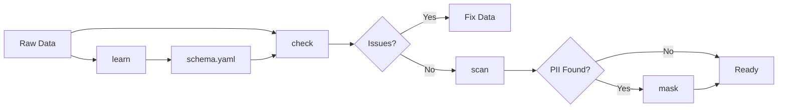

# Core Commands

The core commands provide essential data quality operations for validation, profiling, and data protection.

## Overview

| Command | Description | Primary Use Case |
|---------|-------------|------------------|
| [`learn`](learn.md) | Learn schema from data | Schema inference |
| [`check`](check.md) | Validate data quality | Data validation |
| [`scan`](scan.md) | Scan for PII | Privacy compliance |
| [`mask`](mask.md) | Mask sensitive data | Data anonymization |
| [`profile`](profile.md) | Generate data profile | Data exploration |
| [`compare`](compare.md) | Detect data drift | Model monitoring |

## Typical Workflow



### 1. Schema Learning

First, learn a schema from your reference data:

```bash
truthound learn reference_data.csv -o schema.yaml
```

### 2. Data Validation

Validate new data against the schema:

```bash
truthound check new_data.csv --schema schema.yaml --strict
```

### 3. PII Detection

Scan for personally identifiable information:

```bash
truthound scan customer_data.csv
```

### 4. Data Masking

Mask sensitive columns before sharing:

```bash
truthound mask customer_data.csv -o safe_data.csv --strategy hash
```

### 5. Data Profiling

Generate statistical profile for analysis:

```bash
truthound profile data.csv --format json -o profile.json
```

### 6. Drift Detection

Compare datasets to detect distribution changes:

```bash
truthound compare baseline.csv production.csv --method psi
```

## Common Options

All core commands share these common patterns:

### Output Format (`-f, --format`)

```bash
# Console output (default)
truthound check data.csv

# JSON output
truthound check data.csv --format json

# HTML report
truthound check data.csv --format html -o report.html
```

### Output File (`-o, --output`)

```bash
truthound check data.csv -o results.json --format json
```

### Strict Mode (`--strict`)

Exit with code 1 if issues are found (useful for CI/CD):

```bash
truthound check data.csv --strict
truthound compare baseline.csv current.csv --strict
```

## CI/CD Integration

Use core commands in your CI/CD pipeline:

```yaml
# GitHub Actions example
- name: Validate Data Quality
  run: truthound check data/*.csv --strict

- name: Check for PII
  run: truthound scan data/*.csv --format json -o pii_report.json
```

## Next Steps

- [learn](learn.md) - Learn schema from data
- [check](check.md) - Validate data quality
- [scan](scan.md) - Scan for PII
- [mask](mask.md) - Mask sensitive data
- [profile](profile.md) - Generate data profile
- [compare](compare.md) - Detect data drift
