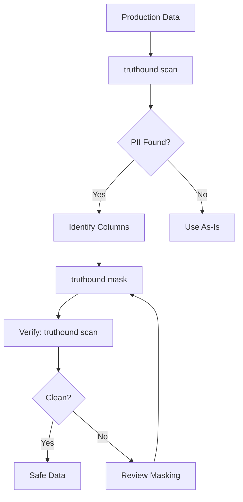

# truthound mask

Mask sensitive data in a file. This command anonymizes PII and sensitive columns using various masking strategies.

## Synopsis

```bash
truthound mask <file> -o <output> [OPTIONS]
```

## Arguments

| Argument | Required | Description |
|----------|----------|-------------|
| `file` | Yes | Path to the data file (CSV, JSON, Parquet, NDJSON, JSONL) |

## Options

| Option | Short | Default | Description |
|--------|-------|---------|-------------|
| `--output` | `-o` | **Required** | Output file path |
| `--columns` | `-c` | Auto-detect | Comma-separated columns to mask |
| `--strategy` | `-s` | `redact` | Masking strategy (redact, hash, fake) |
| `--strict` | | `false` | Fail if specified columns don't exist |

## Description

The `mask` command provides data anonymization capabilities:

1. **Auto-Detection Mode**: Automatically detects PII columns and masks them
2. **Explicit Mode**: Mask specific columns you specify
3. **Multiple Strategies**: Choose how data is transformed

### Masking Strategies

| Strategy | Description | Reversible | Example |
|----------|-------------|------------|---------|
| `redact` | Replace with asterisks | No | `john@example.com` → `****` |
| `hash` | SHA-256 hash (truncated) | No | `john@example.com` → `a8b9c0d1e2f3...` |
| `fake` | Realistic fake data | No | `john@example.com` → `alice@fake.net` |

## Examples

### Basic Masking (Auto-Detection)

Automatically detect and mask PII columns:

```bash
truthound mask data.csv -o masked.csv
```

Output:
```
Masked data written to masked.csv
```

Note: If columns are not specified, the command auto-detects PII columns. Warnings are displayed if any specified columns don't exist (when `--strict` is not used).

### Mask Specific Columns

Explicitly specify columns to mask:

```bash
truthound mask data.csv -o masked.csv -c email,phone,ssn
```

### Hash Strategy

Use hashing for consistent anonymization:

```bash
truthound mask data.csv -o masked.csv --strategy hash
```

Benefits of hashing:
- Same input → same output (deterministic)
- Can join tables on hashed values
- Cannot reverse to original value

### Fake Data Strategy

Replace with realistic fake data:

```bash
truthound mask data.csv -o masked.csv --strategy fake
```

Benefits:
- Data looks realistic for testing
- Maintains data type and format
- Useful for demo environments

### Strict Mode

Fail if a specified column doesn't exist:

```bash
# This will fail if 'nonexistent' column doesn't exist
truthound mask data.csv -o masked.csv -c email,nonexistent --strict
```

Without `--strict`, missing columns generate a warning but continue:

```bash
# This will warn but continue with existing columns
truthound mask data.csv -o masked.csv -c email,nonexistent
# Warning: Column 'nonexistent' not found. Skipping.
```

## Strategy Comparison

### Redact

```
Original:     john.doe@example.com
Redacted:     ****

Original:     +1-555-123-4567
Redacted:     ****

Original:     123-45-6789
Redacted:     ****
```

Best for: Maximum privacy, compliance reports

### Hash

```
Original:     john.doe@example.com
Hashed:       a8b9c0d1e2f34567

Original:     +1-555-123-4567
Hashed:       b2c3d4e5f6a78901

Original:     123-45-6789
Hashed:       c3d4e5f6a7890123
```

Best for: Data analysis, joining datasets, referential integrity

### Fake

```
Original:     john.doe@example.com
Fake:         alice.smith@fake.net

Original:     +1-555-123-4567
Fake:         +1-555-987-6543

Original:     123-45-6789
Fake:         987-65-4321
```

Best for: Testing, demos, development environments

## Output Formats

The output format is determined by the file extension:

```bash
# CSV output
truthound mask data.csv -o masked.csv

# Parquet output
truthound mask data.csv -o masked.parquet

# JSON output
truthound mask data.csv -o masked.json
```

## Use Cases

### 1. Data Sharing

Prepare data for external sharing:

```bash
# Scan to identify PII
truthound scan production.csv

# Mask detected PII
truthound mask production.csv -o shareable.csv --strategy hash
```

### 2. Test Data Generation

Create test data from production:

```bash
truthound mask production.parquet -o test_data.parquet --strategy fake
```

### 3. Compliance Pipeline

GDPR/CCPA compliance workflow:

```bash
# Export data with PII masked
truthound mask customer_export.csv -o compliant_export.csv -c email,phone,address
```

### 4. CI/CD Integration

Mask data before deployment:

```yaml
- name: Anonymize Test Data
  run: |
    truthound mask fixtures/users.csv -o fixtures/users_safe.csv --strategy hash
    truthound mask fixtures/orders.csv -o fixtures/orders_safe.csv --strategy hash
```

## Workflow Example



## Performance

For large datasets, masking uses:

- **Streaming Mode**: Files >1M rows use Polars streaming engine
- **Native Expressions**: All operations use vectorized Polars expressions
- **Memory Efficient**: Processes data in chunks

```bash
# Large file masking (handled efficiently)
truthound mask large_file.parquet -o masked_large.parquet --strategy hash
```

## Related Commands

- [`scan`](scan.md) - Scan for PII (recommended before masking)
- [`check`](check.md) - Validate data quality

## See Also

- [Python API: th.mask()](../../python-api/core-functions.md#thmask)
- [Data Privacy Guide](../../guides/privacy.md)
- [Masking Strategies](../../concepts/masking.md)
