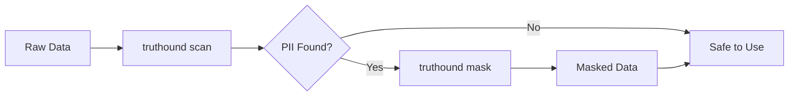

# truthound scan

Scan for personally identifiable information (PII) in a data file. This command detects sensitive data patterns that may require protection.

## Synopsis

```bash
truthound scan <file> [OPTIONS]
```

## Arguments

| Argument | Required | Description |
|----------|----------|-------------|
| `file` | Yes | Path to the data file (CSV, JSON, Parquet, NDJSON, JSONL) |

## Options

| Option | Short | Default | Description |
|--------|-------|---------|-------------|
| `--format` | `-f` | `console` | Output format (console, json, html) |
| `--output` | `-o` | None | Output file path (required for html format) |

## Description

The `scan` command analyzes your data to detect personally identifiable information (PII):

- **Contact Information**: Email addresses, phone numbers
- **Identity Documents**: SSN, passport numbers, national IDs
- **Financial Data**: Credit card numbers, bank accounts
- **Location Data**: Addresses, coordinates
- **Names**: Person names detection

Each finding includes a confidence score indicating the likelihood of PII presence.

## Examples

### Basic PII Scan

```bash
truthound scan customers.csv
```

Output:
```
PII Scan Report
===============
File: customers.csv
Rows: 1000
Columns: 8

Potential PII Detected:

  Column          Type              Confidence    Samples
  ──────────────────────────────────────────────────────────
  email           Email             98%           john@example.com, ...
  phone           Phone Number      95%           +1-555-123-4567, ...
  ssn             SSN               99%           123-45-6789, ...
  full_name       Person Name       85%           John Smith, ...

Recommendations:
  - Consider masking 'email', 'phone', 'ssn' columns before sharing
  - Use 'truthound mask' to anonymize sensitive data
```

### JSON Output

```bash
truthound scan data.csv --format json -o pii_report.json
```

Output file:
```json
{
  "file": "data.csv",
  "rows": 1000,
  "columns": 8,
  "findings": [
    {
      "column": "email",
      "pii_type": "email",
      "confidence": 0.98,
      "match_count": 950,
      "sample_values": ["john@example.com", "jane@test.org"]
    },
    {
      "column": "ssn",
      "pii_type": "ssn",
      "confidence": 0.99,
      "match_count": 1000,
      "sample_values": ["***-**-****"]
    }
  ],
  "summary": {
    "total_pii_columns": 4,
    "high_confidence": 3,
    "medium_confidence": 1
  }
}
```

### HTML Report

```bash
# Requires: pip install truthound[reports]
truthound scan customers.csv --format html -o pii_report.html
```

Generates an interactive HTML report with:

- Visual summary of PII findings
- Column-by-column breakdown
- Confidence indicators
- Remediation recommendations

!!! warning "HTML Report Dependency"
    HTML reports require Jinja2. Install with:
    ```bash
    pip install truthound[reports]
    ```

## Detected PII Types

### Contact Information

| Type | Pattern | Example |
|------|---------|---------|
| Email | RFC 5322 email format | `john@example.com` |
| Phone | International phone numbers | `+1-555-123-4567` |
| Address | Street addresses | `123 Main St, City` |

### Identity Documents

| Type | Pattern | Example |
|------|---------|---------|
| SSN | US Social Security Number | `123-45-6789` |
| Passport | Passport number formats | `AB1234567` |
| Korean RRN | Korean Resident Registration | `123456-1234567` |
| National ID | Various national ID formats | Various |

### Financial Data

| Type | Pattern | Example |
|------|---------|---------|
| Credit Card | Visa, MC, Amex, etc. | `4111-1111-1111-1111` |
| Bank Account | Bank account patterns | `****1234` |
| IBAN | International Bank Account | `DE89370400440532013000` |

### Other

| Type | Pattern | Example |
|------|---------|---------|
| IP Address | IPv4/IPv6 | `192.168.1.1` |
| Date of Birth | Date patterns in context | `1990-01-15` |
| Person Name | Name patterns | `John Smith` |

## Confidence Levels

| Level | Score | Interpretation |
|-------|-------|----------------|
| High | 90-100% | Very likely PII, action recommended |
| Medium | 70-89% | Possible PII, review recommended |
| Low | 50-69% | May contain PII, manual review |

## Use Cases

### 1. Pre-Sharing Data Review

Before sharing data externally:

```bash
# Scan for PII
truthound scan export_data.csv

# If PII found, mask it
truthound mask export_data.csv -o safe_export.csv
```

### 2. Compliance Audit

Generate audit report for compliance:

```bash
truthound scan *.csv --format json -o compliance_audit.json
```

### 3. CI/CD Pipeline

Prevent PII leakage in data pipelines:

```yaml
- name: Check for PII
  run: |
    truthound scan output/*.csv --format json -o pii_scan.json
    if grep -q '"total_pii_columns": [1-9]' pii_scan.json; then
      echo "PII detected! Review required."
      exit 1
    fi
```

### 4. Data Catalog Integration

Automated PII tagging for data catalogs:

```bash
for file in data/*.parquet; do
  truthound scan "$file" --format json -o "scans/$(basename $file .parquet)_pii.json"
done
```

## Workflow with Masking



```bash
# Step 1: Scan for PII
truthound scan customers.csv --format json -o scan_result.json

# Step 2: If PII found, mask the columns
truthound mask customers.csv -o customers_safe.csv -c email,phone,ssn

# Step 3: Verify masking
truthound scan customers_safe.csv
```

## Related Commands

- [`mask`](mask.md) - Mask sensitive data
- [`check`](check.md) - Validate data quality

## See Also

- [Python API: th.scan()](../../python-api/core-functions.md#thscan)
- [Data Masking Guide](../../guides/data-masking.md)
- [Privacy Compliance](../../guides/privacy.md)
