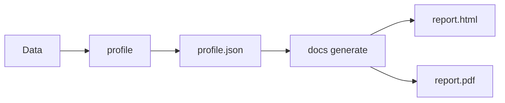

# Docs Commands

Documentation generation commands for creating data quality reports.

## Overview

| Command | Description | Primary Use Case |
|---------|-------------|------------------|
| [`generate`](generate.md) | Generate HTML/PDF reports | Static report creation |
| [`themes`](themes.md) | List available themes | Theme selection |

## What are Data Docs?

Data Docs are human-readable reports generated from profile data:

- **Static HTML files** - Self-contained, no server required
- **PDF reports** - Print-ready documentation
- **CI/CD artifacts** - Store with build outputs
- **Shareable** - Email, Slack, or web hosting

## Workflow



## Quick Examples

### Generate HTML Report

```bash
# Basic HTML report
truthound docs generate profile.json -o report.html

# With custom title and theme
truthound docs generate profile.json -o report.html --title "Q4 Data Report" --theme dark
```

### Generate PDF Report

```bash
# PDF output
truthound docs generate profile.json -o report.pdf --format pdf
```

!!! warning "PDF System Dependencies"
    PDF export requires WeasyPrint **and** system libraries (Pango, Cairo, etc.).

    ```bash
    # macOS
    brew install pango cairo gdk-pixbuf libffi

    # Ubuntu/Debian
    sudo apt-get install libpango-1.0-0 libpangocairo-1.0-0 libgdk-pixbuf2.0-0 libffi-dev

    # Then install Python package
    pip install truthound[pdf]
    ```

    See [Data Docs Guide](../../guides/datadocs.md#pdf-export-system-dependencies) for details.

### List Themes

```bash
truthound docs themes
```

## Report Features

### Chart Rendering

Chart library selection is automatic:

| Output Format | Chart Renderer | Description |
|---------------|----------------|-------------|
| **HTML** | ApexCharts | Modern interactive charts with tooltips and animations |
| **PDF** | SVG | Zero-dependency, optimized for PDF rendering |

!!! tip "Theme-Aware Charts"
    Charts automatically adapt to the selected theme. Dark mode reports use light-colored text for all chart elements (axis labels, legends, tooltips) for optimal readability.

### Theme Options

| Theme | Description |
|-------|-------------|
| `light` | Clean, bright style |
| `dark` | Dark mode, reduced eye strain |
| `professional` | Corporate style (default) |
| `minimal` | Minimalist design |
| `modern` | Vibrant gradients |

## Use Cases

### 1. CI/CD Integration

```yaml
# GitHub Actions
- name: Generate Data Report
  run: |
    truthound profile data.csv --format json -o profile.json
    truthound docs generate profile.json -o report.html --theme professional

- name: Upload Report
  uses: actions/upload-artifact@v4
  with:
    name: data-quality-report
    path: report.html
```

### 2. Scheduled Reports

```bash
# Daily report generation
truthound profile daily_data.csv --format json -o profile.json
truthound docs generate profile.json -o "report_$(date +%Y%m%d).html" --title "Daily Data Report"
```

### 3. Email Distribution

```bash
# Generate PDF for email
truthound docs generate profile.json -o report.pdf --format pdf --theme professional
```

## Next Steps

- [generate](generate.md) - Generate reports
- [themes](themes.md) - List available themes

## See Also

- [Data Docs Guide](../../guides/datadocs.md)
- [profile command](../core/profile.md)
- [auto-profile command](../profiler/auto-profile.md)
