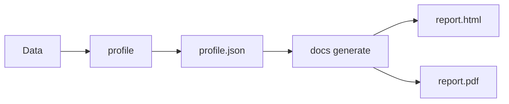

# Docs Commands

Documentation generation commands for creating data quality reports.

## Overview

| Command | Description | Primary Use Case |
|---------|-------------|------------------|
| [`generate`](generate.md) | Generate HTML/PDF reports | Static report creation |
| [`themes`](themes.md) | List available themes | Theme selection |

## What are Data Docs?

Data Docs are human-readable reports generated from profile data:

- **Static HTML files** - Self-contained, no server required
- **PDF reports** - Print-ready documentation
- **CI/CD artifacts** - Store with build outputs
- **Shareable** - Email, Slack, or web hosting

## Workflow



## Quick Examples

### Generate HTML Report

```bash
# Basic HTML report
truthound docs generate profile.json -o report.html

# With custom title and theme
truthound docs generate profile.json -o report.html --title "Q4 Data Report" --theme dark

# With different chart engine
truthound docs generate profile.json -o report.html --charts chartjs
```

### Generate PDF Report

```bash
# PDF output
truthound docs generate profile.json -o report.pdf --format pdf
```

!!! note "PDF Dependency"
    PDF export requires weasyprint:
    ```bash
    pip install truthound[pdf]
    ```

### List Themes

```bash
truthound docs themes
```

## Report Features

### Chart Engines

| Engine | Description | Best For |
|--------|-------------|----------|
| `apexcharts` | Modern interactive charts | Web viewing |
| `chartjs` | Lightweight charts | Simple reports |
| `plotly` | Advanced interactive | Data exploration |
| `svg` | Zero-dependency | Offline/email |

### Theme Options

| Theme | Description |
|-------|-------------|
| `light` | Clean, bright style |
| `dark` | Dark mode, reduced eye strain |
| `professional` | Corporate style (default) |
| `minimal` | Minimalist design |
| `modern` | Vibrant gradients |

## Use Cases

### 1. CI/CD Integration

```yaml
# GitHub Actions
- name: Generate Data Report
  run: |
    truthound profile data.csv --format json -o profile.json
    truthound docs generate profile.json -o report.html --theme professional

- name: Upload Report
  uses: actions/upload-artifact@v4
  with:
    name: data-quality-report
    path: report.html
```

### 2. Scheduled Reports

```bash
# Daily report generation
truthound profile daily_data.csv --format json -o profile.json
truthound docs generate profile.json -o "report_$(date +%Y%m%d).html" --title "Daily Data Report"
```

### 3. Email Distribution

```bash
# Generate PDF for email
truthound docs generate profile.json -o report.pdf --format pdf --theme professional
```

## Next Steps

- [generate](generate.md) - Generate reports
- [themes](themes.md) - List available themes

## See Also

- [Data Docs Guide](../../guides/datadocs.md)
- [profile command](../core/profile.md)
- [auto-profile command](../profiler/auto-profile.md)
