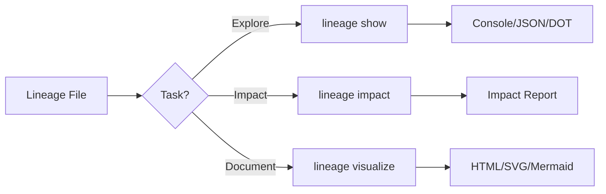

# Lineage Commands

Data lineage tracking and visualization commands.

## Overview

| Command | Description | Primary Use Case |
|---------|-------------|------------------|
| [`show`](show.md) | Display lineage information | Explore dependencies |
| [`impact`](impact.md) | Analyze change impact | Change management |
| [`visualize`](visualize.md) | Generate lineage visualization | Documentation |

## What is Data Lineage?

Data lineage tracks the flow of data through your systems:

- **Upstream**: Where data comes from (sources)
- **Downstream**: Where data goes (consumers)
- **Transformations**: How data is modified

## Lineage File Format

Lineage information is stored in JSON format:

```json
{
  "version": "1.0",
  "nodes": [
    {
      "id": "raw_data",
      "type": "source",
      "name": "Raw Data",
      "metadata": {
        "path": "s3://bucket/raw/",
        "format": "parquet"
      }
    },
    {
      "id": "cleaned_data",
      "type": "transformation",
      "name": "Cleaned Data",
      "metadata": {
        "path": "s3://bucket/cleaned/",
        "transformation": "data_cleaning_job"
      }
    },
    {
      "id": "analytics_table",
      "type": "table",
      "name": "Analytics Table",
      "metadata": {
        "database": "analytics",
        "table": "user_metrics"
      }
    }
  ],
  "edges": [
    {
      "source": "raw_data",
      "target": "cleaned_data"
    },
    {
      "source": "cleaned_data",
      "target": "analytics_table"
    }
  ]
}
```

## Workflow



## Quick Examples

### Show Lineage

```bash
# Show all lineage
truthound lineage show lineage.json

# Show upstream of a specific node
truthound lineage show lineage.json --node analytics_table --direction upstream

# Export as DOT format
truthound lineage show lineage.json --format dot > lineage.dot
```

### Analyze Impact

```bash
# Analyze impact of changing raw_data
truthound lineage impact lineage.json raw_data

# Limit analysis depth
truthound lineage impact lineage.json raw_data --max-depth 2
```

### Visualize

```bash
# Generate interactive D3 visualization
truthound lineage visualize lineage.json -o graph.html

# Generate Graphviz diagram
truthound lineage visualize lineage.json -o graph.svg --renderer graphviz

# Generate Mermaid diagram
truthound lineage visualize lineage.json -o graph.md --renderer mermaid
```

## Visualization Renderers

| Renderer | Output | Features |
|----------|--------|----------|
| `d3` | HTML | Interactive, pan/zoom, tooltips |
| `cytoscape` | HTML | Interactive, layouts, search |
| `graphviz` | SVG/PNG | Static, publication quality |
| `mermaid` | Markdown | Embeddable in docs |

## Node Types

| Type | Description | Icon |
|------|-------------|------|
| `source` | Raw data source | 📥 |
| `table` | Database table | 🗃️ |
| `file` | File-based data | 📄 |
| `stream` | Streaming source | 🌊 |
| `transformation` | Data transformation | ⚙️ |
| `validation` | Validation checkpoint | ✅ |
| `model` | ML model | 🤖 |
| `report` | Output report | 📊 |
| `external` | External system | 🔗 |
| `virtual` | Virtual/computed dataset | 💭 |

## Use Cases

### 1. Data Discovery

```bash
# Explore what feeds into a table
truthound lineage show lineage.json --node my_table --direction upstream
```

### 2. Change Impact Analysis

```bash
# Before changing a source, check what's affected
truthound lineage impact lineage.json source_table -o impact_report.json
```

### 3. Documentation

```bash
# Generate documentation for data catalog
truthound lineage visualize lineage.json -o docs/lineage.html --renderer d3 --theme light
```

### 4. Debugging

```bash
# Trace data flow to find issues
truthound lineage show lineage.json --node failed_table --direction both
```

## Integration with OpenLineage

Truthound supports the OpenLineage standard for interoperability via the Python API:

```python
from truthound.lineage.integrations.openlineage import OpenLineageEmitter

# Create emitter
emitter = OpenLineageEmitter()

# Start a run
run = emitter.start_run("my-job")

# Emit completion
emitter.emit_complete(run, outputs=[...])
```

!!! note "OpenLineage API"
    OpenLineage integration is available through the Python API.
    CLI commands for import/export are planned for future releases.

## Next Steps

- [show](show.md) - Display lineage information
- [impact](impact.md) - Analyze change impact
- [visualize](visualize.md) - Generate visualization

## See Also

- [Advanced Features](../../concepts/advanced.md)
- [OpenLineage Integration](../../concepts/openlineage.md)
