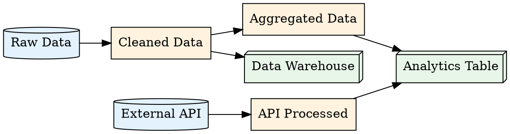

# truthound lineage show

Display data lineage information. This command shows the relationships between data assets, including upstream sources and downstream consumers.

## Synopsis

```bash
truthound lineage show <lineage_file> [OPTIONS]
```

## Arguments

| Argument | Required | Description |
|----------|----------|-------------|
| `lineage_file` | Yes | Path to the lineage file (JSON) |

## Options

| Option | Short | Default | Description |
|--------|-------|---------|-------------|
| `--node` | `-n` | None | Focus on a specific node |
| `--direction` | `-d` | `both` | Traversal direction (upstream, downstream, both) |
| `--format` | `-f` | `console` | Output format (console, json, dot) |

## Description

The `lineage show` command displays lineage information:

1. **Shows** node relationships and dependencies
2. **Filters** by specific node and direction
3. **Exports** in multiple formats for integration

## Examples

### Basic Usage

```bash
truthound lineage show lineage.json
```

Output:
```
Data Lineage
============
File: lineage.json
Nodes: 8
Edges: 10

Node Graph
──────────────────────────────────────────────────────────────────
[source] raw_data
    └── [transformation] cleaned_data
        ├── [transformation] aggregated_data
        │   └── [sink] analytics_table
        └── [sink] data_warehouse

[source] external_api
    └── [transformation] api_processed
        └── [sink] analytics_table
──────────────────────────────────────────────────────────────────

Summary:
  Sources: 2
  Transformations: 3
  Sinks: 2
```

### Focus on Specific Node

```bash
truthound lineage show lineage.json --node analytics_table
```

Output:
```
Data Lineage: analytics_table
=============================

Node Details:
  ID: analytics_table
  Type: sink
  Name: Analytics Table
  Metadata:
    database: analytics
    table: user_metrics

Upstream (2 levels):
  └── aggregated_data
      └── cleaned_data
          └── raw_data
  └── api_processed
      └── external_api

Downstream: None (sink node)
```

### Upstream Only

Show only where data comes from:

```bash
truthound lineage show lineage.json --node analytics_table --direction upstream
```

Output:
```
Upstream Lineage: analytics_table
=================================

Level 1:
  - aggregated_data (transformation)
  - api_processed (transformation)

Level 2:
  - cleaned_data (transformation)
  - external_api (source)

Level 3:
  - raw_data (source)

Total Upstream Nodes: 5
```

### Downstream Only

Show where data goes:

```bash
truthound lineage show lineage.json --node raw_data --direction downstream
```

Output:
```
Downstream Lineage: raw_data
============================

Level 1:
  - cleaned_data (transformation)

Level 2:
  - aggregated_data (transformation)
  - data_warehouse (sink)

Level 3:
  - analytics_table (sink)

Total Downstream Nodes: 4
```

### JSON Output

```bash
truthound lineage show lineage.json --format json
```

Output:
```json
{
  "file": "lineage.json",
  "node_count": 8,
  "edge_count": 10,
  "nodes": [
    {
      "id": "raw_data",
      "type": "source",
      "name": "Raw Data",
      "upstream": [],
      "downstream": ["cleaned_data"]
    },
    {
      "id": "cleaned_data",
      "type": "transformation",
      "name": "Cleaned Data",
      "upstream": ["raw_data"],
      "downstream": ["aggregated_data", "data_warehouse"]
    },
    {
      "id": "analytics_table",
      "type": "sink",
      "name": "Analytics Table",
      "upstream": ["aggregated_data", "api_processed"],
      "downstream": []
    }
  ],
  "summary": {
    "sources": 2,
    "transformations": 3,
    "sinks": 2,
    "models": 0,
    "reports": 1
  }
}
```

### DOT Output (Graphviz)

```bash
truthound lineage show lineage.json --format dot > lineage.dot
```

Output file (`lineage.dot`):


Convert to image:
```bash
dot -Tpng lineage.dot -o lineage.png
dot -Tsvg lineage.dot -o lineage.svg
```

### Focused Node with JSON

```bash
truthound lineage show lineage.json --node analytics_table --direction upstream --format json
```

Output:
```json
{
  "focus_node": "analytics_table",
  "direction": "upstream",
  "upstream_nodes": [
    {
      "id": "aggregated_data",
      "type": "transformation",
      "level": 1
    },
    {
      "id": "api_processed",
      "type": "transformation",
      "level": 1
    },
    {
      "id": "cleaned_data",
      "type": "transformation",
      "level": 2
    },
    {
      "id": "external_api",
      "type": "source",
      "level": 2
    },
    {
      "id": "raw_data",
      "type": "source",
      "level": 3
    }
  ],
  "total_upstream": 5,
  "max_depth": 3
}
```

## Direction Options

| Direction | Description |
|-----------|-------------|
| `upstream` | Show only data sources (where data comes from) |
| `downstream` | Show only data consumers (where data goes) |
| `both` | Show both upstream and downstream (default) |

## Output Formats

| Format | Description | Use Case |
|--------|-------------|----------|
| `console` | Human-readable tree view | Interactive exploration |
| `json` | Machine-readable JSON | Automation, APIs |
| `dot` | Graphviz DOT format | Static diagrams |

## Use Cases

### 1. Data Discovery

```bash
# What feeds into my table?
truthound lineage show lineage.json --node my_table --direction upstream
```

### 2. Dependency Documentation

```bash
# Generate DOT file for documentation
truthound lineage show lineage.json --format dot > docs/lineage.dot
```

### 3. CI/CD Integration

```bash
# Check lineage as JSON for automated processing
truthound lineage show lineage.json --format json > lineage_report.json
```

### 4. Debugging Data Issues

```bash
# Trace data flow both ways
truthound lineage show lineage.json --node problematic_table --direction both
```

## Exit Codes

| Code | Condition |
|------|-----------|
| 0 | Success |
| 1 | Node not found (with --node) |
| 2 | Invalid file or arguments |

## Related Commands

- [`lineage impact`](impact.md) - Analyze change impact
- [`lineage visualize`](visualize.md) - Generate visualization

## See Also

- [Lineage Overview](index.md)
- [Advanced Features](../../concepts/advanced.md)
