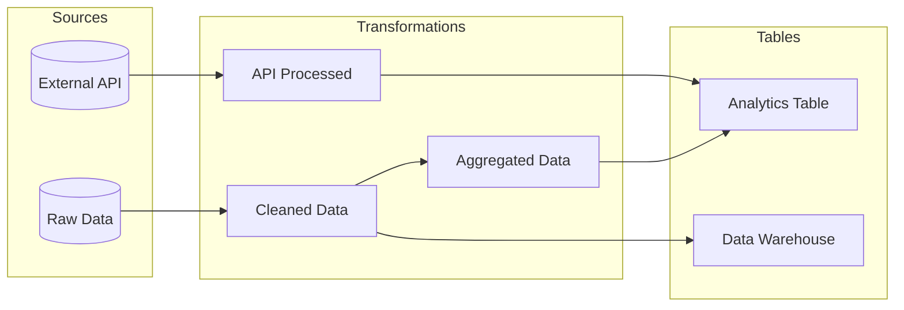

# truthound lineage visualize

Generate visual representation of data lineage. This command creates interactive or static diagrams of your data flow.

## Synopsis

```bash
truthound lineage visualize <lineage_file> -o <output> [OPTIONS]
```

## Arguments

| Argument | Required | Description |
|----------|----------|-------------|
| `lineage_file` | Yes | Path to the lineage file (JSON) |

## Options

| Option | Short | Default | Description |
|--------|-------|---------|-------------|
| `--output` | `-o` | **Required** | Output file path |
| `--renderer` | `-r` | `d3` | Renderer (d3, cytoscape, graphviz, mermaid) |
| `--theme` | `-t` | `light` | Theme (light, dark) |
| `--focus` | `-f` | None | Focus on specific node |

## Description

The `lineage visualize` command generates visual lineage diagrams:

1. **Renders** lineage graph with selected renderer
2. **Applies** theme and styling
3. **Supports** interactive and static outputs
4. **Enables** focused views on specific nodes

## Renderers

### D3.js (`d3`)

Interactive HTML visualization with JavaScript.

**Features:**
- Pan and zoom
- Drag nodes
- Hover tooltips
- Collapsible branches
- Search functionality

```bash
truthound lineage visualize lineage.json -o graph.html --renderer d3
```

**Output**: Interactive HTML file

### Cytoscape.js (`cytoscape`)

Advanced interactive graph visualization.

**Features:**
- Multiple layout algorithms
- Advanced filtering
- Export to PNG/SVG
- Node clustering
- Path highlighting

```bash
truthound lineage visualize lineage.json -o graph.html --renderer cytoscape
```

**Output**: Interactive HTML file

### Graphviz (`graphviz`)

Static publication-quality diagrams.

**Features:**
- Automatic layout
- Multiple output formats (SVG, PNG, PDF)
- Print-ready quality
- Deterministic layout

```bash
truthound lineage visualize lineage.json -o graph.svg --renderer graphviz
```

**Output**: SVG, PNG, or PDF (based on extension)

!!! warning "Graphviz System Dependency"
    The `graphviz` renderer requires the Graphviz system package:

    ```bash
    # macOS
    brew install graphviz

    # Ubuntu/Debian
    sudo apt-get install graphviz

    # Fedora/RHEL
    sudo dnf install graphviz

    # Windows (via Chocolatey)
    choco install graphviz
    ```

### Mermaid (`mermaid`)

Markdown-embeddable diagrams.

**Features:**
- Text-based format
- Embeddable in Markdown
- GitHub/GitLab rendering
- Documentation-friendly

```bash
truthound lineage visualize lineage.json -o graph.md --renderer mermaid
```

**Output**: Markdown file with Mermaid diagram

## Examples

### Basic D3 Visualization

```bash
truthound lineage visualize lineage.json -o lineage_graph.html
```

Opens in browser showing interactive graph.

### Cytoscape with Dark Theme

```bash
truthound lineage visualize lineage.json -o graph.html --renderer cytoscape --theme dark
```

### Static SVG with Graphviz

```bash
truthound lineage visualize lineage.json -o lineage.svg --renderer graphviz
```

### Mermaid for Documentation

```bash
truthound lineage visualize lineage.json -o lineage.md --renderer mermaid
```

Output (`lineage.md`):
````markdown

````

### Focused View

Focus on a specific node and its connections:

```bash
truthound lineage visualize lineage.json -o focused.html --focus analytics_table
```

Output shows `analytics_table` centered with only connected nodes.

### Focused View with Dark Theme

```bash
truthound lineage visualize lineage.json -o focused.html --renderer d3 --theme dark --focus my_node
```

## Renderer Comparison

| Feature | D3 | Cytoscape | Graphviz | Mermaid |
|---------|----|-----------|---------:|---------|
| Interactive | ✅ | ✅ | ❌ | ❌ |
| Pan/Zoom | ✅ | ✅ | ❌ | ❌ |
| Drag Nodes | ✅ | ✅ | ❌ | ❌ |
| Static Export | ❌ | ✅ | ✅ | ✅ |
| Markdown Embed | ❌ | ❌ | ❌ | ✅ |
| Custom Layouts | Basic | Advanced | Automatic | Basic |
| Large Graphs | Good | Excellent | Good | Limited |
| Offline Use | ✅ | ✅ | ✅ | ❌* |

*Mermaid requires renderer (GitHub, GitLab, or mermaid-cli)

## Theme Options

### Light Theme
- White background
- Dark text and edges
- Colored nodes by type
- Best for: Presentations, printing

### Dark Theme
- Dark background (#1e1e1e)
- Light text and edges
- Bright colored nodes
- Best for: Dark mode UIs, screen viewing

## Output Formats by Renderer

| Renderer | Supported Outputs |
|----------|-------------------|
| d3 | `.html` |
| cytoscape | `.html` |
| graphviz | `.svg`, `.png`, `.pdf` |
| mermaid | `.md`, `.mmd` |

## Use Cases

### 1. Documentation

```bash
# Generate for data catalog
truthound lineage visualize lineage.json -o docs/lineage.html --renderer cytoscape --theme light
```

### 2. Presentations

```bash
# High-quality static diagram
truthound lineage visualize lineage.json -o slides/lineage.svg --renderer graphviz
```

### 3. README Files

```bash
# Embed in GitHub README
truthound lineage visualize lineage.json -o README_LINEAGE.md --renderer mermaid
```

### 4. Debugging

```bash
# Focus on problematic node
truthound lineage visualize lineage.json -o debug.html --focus broken_table --renderer d3
```

### 5. CI/CD Artifacts

```yaml
# GitHub Actions
- name: Generate Lineage Diagram
  run: |
    truthound lineage visualize lineage.json -o lineage.html --renderer cytoscape

- name: Upload Artifact
  uses: actions/upload-artifact@v4
  with:
    name: lineage-diagram
    path: lineage.html
```

### 6. Multiple Formats

```bash
# Generate all formats
truthound lineage visualize lineage.json -o lineage.html --renderer d3
truthound lineage visualize lineage.json -o lineage.svg --renderer graphviz
truthound lineage visualize lineage.json -o lineage.md --renderer mermaid
```

## Customization

### Node Colors (by type)

| Type | Light Theme | Dark Theme |
|------|-------------|------------|
| source | Blue (#e3f2fd) | Blue (#1565c0) |
| table | Green (#e8f5e9) | Green (#2e7d32) |
| file | Cyan (#e0f7fa) | Cyan (#00838f) |
| stream | Teal (#e0f2f1) | Teal (#00695c) |
| transformation | Orange (#fff3e0) | Orange (#ef6c00) |
| validation | Light Green (#f1f8e9) | Light Green (#558b2f) |
| model | Purple (#f3e5f5) | Purple (#7b1fa2) |
| report | Yellow (#fffde7) | Yellow (#f9a825) |
| external | Red (#ffebee) | Red (#c62828) |
| virtual | Grey (#fafafa) | Grey (#616161) |

### Edge Styles

- Solid lines: Direct data flow
- Dashed lines: Optional/conditional flow
- Arrow direction: Data flow direction

## Performance Tips

For large graphs (100+ nodes):

```bash
# Use Cytoscape for best performance
truthound lineage visualize large_lineage.json -o graph.html --renderer cytoscape

# Or generate static SVG
truthound lineage visualize large_lineage.json -o graph.svg --renderer graphviz

# Focus on subset
truthound lineage visualize large_lineage.json -o focused.html --focus important_node
```

## Exit Codes

| Code | Condition |
|------|-----------|
| 0 | Success |
| 1 | Error (renderer error, invalid file, or other error) |

## Related Commands

- [`lineage show`](show.md) - Display lineage information
- [`lineage impact`](impact.md) - Analyze change impact

## Python API

For programmatic access, use the renderer classes directly:

```python
from truthound.lineage import LineageGraph
from truthound.lineage.visualization import (
    D3Renderer,
    CytoscapeRenderer,
    GraphvizRenderer,
    MermaidRenderer,
    RenderConfig,
)

# Load graph
graph = LineageGraph.load("lineage.json")

# Create renderer
renderer = D3Renderer()

# Render with config
config = RenderConfig(theme="dark", highlight_nodes=["my_node"])
html = renderer.render(graph, config)

# Save output
with open("graph.html", "w") as f:
    f.write(html)
```

## See Also

- [Lineage Overview](index.md)
- [Data Docs Generation](../../guides/datadocs.md)
