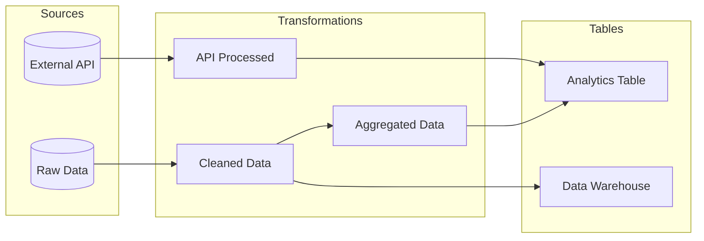

# truthound lineage visualize

Generate visual representation of data lineage. This command creates interactive or static diagrams of your data flow.

## Synopsis

```bash
truthound lineage visualize <lineage_file> -o <output> [OPTIONS]
```

## Arguments

| Argument | Required | Description |
|----------|----------|-------------|
| `lineage_file` | Yes | Path to the lineage file (JSON) |

## Options

| Option | Short | Default | Description |
|--------|-------|---------|-------------|
| `--output` | `-o` | **Required** | Output file path |
| `--renderer` | `-r` | `d3` | Renderer (d3, cytoscape, graphviz, mermaid) |
| `--theme` | `-t` | `light` | Theme (light, dark) |
| `--focus` | `-f` | None | Focus on specific node |

## Description

The `lineage visualize` command generates visual lineage diagrams:

1. **Renders** lineage graph with selected renderer
2. **Applies** theme and styling
3. **Supports** interactive and static outputs
4. **Enables** focused views on specific nodes

## Renderers

### D3.js (`d3`)

Interactive HTML visualization with JavaScript.

**Features:**
- Pan and zoom
- Drag nodes
- Hover tooltips
- Collapsible branches
- Search functionality

```bash
truthound lineage visualize lineage.json -o graph.html --renderer d3
```

**Output**: Interactive HTML file

### Cytoscape.js (`cytoscape`)

Advanced interactive graph visualization.

**Features:**
- Multiple layout algorithms
- Advanced filtering
- Export to PNG/SVG
- Node clustering
- Path highlighting

```bash
truthound lineage visualize lineage.json -o graph.html --renderer cytoscape
```

**Output**: Interactive HTML file

### Graphviz (`graphviz`)

Static publication-quality diagrams.

**Features:**
- Automatic layout
- Multiple output formats (SVG, PNG, PDF)
- Print-ready quality
- Deterministic layout

```bash
truthound lineage visualize lineage.json -o graph.svg --renderer graphviz
```

**Output**: SVG, PNG, or PDF (based on extension)

!!! warning "Graphviz System Dependency"
    The `graphviz` renderer requires the Graphviz system package:

    ```bash
    # macOS
    brew install graphviz

    # Ubuntu/Debian
    sudo apt-get install graphviz

    # Fedora/RHEL
    sudo dnf install graphviz

    # Windows (via Chocolatey)
    choco install graphviz
    ```

### Mermaid (`mermaid`)

Markdown-embeddable diagrams.

**Features:**
- Text-based format
- Embeddable in Markdown
- GitHub/GitLab rendering
- Documentation-friendly

```bash
truthound lineage visualize lineage.json -o graph.md --renderer mermaid
```

**Output**: Markdown file with Mermaid diagram

## Examples

### Basic D3 Visualization

```bash
truthound lineage visualize lineage.json -o lineage_graph.html
```

Opens in browser showing interactive graph.

### Cytoscape with Dark Theme

```bash
truthound lineage visualize lineage.json -o graph.html --renderer cytoscape --theme dark
```

### Static SVG with Graphviz

```bash
truthound lineage visualize lineage.json -o lineage.svg --renderer graphviz
```

### Mermaid for Documentation

```bash
truthound lineage visualize lineage.json -o lineage.md --renderer mermaid
```

Output (`lineage.md`):
````markdown

````

### Focused View

Focus on a specific node and its connections:

```bash
truthound lineage visualize lineage.json -o focused.html --focus analytics_table
```

Output shows `analytics_table` centered with only connected nodes.

### Focused View with Dark Theme

```bash
truthound lineage visualize lineage.json -o focused.html --renderer d3 --theme dark --focus my_node
```

## Renderer Comparison

| Feature | D3 | Cytoscape | Graphviz | Mermaid |
|---------|----|-----------|---------:|---------|
| Interactive | Yes | Yes | No | No |
| Pan/Zoom | Yes | Yes | No | No |
| Drag Nodes | Yes | Yes | No | No |
| Static Export | No | Yes | Yes | Yes |
| Markdown Embed | No | No | No | Yes |
| Custom Layouts | Basic | Advanced | Automatic | Basic |
| Large Graphs | Good | Excellent | Good | Limited |
| Offline Use | Yes | Yes | Yes | No* |

*Mermaid requires renderer (GitHub, GitLab, or mermaid-cli)

## Theme Options

All renderers support both `light` and `dark` themes:

```bash
# Light theme (default)
truthound lineage visualize lineage.json -o graph.html --theme light

# Dark theme
truthound lineage visualize lineage.json -o graph.html --theme dark
```

### Theme Comparison

| Aspect | Light | Dark |
|--------|-------|------|
| Background | White (`#FFFFFF`) | Navy (`#1a1a2e`) |
| Text | Dark grey (`#333`) | Light grey (`#e0e0e0`) |
| Panel background | White | Dark blue (`#16213e`) |
| Node colors | Standard palette | Brighter palette |

### Dark Theme Node Colors

| Type | Light | Dark |
|------|-------|------|
| source | `#4CAF50` | `#66BB6A` |
| table | `#2196F3` | `#42A5F5` |
| file | `#9C27B0` | `#AB47BC` |
| stream | `#FF9800` | `#FFA726` |
| transformation | `#607D8B` | `#78909C` |
| validation | `#E91E63` | `#EC407A` |
| model | `#00BCD4` | `#26C6DA` |
| report | `#795548` | `#8D6E63` |
| external | `#9E9E9E` | `#BDBDBD` |
| virtual | `#CDDC39` | `#D4E157` |

Custom colors can be configured programmatically via `RenderConfig`.

### Theme Support by Renderer

| Renderer | Theme Support | Notes |
|----------|---------------|-------|
| d3 | Full | HTML output with dark background, text, tooltips |
| cytoscape | Full | HTML output with dark panels, controls |
| graphviz | Full | SVG/PNG with dark background, font colors |
| mermaid | HTML only | Markdown output ignores theme (rendered by viewer) |

!!! warning "Mermaid Theme Limitation"
    The `--theme` option only works when Mermaid outputs to `.html` format.
    When outputting to `.md` or `.mmd`, the theme is ignored because the diagram
    is rendered by the viewing platform (GitHub, GitLab, etc.), not by Truthound.

    ```bash
    # Theme applies (HTML output)
    truthound lineage visualize lineage.json -o graph.html --renderer mermaid --theme dark

    # Theme ignored (Markdown output - viewer decides theme)
    truthound lineage visualize lineage.json -o graph.md --renderer mermaid --theme dark
    ```

## Output Formats by Renderer

| Renderer | Supported Outputs |
|----------|-------------------|
| d3 | `.html` |
| cytoscape | `.html` |
| graphviz | `.svg`, `.png`, `.pdf` |
| mermaid | `.md`, `.mmd` |

## Use Cases

### 1. Documentation

```bash
# Generate for data catalog
truthound lineage visualize lineage.json -o docs/lineage.html --renderer cytoscape --theme light
```

### 2. Presentations

```bash
# High-quality static diagram
truthound lineage visualize lineage.json -o slides/lineage.svg --renderer graphviz
```

### 3. README Files

```bash
# Embed in GitHub README
truthound lineage visualize lineage.json -o README_LINEAGE.md --renderer mermaid
```

### 4. Debugging

```bash
# Focus on problematic node
truthound lineage visualize lineage.json -o debug.html --focus broken_table --renderer d3
```

### 5. CI/CD Artifacts

```yaml
# GitHub Actions
- name: Generate Lineage Diagram
  run: |
    truthound lineage visualize lineage.json -o lineage.html --renderer cytoscape

- name: Upload Artifact
  uses: actions/upload-artifact@v4
  with:
    name: lineage-diagram
    path: lineage.html
```

### 6. Multiple Formats

```bash
# Generate all formats
truthound lineage visualize lineage.json -o lineage.html --renderer d3
truthound lineage visualize lineage.json -o lineage.svg --renderer graphviz
truthound lineage visualize lineage.json -o lineage.md --renderer mermaid
```

## Customization

### Node Colors (by type)

| Type | Color | Hex Code |
|------|-------|----------|
| source | Green | `#4CAF50` |
| table | Blue | `#2196F3` |
| file | Purple | `#9C27B0` |
| stream | Orange | `#FF9800` |
| transformation | Blue Grey | `#607D8B` |
| validation | Pink | `#E91E63` |
| model | Cyan | `#00BCD4` |
| report | Brown | `#795548` |
| external | Grey | `#9E9E9E` |
| virtual | Lime | `#CDDC39` |

### Edge Colors (by type)

| Type | Color | Hex Code |
|------|-------|----------|
| derived_from | Blue | `#2196F3` |
| validated_by | Pink | `#E91E63` |
| used_by | Green | `#4CAF50` |
| transformed_to | Orange | `#FF9800` |
| joined_with | Purple | `#9C27B0` |
| aggregated_to | Cyan | `#00BCD4` |
| filtered_to | Blue Grey | `#607D8B` |
| depends_on | Brown | `#795548` |

### Edge Styles

- Solid lines: Direct data flow
- Dashed lines: Optional/conditional flow
- Arrow direction: Data flow direction

## Performance Tips

For large graphs (100+ nodes):

```bash
# Use Cytoscape for best performance
truthound lineage visualize large_lineage.json -o graph.html --renderer cytoscape

# Or generate static SVG
truthound lineage visualize large_lineage.json -o graph.svg --renderer graphviz

# Focus on subset
truthound lineage visualize large_lineage.json -o focused.html --focus important_node
```

## Exit Codes

| Code | Condition |
|------|-----------|
| 0 | Success |
| 1 | Error (renderer error, invalid file, or other error) |

## Related Commands

- [`lineage show`](show.md) - Display lineage information
- [`lineage impact`](impact.md) - Analyze change impact

## Python API

For programmatic access, use the `get_renderer` factory function or renderer classes directly:

```python
from truthound.lineage import LineageGraph
from truthound.lineage.visualization import (
    get_renderer,  # Factory function
    D3Renderer,
    CytoscapeRenderer,
    GraphvizRenderer,
    MermaidRenderer,
    RenderConfig,
)

# Load graph
graph = LineageGraph.load("lineage.json")

# Option 1: Use factory function with theme (recommended)
renderer = get_renderer("d3", theme="dark")

# render() returns JSON data for D3.js
json_data = renderer.render(graph)

# render_html() returns complete interactive HTML page with dark theme
html = renderer.render_html(graph)

# Option 2: Create renderer directly with theme
renderer = D3Renderer(theme="dark")
html = renderer.render_html(graph)

# Option 3: Use RenderConfig for fine-grained control
renderer = D3Renderer()
config = RenderConfig(
    theme="dark",
    highlight_nodes=["my_node"],
)
html = renderer.render_html(graph, config)

# Render subgraph focused on a specific node (returns JSON)
json_subgraph = renderer.render_subgraph(
    graph,
    root_node_id="my_table",
    direction="both",  # "upstream" or "downstream"
    max_depth=3,
)

# Save output
with open("graph.html", "w") as f:
    f.write(html)
```

### Available Renderers

| Renderer Type | Class | Output Format |
|---------------|-------|---------------|
| `"d3"` | `D3Renderer` | HTML (interactive) |
| `"cytoscape"` | `CytoscapeRenderer` | HTML (interactive) |
| `"graphviz"` | `GraphvizRenderer` | SVG/PNG/PDF (static) |
| `"mermaid"` | `MermaidRenderer` | Markdown (text) |

## See Also

- [Lineage Overview](index.md)
- [Data Docs Generation](../../guides/datadocs.md)
