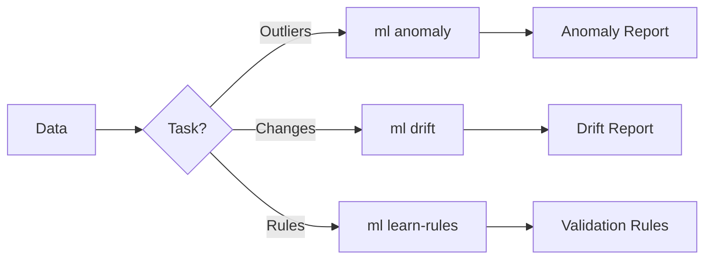

# ML Commands

Machine learning-based data quality detection commands.

## Overview

| Command | Description | Primary Use Case |
|---------|-------------|------------------|
| [`anomaly`](anomaly.md) | Detect anomalies in data | Outlier detection |
| [`drift`](drift.md) | Detect data drift | Model monitoring |
| [`learn-rules`](learn-rules.md) | Learn validation rules from data | Rule automation |

## What is ML-based Detection?

ML-based detection uses statistical and machine learning algorithms to:

- **Detect anomalies**: Find outliers and unusual patterns
- **Detect drift**: Identify distribution changes between datasets
- **Learn rules**: Automatically generate validation rules from data

## Workflow



## Quick Examples

### Anomaly Detection

```bash
# Detect outliers using Isolation Forest
truthound ml anomaly data.csv --method isolation_forest

# Detect outliers in specific columns
truthound ml anomaly data.csv --columns age,salary --method zscore
```

### Drift Detection

```bash
# Detect distribution drift
truthound ml drift baseline.csv current.csv --method distribution

# Detect multivariate drift
truthound ml drift train.csv production.csv --method multivariate
```

### Rule Learning

```bash
# Learn validation rules from data
truthound ml learn-rules data.csv -o rules.json --strictness medium
```

## Detection Methods

### Anomaly Detection Methods

| Method | Description | Best For |
|--------|-------------|----------|
| `zscore` | Z-score based detection | Normal distributions |
| `iqr` | Interquartile range | Robust to outliers |
| `mad` | Median absolute deviation | Skewed distributions |
| `isolation_forest` | ML-based isolation | Complex patterns |

### Drift Detection Methods

| Method | Description | Best For |
|--------|-------------|----------|
| `distribution` | Per-column distribution comparison | Feature drift |
| `feature` | Feature-wise statistical tests | ML features |
| `multivariate` | Multi-dimensional drift detection | Correlated features |

## Use Cases

### 1. Data Quality Monitoring

```bash
# Scheduled anomaly check
truthound ml anomaly daily_data.csv --method isolation_forest --format json -o anomalies.json
```

### 2. ML Model Monitoring

```bash
# Check for feature drift before retraining
truthound ml drift training_data.csv production_data.csv --method multivariate --threshold 0.05
```

### 3. Automated Rule Generation

```bash
# Bootstrap validation rules from reference data
truthound ml learn-rules reference_data.csv -o rules.json --strictness strict
```

### 4. CI/CD Integration

```yaml
# GitHub Actions
- name: Check for Data Drift
  run: |
    truthound ml drift baseline.csv current.csv --threshold 0.1
    if [ $? -ne 0 ]; then
      echo "Data drift detected!"
      exit 1
    fi
```

## Performance Considerations

| Method | Speed | Memory | Scalability |
|--------|-------|--------|-------------|
| zscore | Fast | Low | Excellent |
| iqr | Fast | Low | Excellent |
| mad | Fast | Low | Excellent |
| isolation_forest | Medium | Medium | Good |
| distribution drift | Fast | Low | Excellent |
| multivariate drift | Slow | High | Limited |

For large datasets, consider:

```bash
# Use sampling for large files
truthound ml anomaly large_data.parquet --method isolation_forest --sample 100000
```

## Next Steps

- [anomaly](anomaly.md) - Detect anomalies
- [drift](drift.md) - Detect data drift
- [learn-rules](learn-rules.md) - Learn validation rules

## See Also

- [Statistical Methods](../../concepts/statistical-methods.md)
- [Advanced Features](../../concepts/advanced.md)
- [compare command](../core/compare.md) - Statistical drift detection
