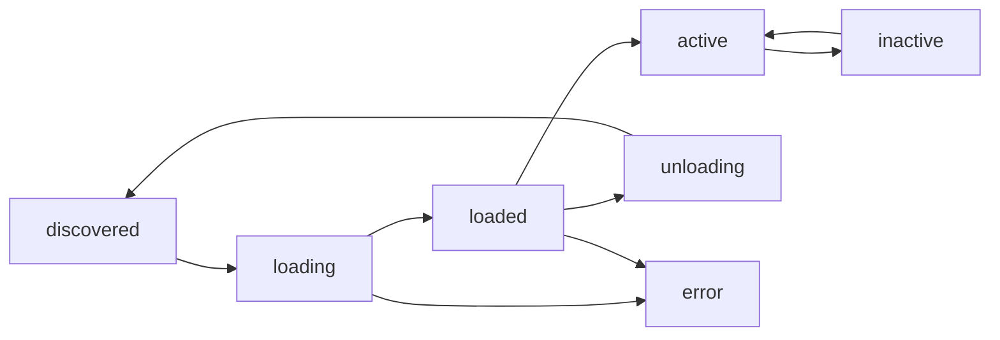

# Plugin Commands

Plugin management commands for discovering, loading, and managing Truthound plugins.

## Overview

| Command | Description | Primary Use Case |
|---------|-------------|------------------|
| [`plugin list`](list.md) | List discovered plugins | Discovery |
| [`plugin info`](info.md) | Show plugin details | Inspection |
| [`plugin load`](load.md) | Load a plugin | Activation |
| [`plugin unload`](unload.md) | Unload a plugin | Cleanup |
| [`plugin enable`](enable.md) | Enable a plugin | Activation |
| [`plugin disable`](disable.md) | Disable a plugin | Deactivation |
| [`plugin create`](create.md) | Create plugin template | Development |

## Plugin Types

| Type | Description |
|------|-------------|
| `validator` | Custom validator plugins |
| `reporter` | Custom reporter plugins |
| `hook` | Event hook plugins (before/after validation) |
| `datasource` | Data source connection plugins |
| `action` | Notification/action plugins |
| `custom` | General-purpose custom plugins |

## Plugin States

| State | Description | Color |
|-------|-------------|-------|
| `discovered` | Found (not loaded) | Yellow |
| `loading` | Loading in progress | Cyan |
| `loaded` | Load complete | Blue |
| `active` | Activated | Green |
| `inactive` | Deactivated | Gray |
| `error` | Error occurred | Red |
| `unloading` | Unloading in progress | Yellow |

## Plugin Lifecycle



## Quick Examples

### List Plugins

```bash
# List all plugins
truthound plugins list

# Filter by type
truthound plugins list --type validator

# Filter by state
truthound plugins list --state active

# Verbose output with details
truthound plugins list --verbose

# JSON output
truthound plugins list --json
```

### Manage Plugins

```bash
# Load and activate plugin
truthound plugins load my-validator

# Load without activating
truthound plugins load my-validator --no-activate

# Enable/disable plugin
truthound plugins enable my-validator
truthound plugins disable my-validator

# Unload plugin
truthound plugins unload my-validator
```

### Create Plugins

```bash
# Create validator plugin
truthound plugins create my-validator --type validator

# Create with author info
truthound plugins create my-reporter --type reporter --author "John Doe"

# Create in specific directory
truthound plugins create my-hook --type hook --output ./plugins
```

## Plugin Development Workflow

```bash
# 1. Create plugin template
truthound plugins create my-custom-validator --type validator

# 2. Develop and install
cd truthound-plugin-my-custom-validator
pip install -e .

# 3. Verify plugin
truthound plugins list

# 4. Load and test
truthound plugins load my-custom-validator
truthound check data.csv --validators my-custom-validator

# 5. Disable/unload when done
truthound plugins disable my-custom-validator
truthound plugins unload my-custom-validator
```

## Generated Plugin Structure

```
truthound-plugin-my-validator/
├── my_validator/
│   ├── __init__.py
│   └── plugin.py      # Plugin implementation
├── pyproject.toml     # Package config (entry-point)
└── README.md          # Documentation
```

## Use Cases

### 1. Discover Available Plugins

```bash
# See all plugins with their states
truthound plugins list --verbose

# Find validator plugins
truthound plugins list --type validator
```

### 2. Manage Plugin Lifecycle

```bash
# Load plugin for use
truthound plugins load my-validator

# Temporarily disable
truthound plugins disable my-validator

# Re-enable when needed
truthound plugins enable my-validator

# Unload when no longer needed
truthound plugins unload my-validator
```

### 3. Create Custom Plugins

```bash
# Create a custom validator
truthound plugins create company-validators \
  --type validator \
  --author "Data Team" \
  --output ./plugins
```

## Command Reference

- [plugin list](list.md) - List discovered plugins
- [plugin info](info.md) - Show plugin details
- [plugin load](load.md) - Load a plugin
- [plugin unload](unload.md) - Unload a plugin
- [plugin enable](enable.md) - Enable a plugin
- [plugin disable](disable.md) - Disable a plugin
- [plugin create](create.md) - Create plugin template

## See Also

- [Plugin System](../../concepts/plugins.md)
- [Custom Validator Tutorial](../../tutorials/custom-validator.md)
- [Scaffolding Commands](../scaffolding/index.md)
