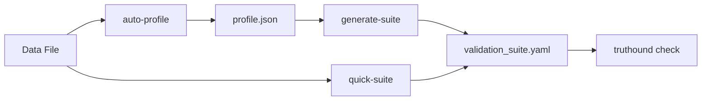

# Profiler Commands

Advanced data profiling and validation rule generation commands.

## Overview

| Command | Description | Primary Use Case |
|---------|-------------|------------------|
| [`auto-profile`](auto-profile.md) | Advanced data profiling | Deep data analysis |
| [`generate-suite`](generate-suite.md) | Generate validation rules from profile | Rule automation |
| [`quick-suite`](quick-suite.md) | Profile and generate rules in one step | Quick setup |
| [`list-formats`](list-formats.md) | List supported output formats | Reference |
| [`list-presets`](list-presets.md) | List available presets | Reference |
| [`list-categories`](list-categories.md) | List rule categories | Reference |

## Workflow



### Two-Step Workflow

1. **Profile first, then generate rules:**

```bash
# Step 1: Generate detailed profile
truthound auto-profile data.csv -o profile.json --format json

# Step 2: Generate validation suite from profile
truthound generate-suite profile.json -o suite.yaml --strictness medium
```

### One-Step Workflow

2. **Profile and generate in one command:**

```bash
# Combined: profile + generate
truthound quick-suite data.csv -o suite.yaml --strictness medium
```

## Available Presets

Presets provide pre-configured settings for common use cases:

| Preset | Description |
|--------|-------------|
| `default` | Balanced settings (medium strictness, all categories) |
| `strict` | Strict validation rules with high confidence |
| `loose` | Relaxed validation for flexible data |
| `minimal` | Only high-confidence schema rules |
| `comprehensive` | All generators with detailed output |
| `schema_only` | Schema and completeness rules only |
| `format_only` | Format and pattern rules only |
| `ci_cd` | Optimized for CI/CD pipelines (checkpoint format) |
| `development` | Development-friendly (Python code output) |
| `production` | Production-ready (strict, high confidence) |

## Rule Categories

Categories determine which types of validation rules are generated:

| Category | Description |
|----------|-------------|
| `completeness` | Null checks, missing data validation |
| `uniqueness` | Duplicate detection, primary key validation |
| `format` | Pattern matching, format validation |
| `range` | Numeric range validation |
| `consistency` | Cross-column consistency checks |
| `schema` | Data type and structure validation |

## Output Formats

### Profile Formats (auto-profile)

| Format | Extension | Description |
|--------|-----------|-------------|
| `console` | - | Human-readable terminal output |
| `json` | `.json` | Machine-readable JSON |
| `yaml` | `.yaml` | YAML format |

### Suite Formats (generate-suite, quick-suite)

| Format | Extension | Description |
|--------|-----------|-------------|
| `yaml` | `.yaml` | YAML configuration |
| `json` | `.json` | JSON configuration |
| `python` | `.py` | Python code |
| `toml` | `.toml` | TOML configuration |
| `checkpoint` | `.yaml` | Checkpoint-compatible YAML |

## Use Cases

### 1. Data Discovery

Profile unknown data to understand its structure:

```bash
truthound auto-profile unknown_data.csv --patterns --correlations
```

### 2. Automated Rule Generation

Generate validation rules from existing data:

```bash
truthound quick-suite production_data.csv -o rules.yaml --preset production
```

### 3. CI/CD Pipeline Setup

Create checkpoint-compatible rules for CI/CD:

```bash
truthound quick-suite data.csv -o checkpoint.yaml --preset ci_cd
```

### 4. Development Environment

Generate Python validation code:

```bash
truthound generate-suite profile.json -o validators.py --format python --code-style class_based
```

## Next Steps

- [auto-profile](auto-profile.md) - Advanced data profiling
- [generate-suite](generate-suite.md) - Generate validation rules
- [quick-suite](quick-suite.md) - Quick profile + rules generation
