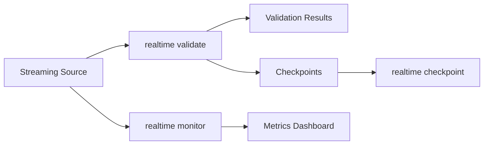

# Realtime Commands

Streaming validation commands for real-time data quality monitoring.

## Overview

| Command | Description | Primary Use Case |
|---------|-------------|------------------|
| [`validate`](validate.md) | Validate streaming data | Real-time quality checks |
| [`monitor`](monitor.md) | Monitor validation metrics | Continuous monitoring |
| [`checkpoint`](checkpoint/index.md) | Manage validation checkpoints | State management |

### Checkpoint Subcommands

| Subcommand | Description |
|------------|-------------|
| [`checkpoint list`](checkpoint/list.md) | List available checkpoints |
| [`checkpoint show`](checkpoint/show.md) | Show checkpoint details |
| [`checkpoint delete`](checkpoint/delete.md) | Delete a checkpoint |

## What is Realtime Validation?

Realtime validation enables continuous data quality monitoring on streaming sources:

- **Streaming validation** - Check data as it flows through pipelines
- **Metric monitoring** - Track quality metrics over time
- **Checkpoint recovery** - Resume validation from saved state
- **Multiple sources** - Kafka, Kinesis, and mock sources

## Supported Streaming Sources

| Source | Format | Description | Dependency |
|--------|--------|-------------|------------|
| Mock | `mock` | Test mock data source | Built-in |
| Kafka | `kafka:topic_name` | Apache Kafka topic | `aiokafka` |
| Kinesis | `kinesis:stream_name` | AWS Kinesis stream | `aiobotocore` |

### Installation

```bash
# For Kafka support
pip install truthound[kafka]

# For Kinesis support
pip install truthound[kinesis]

# For all streaming sources
pip install truthound[streaming]
```

## Workflow



## Quick Examples

### Validate Streaming Data

```bash
# Mock source for testing
truthound realtime validate mock

# Kafka topic
truthound realtime validate kafka:my_topic --batch-size 500

# Kinesis stream
truthound realtime validate kinesis:my_stream --max-batches 100
```

### Monitor Metrics

```bash
# Basic monitoring
truthound realtime monitor mock

# Custom interval and duration
truthound realtime monitor kafka:my_topic --interval 10 --duration 300
```

### Manage Checkpoints

```bash
# List checkpoints
truthound realtime checkpoint list

# Show checkpoint details
truthound realtime checkpoint show abc12345

# Delete checkpoint
truthound realtime checkpoint delete abc12345 --force
```

## Architecture

### Validation Flow

1. **Connect** to streaming source (Kafka/Kinesis/Mock)
2. **Batch** incoming records (configurable size)
3. **Validate** each batch with specified validators
4. **Save** checkpoint after each batch
5. **Report** results and metrics

### Checkpoint System

Checkpoints enable:
- **Recovery** - Resume from last successful batch
- **Progress tracking** - Know exactly where validation stopped
- **State persistence** - Survive process restarts

```bash
# Checkpoints are saved automatically
./checkpoints/
├── abc12345.json
├── def67890.json
└── ...
```

## Use Cases

### 1. Kafka Pipeline Monitoring

```bash
# Validate Kafka messages
truthound realtime validate kafka:orders --validators null,range --batch-size 1000

# Monitor continuously
truthound realtime monitor kafka:orders --interval 5 --duration 0
```

### 2. Kinesis Stream Validation

```bash
# Validate Kinesis records
truthound realtime validate kinesis:events --max-batches 50

# Check validation status
truthound realtime checkpoint list --format json
```

### 3. Development Testing

```bash
# Use mock source for testing
truthound realtime validate mock --validators null,unique --batch-size 100

# Monitor mock metrics
truthound realtime monitor mock --interval 2 --duration 30
```

### 4. CI/CD Integration

```yaml
# GitHub Actions
- name: Validate Streaming Pipeline
  run: |
    truthound realtime validate kafka:test_topic \
      --validators null,range \
      --max-batches 10 \
      -o results.json

    # Check results
    python -c "
    import json
    with open('results.json') as f:
        data = json.load(f)
    if data['failed_batches'] > 0:
        exit(1)
    "
```

## Performance Considerations

| Parameter | Impact | Recommendation |
|-----------|--------|----------------|
| `--batch-size` | Memory usage, latency | 500-2000 for most cases |
| `--max-batches` | Total processing time | Set based on test scope |
| `--interval` | Monitoring overhead | 5-30 seconds |

## Command Reference

- [validate](validate.md) - Validate streaming data
- [monitor](monitor.md) - Monitor validation metrics
- [checkpoint](checkpoint/index.md) - Manage checkpoints

## See Also

- [Kafka Integration](../../guides/datasources.md)
- [CI/CD Integration](../../guides/ci-cd.md)
- [Advanced Features](../../concepts/advanced.md)
