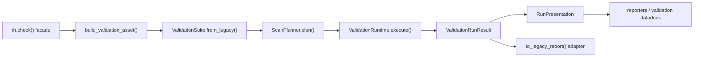

# Truthound 2.0 Architecture

## Design Goal

Truthound 2.0 replaces a monolithic validation path with a small kernel and explicit adapters. The primary design target is not novelty; it is maintainability under extension pressure.

This redesign draws on four reference systems:

- Great Expectations: suite execution separated from storage and presentation
- Soda: scan planning and backend-aware execution
- Deequ: analyzers, constraints, verification, and metric repositories as distinct concepts
- Pandera: schema-centric validation and lazy data interaction

## Kernel Boundaries

Truthound now fixes the internal standard boundary at five packages:

| Package | Role | Representative Types |
| --- | --- | --- |
| `truthound.core.contracts` | Stable ports and capability contracts | `DataAsset`, `ExecutionBackend`, `MetricRepository`, `ArtifactStore`, `PluginCapability` |
| `truthound.core.suite` | Declarative validation intent | `ValidationSuite`, `CheckSpec`, `SchemaSpec`, `EvidencePolicy`, `SeverityPolicy` |
| `truthound.core.planning` | Compilation from suite to executable plan | `ScanPlanner`, `ScanPlan`, `PlanStep` |
| `truthound.core.runtime` | Orchestration and failure isolation | `ValidationRuntime` |
| `truthound.core.results` | Canonical runtime result model | `ValidationRunResult`, `CheckResult`, `ExecutionIssue` |

## Runtime Flow

The facade remains user-friendly, but all meaningful orchestration now happens inside the kernel.

## Ports and Adapters

Truthound 2.0 uses a ports-and-adapters interpretation tailored for data validation:

- Ports describe durable contracts such as `DataAsset`, `ExecutionBackend`, and plugin capabilities.
- Adapters translate real sources into those ports, for example Polars-backed or SQL-backed assets.
- Planning decides whether a suite should execute sequentially, in parallel, or with SQL pushdown.
- Runtime executes the compiled plan and isolates validator failures into `ExecutionIssue`.
- Results remain stable even when execution strategy changes.

This makes it possible to evolve the runtime or backend strategy without forcing a public API rewrite.

## Peripheral Boundaries

Peripheral subsystems are intentionally kept outside the kernel while still consuming the same canonical contracts:

- checkpoint orchestration uses `CheckpointResult.validation_run` as its in-memory result model
- profiler integrations consume suite and result contracts without importing report rendering layers directly
- realtime, ML, and lineage integrations are expected to depend on `truthound.core` contracts or subsystem-local adapters rather than presentation or CLI layers

This keeps outer subsystems extensible without letting them become alternate sources of truth for results or presentation.

## Public Compatibility

`th.check()` still exists because it is the fastest onboarding path. In 2.0 it is explicitly a compatibility facade:

- it builds a `ValidationSuite`
- it compiles a `ScanPlan`
- it executes through `ValidationRuntime`
- it returns a legacy `Report`
- it also attaches `report.validation_run`

This means users can stay on the familiar facade while advanced consumers move toward the structured result model.

## Planner Responsibilities

`ScanPlanner` owns the concerns that previously leaked through the API or validator base layer:

- duplicate check accounting
- parallel eligibility
- pushdown eligibility
- backend routing metadata

The planner is intentionally narrow. It should decide *how* a suite should run, not *perform* the validation itself.

## Runtime Responsibilities

`ValidationRuntime` owns execution semantics:

- validator construction from `CheckSpec`
- timeout-safe and retry-safe execution
- sequential and parallel orchestration
- pushdown delegation for SQL assets
- conversion of runtime failures into `ExecutionIssue`

This keeps operational concerns out of suite definition and out of validator authoring.

## Result Model

`ValidationRunResult` is the canonical output for the 2.0 kernel. It separates:

- aggregate verdicts through `CheckResult`
- issue evidence through `ValidationIssue`
- runtime failures through `ExecutionIssue`

The legacy `Report` remains as an adapter layer rather than the source of truth.

## Presentation Boundary

Reporter and validation-doc generation now consume the kernel result model directly:

- `ValidationRunResult` is the only canonical reporter input
- `RunPresentation` is the shared immutable projection used by reporters and validation datadocs
- `ReporterContext` carries render-time metadata without re-coupling renderers to runtime internals
- `truthound.stores.results.ValidationResult` is now a persistence DTO, not a rendering contract

This preserves one result model for execution while still allowing multiple output renderers to share aggregation and formatting logic.

## Plugin Architecture

The plugin platform now has one lifecycle runtime. See the dedicated [Plugin Platform](plugins.md) document for details, but the key decision is simple:

- `PluginManager` is the real manager
- `EnterprisePluginManager` is a capability-driven facade over that manager

This removes lifecycle duplication while still allowing security, trust, hot reload, and versioning capabilities to exist as optional services.

## Dependency Rule

`truthound.core` must not depend on:

- `truthound.reporters`
- `truthound.plugins`
- `truthound.datadocs`
- `truthound.cli_modules`

That rule is enforced by architecture tests and exists to prevent outer layers from re-coupling the kernel.

Reporter and validation-doc layers must also avoid direct imports of `truthound.stores.results`; storage conversion is allowed only in adapter modules at the edge.

The same rule now applies to peripheral subsystems such as checkpoint, profiler, realtime, ML, and lineage. If they need presentation or persistence behavior, they should go through subsystem adapters rather than import those outer layers directly.

## Migration Path

Truthound 2.0 is intended as a controlled transition:

1. Preserve top-level facades for users.
2. Move orchestration into the kernel.
3. Standardize plugins on stable ports.
4. Shift reporters and validation docs generators onto `ValidationRunResult`.
5. Keep legacy `Report` and persistence DTO support only as compatibility adapters.

The detailed user-facing changes are summarized in the [Migration Guide](../guides/migration-2.0.md) and recorded in [ADR 001](../adr/001-validation-kernel.md), [ADR 002](../adr/002-plugin-platform.md), [ADR 003](../adr/003-result-model.md), and [ADR 004](../adr/004-migration-compatibility.md).

Canonical documentation lives in the main MkDocs navigation. Historical paths remain available only through the [Legacy Archive](../legacy/index.md) and compatibility alias pages.
