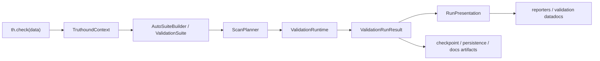

# Truthound 3.0 Architecture

## Design Goal

Truthound 3.0 replaces a compatibility-oriented 2.x facade with a native zero-config validation platform. The primary design target is not novelty; it is maintainability, exactness, and extensibility under real production pressure.

This redesign draws on four reference systems:

- Great Expectations: suite execution separated from storage and presentation
- Soda: scan planning and backend-aware execution
- Deequ: analyzers, constraints, verification, and metric repositories as distinct concepts
- Pandera: schema-centric validation and lazy data interaction

## Architectural Theme

Truthound 3.0 is organized around:

- a small kernel
- a first-class `TruthoundContext`
- deterministic auto-suite synthesis
- exact-by-default validation semantics
- optional namespaces for non-core systems

## Kernel Boundaries

Truthound now fixes the internal standard boundary at five packages:

| Package | Role | Representative Types |
| --- | --- | --- |
| `truthound.core.contracts` | Stable ports and capability contracts | `DataAsset`, `ExecutionBackend`, `MetricRepository`, `ArtifactStore`, `PluginCapability` |
| `truthound.core.suite` | Declarative validation intent | `ValidationSuite`, `CheckSpec`, `SchemaSpec`, `EvidencePolicy`, `SeverityPolicy` |
| `truthound.core.planning` | Compilation from suite to executable plan | `ScanPlanner`, `ScanPlan`, `PlanStep` |
| `truthound.core.runtime` | Orchestration and failure isolation | `ValidationRuntime` |
| `truthound.core.results` | Canonical runtime result model | `ValidationRunResult`, `CheckResult`, `ExecutionIssue` |

The context and checkpoint layers sit beside the kernel rather than inside it:

- `truthound.context` owns `.truthound/`, baselines, run artifacts, docs artifacts, and plugin-manager access
- `truthound.checkpoint` orchestrates validation around the canonical `ValidationRunResult`

## Runtime Flow

The facade remains user-friendly, but orchestration is now explicit and canonical end-to-end.

## Ports and Adapters

Truthound 3.0 uses a ports-and-adapters interpretation tailored for data validation:

- Ports describe durable contracts such as `DataAsset`, `ExecutionBackend`, and plugin capabilities.
- Adapters translate real sources into those ports, for example Polars-backed or SQL-backed assets.
- Planning decides whether a suite should execute sequentially, in parallel, or with SQL pushdown, and which metric work can be fused.
- Runtime executes the compiled plan and isolates validator failures into `ExecutionIssue`.
- Results remain stable even when execution strategy changes.

This lets Truthound evolve the planner or backend strategy without rewriting the user contract.

## TruthoundContext and Zero-Config State

`TruthoundContext` is now the default project boundary. It auto-discovers the project root, creates `.truthound/`, and owns:

- resolved defaults from `truthound.yaml` when present
- asset catalog fingerprints
- baseline schemas and metric history
- persisted validation runs
- validation-doc artifacts
- plugin manager access

The fixed workspace layout is:

- `.truthound/config.yaml`
- `.truthound/catalog/`
- `.truthound/baselines/`
- `.truthound/runs/`
- `.truthound/docs/`
- `.truthound/plugins/`

## Peripheral Boundaries

Peripheral subsystems are intentionally kept outside the kernel while still consuming the same canonical contracts:

- checkpoint orchestration uses `CheckpointResult.validation_run` as its in-memory result model
- checkpoint formatting helpers use `CheckpointResult.validation_view` rather than reintroducing a second result model
- profiler integrations consume suite and result contracts without importing report rendering layers directly
- realtime, ML, and lineage integrations are expected to depend on `truthound.core` contracts or subsystem-local adapters rather than presentation or CLI layers

This keeps outer subsystems extensible without letting them become alternate sources of truth for results or presentation.

## Public Contract

Truthound 3.0 narrows the public surface and makes it honest:

- `th.check()` returns `ValidationRunResult`
- `compare` is imported from `truthound.drift.compare`
- the root package exports `TruthoundContext`, `ValidationSuite`, `CheckSpec`, `SchemaSpec`, `ValidationRunResult`, and `CheckResult`
- advanced systems move to namespace imports such as `truthound.ml` or `truthound.realtime`

This prevents the public API from drifting away from the real runtime model.

## Auto-Suite and Planner Responsibilities

When `validators=None`, Truthound does not run every validator. It invokes a deterministic `AutoSuiteBuilder` that:

- always includes schema/nullability/type coverage when enough information exists
- adds uniqueness only for key-like columns inferred from profile and naming heuristics
- adds range checks for numeric columns with confident bounds
- avoids expensive probabilistic work unless explicitly eligible

`ScanPlanner` then owns the execution planning concerns that previously leaked through the API or validator base layer:

- duplicate check accounting
- parallel eligibility
- pushdown eligibility
- backend routing metadata
- metric deduplication
- aggregate query fusion opportunities

The planner is intentionally narrow. It should decide *how* a suite should run, not *perform* the validation itself.

## Runtime Responsibilities

`ValidationRuntime` owns execution semantics:

- validator construction from `CheckSpec`
- timeout-safe and retry-safe execution
- sequential and parallel orchestration
- pushdown delegation for SQL assets
- conversion of runtime failures into `ExecutionIssue`
- stable result ordering
- exact-by-default confirmation behavior

This keeps operational concerns out of suite definition and out of validator authoring.

## Backend Strategy

Truthound 3.0 treats Polars as the reference backend and optimization target:

- `PolarsBackend` is the primary local execution path
- SQL pushdown is planner-driven and first-class
- pandas and Spark enter through datasource adapters but are normalized to the same backend contract

Core deterministic checks are exact by default. Sampling or sketches are allowed only for profiling, drift, anomaly detection, or explicitly approximate workloads, and any sketch-triggered failure should be exact-confirmed before the final verdict.

## Result Model

`ValidationRunResult` is the canonical output for the 3.0 kernel. It separates:

- aggregate verdicts through `CheckResult`
- issue evidence through `ValidationIssue`
- runtime failures through `ExecutionIssue`

Convenience methods such as `render()`, `write()`, and `build_docs()` live on the result object, but they are facades over reporter and datadocs services rather than alternate result models.

## Presentation Boundary

Reporter and validation-doc generation now consume the kernel result model directly:

- `ValidationRunResult` is the only canonical reporter input
- `RunPresentation` is the shared immutable projection used by reporters and validation datadocs
- `ReporterContext` carries render-time metadata without re-coupling renderers to runtime internals
- `truthound.stores.results.ValidationResult` is now a persistence DTO, not a rendering contract

This preserves one execution model while still allowing multiple output renderers to share aggregation and formatting logic.

## Plugin Architecture

The plugin platform now has one lifecycle runtime. See the dedicated [Plugin Platform](plugins.md) document for details, but the key decision is simple:

- `PluginManager` is the real manager
- `EnterprisePluginManager` is a capability-driven facade over that manager

The public extension contracts are:

- `CheckSpecFactory`
- `Reporter.render(run_result, *, context)`
- `DataAssetProvider`
- lifecycle hooks over stable kernel contracts only

This removes lifecycle duplication while still allowing security, trust, hot reload, and versioning capabilities to exist as optional services.

## Dependency Rule

`truthound.core` must not depend on:

- `truthound.reporters`
- `truthound.plugins`
- `truthound.datadocs`
- `truthound.cli_modules`

That rule is enforced by architecture tests and exists to prevent outer layers from re-coupling the kernel.

Reporter and validation-doc layers must also avoid direct imports of `truthound.stores.results`; storage conversion is allowed only in adapter modules at the edge.

The same rule now applies to peripheral subsystems such as checkpoint, profiler, realtime, ML, and lineage. If they need presentation or persistence behavior, they should go through subsystem adapters rather than import those outer layers directly.

## Stability Model

Stability is part of the architecture, not a later hardening pass:

- per-check timeout budgets
- isolated exception capture
- deterministic retry behavior
- idempotent persistence of run artifacts
- corrupted baseline/cache quarantine
- stable serialization and ordering

## Migration Path

Truthound 3.0 is an intentional breaking release:

1. remove legacy `Report` assumptions from core runtime
2. make `TruthoundContext` and auto-suite behavior the default path
3. standardize plugins and reporters on canonical 3.0 contracts
4. isolate optional namespaces from the kernel boundary
5. ship migration tooling so upgrades are mechanical rather than guesswork

The detailed user-facing changes are summarized in the [Migration Guide](../guides/migration-3.0.md) and recorded in [ADR 001](../adr/001-validation-kernel.md), [ADR 002](../adr/002-plugin-platform.md), [ADR 003](../adr/003-result-model.md), and [ADR 004](../adr/004-migration-compatibility.md).

Canonical documentation lives in the main MkDocs navigation. Historical paths remain available only through the [Legacy Archive](../legacy/index.md) and compatibility alias pages.
