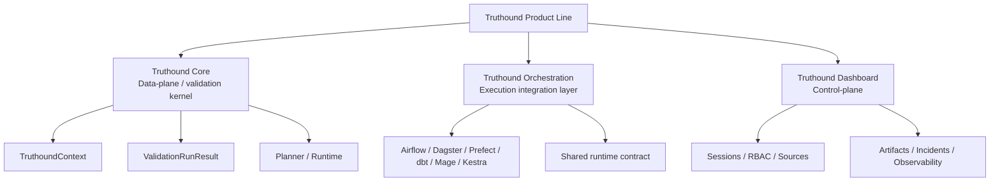

# Concepts & Architecture

This section explains the architecture of the Truthound product line. The main
portal combines Truthound Core, Truthound Orchestration, and Truthound
Dashboard in one site, but those layers should not be read as one flat feature
catalog.

Read this section when you want to understand:

- why Truthound Core is the data-plane and validation kernel
- how the execution integration layer and control-plane relate to that core
- where optional namespaces such as drift, profiler, realtime, lineage, and ML
  attach without becoming the kernel itself
- which layer owns which contract

## Layered System Map

| Layer | Role | Owns | Does not own |
|------|------|------|--------------|
| **Truthound Core** | Data-plane / validation kernel | `TruthoundContext`, `ValidationRunResult`, planner/runtime, zero-config workspace, validation docs, reporters, checkpoint runtime | host-native scheduler APIs, UI sessions, RBAC, incident queues |
| **Truthound Orchestration** | Execution integration layer | Airflow, Dagster, Prefect, dbt, Mage, and Kestra adapters plus a shared runtime contract | the kernel result model itself, dashboard control-plane state |
| **Truthound Dashboard** | Control-plane | workspaces, sessions, RBAC, sources, artifacts, incidents, secrets, observability | validation execution semantics, planner/runtime logic |

## Core-Adjoining Namespaces vs First-Party Layers

Not everything outside the root facade is a separate product layer.

| Category | Examples | Interpretation |
|---------|----------|----------------|
| **Core-adjoining namespaces** | `truthound.drift`, `truthound.checkpoint`, `truthound.reporters`, `truthound.datadocs`, `truthound.profiler` | part of the main `truthound` repository and still downstream of the core validation contract |
| **Optional advanced namespaces** | `truthound.lineage`, `truthound.realtime`, `truthound.ml` | broader capability surface inside the main repository; useful, but not the same thing as the core kernel |
| **First-party external layers** | `truthound-orchestration`, `truthound-dashboard` | separate repositories and separate operational layers, mirrored into this portal for one-stop discovery |

## How To Read The Docs Correctly

- Start in **Core** if you want the most proven runtime contract.
- Move to **Orchestration** if Truthound must run inside a scheduler, asset
  graph, flow system, or warehouse-native automation environment.
- Move to **Dashboard** if you need a control-plane with sessions, ownership,
  artifacts, incidents, or permissions.
- Treat benchmark evidence as evidence about the **core validation kernel**
  unless a page explicitly says otherwise.

## Recommended Reading Path

1. [Truthound 3.0 Architecture](architecture.md)
2. [Zero-Config Context](zero-config.md)
3. [Plugin Platform](plugins.md)
4. [Advanced Features](advanced.md)
5. [Truthound Orchestration](../orchestration/index.md)
6. [Truthound Dashboard](../dashboard/index.md)

## Related Reading

- [Home](../index.md)
- [Getting Started](../getting-started/index.md)
- [Guides](../guides/index.md)
- [Reference](../reference/index.md)
