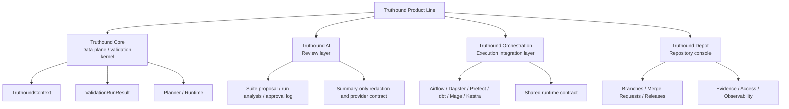

# Concepts & Architecture

This section explains the architecture of the Truthound product line. The main
portal combines Truthound Core, Truthound AI, Truthound Orchestration, and a
boundary-level Truthound Depot overview in one site, but those layers
should not be read as one flat feature catalog.

Read this section when you want to understand:

- why Truthound Core is the data-plane and validation kernel
- where the optional AI review layer attaches without mutating the kernel by default
- how the execution integration layer and repository console relate to that core
- where optional namespaces such as drift, profiler, realtime, lineage, and ML
  attach without becoming the kernel itself
- how private Depot engine primitives let Truthound Depot and Truthound
  Orchestration share dataset repository artifacts without making Core own the
  console domain
- which layer owns which contract

## Layered System Map

| Layer | Role | Owns | Does not own |
|------|------|------|--------------|
| **Truthound Core** | Data-plane / validation kernel | `TruthoundContext`, `ValidationRunResult`, planner/runtime, zero-config workspace, validation docs, reporters, checkpoint runtime | host-native scheduler APIs, UI sessions, RBAC, incident queues |
| **Truthound AI** | Review layer | prompt-to-proposal compilation, canonical run analysis, approval logs, controlled suite apply, provider/redaction contracts | direct mutation of core state before review, Depot runtime ownership |
| **Truthound Orchestration** | Execution integration layer | Airflow, Dagster, Prefect, dbt, Mage, and Kestra adapters plus a shared runtime contract | the kernel result model itself, Depot business state |
| **Truthound Depot** | Repository console / business-state layer | Depot, branch, snapshot, merge request, release, rollback, evidence, audit, access, and operator workflows | validation execution semantics, planner/runtime logic, host-native execution projection |

## Core-Adjoining Namespaces vs First-Party Layers

Not everything outside the root facade is a separate product layer.

| Category | Examples | Interpretation |
|---------|----------|----------------|
| **Core-adjoining namespaces** | `truthound.drift`, `truthound.checkpoint`, `truthound.reporters`, `truthound.datadocs`, `truthound.profiler` | part of the main `truthound` repository and still downstream of the core validation contract |
| **Review-layer namespace** | `truthound.ai` | additive AI surface that compiles proposals and run analysis into reviewable artifacts without redefining the kernel contract |
| **Private engine primitives** | `truthound._datasets` | internal dataset repository contracts for redacted envelopes, fingerprints, summary diffs, quality gate projections, and bundle exchange before public API promotion |
| **Optional advanced namespaces** | `truthound.lineage`, `truthound.realtime`, `truthound.ml` | broader capability surface inside the main repository; useful, but not the same thing as the core kernel |
| **First-party external layers** | `truthound-orchestration`, Truthound Depot | separate operational layers; orchestration remains mirrored here, while Depot is represented through curated overview pages rather than a full mirrored manual |

## How To Read The Docs Correctly

- Start in **Core** if you want the most proven runtime contract.
- Move to **AI** if you need reviewable proposal generation, run analysis, or approval/apply semantics on top of the kernel.
- Move to **Orchestration** if Truthound must run inside a scheduler, asset
  graph, flow system, or warehouse-native automation environment.
- Move to **Depot** if you need a dataset repository console with branches,
  merge requests, releases, rollback, evidence, access, or permissions.
- Treat benchmark evidence as evidence about the **core validation kernel**
  unless a page explicitly says otherwise.

## Recommended Reading Path

1. [Truthound 3.0 Architecture](architecture.md)
2. [Zero-Config Context](zero-config.md)
3. [Plugin Platform](plugins.md)
4. [Depot Engine Primitives](depot-engine-primitives.md)
5. [Truthound AI](../ai/index.md)
6. [Advanced Features](advanced.md)
7. [Truthound Orchestration](../orchestration/index.md)
8. [Truthound Depot](../dashboard/index.md)

## Related Reading

- [Home](../index.md)
- [Getting Started](../getting-started/index.md)
- [Guides](../guides/index.md)
- [Reference](../reference/index.md)
- [Truthound AI](../ai/index.md)
