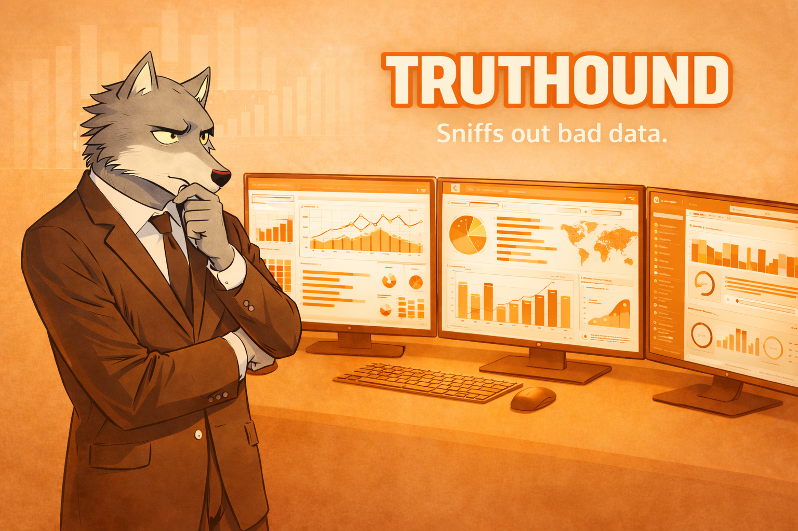

  

# Truthound Dashboard

Truthound Dashboard is the operational control-plane for the broader Truthound
system. It sits above the core validation kernel and above the additive
`truthound.ai` review layer, giving operators one place to review sources,
ownership, artifacts, incidents, approval history, and validation outcomes.

This public docs portal keeps the dashboard visible at the system-boundary
level, but it does not reproduce the full console manual or deployment bundle
here. The dashboard is treated as an installation-managed operational surface
rather than part of the `pip install truthound` developer workflow.

## What The Dashboard Owns

- sessions, workspace routing, and operator-facing navigation
- RBAC, ownership, and approval workflows
- source registration, secrets handling, and artifact browsing
- review surfaces for AI-generated suite proposals and run analysis
- observability and incident handling around Truthound operations

## What The Dashboard Does Not Own

- validation execution semantics
- planner/runtime logic
- `ValidationRunResult` as the canonical result model
- provider contracts, redaction policy, or AI artifact schema definitions

Those contracts remain fixed in `truthound` and, for AI, in the public
`truthound.ai` namespace.

## Relationship To Truthound AI

The dashboard is where human review happens, not where AI rules are invented.
The underlying proposal and analysis lifecycle is intentionally defined in the
core repository first:

- `suggest_suite(...)` produces reviewable suite proposal artifacts
- `explain_run(...)` produces reviewable run analysis artifacts
- `approve_proposal(...)`, `reject_proposal(...)`, and `apply_proposal(...)`
  keep mutation behind explicit approval

That boundary lets the control-plane evolve without forcing the validation
kernel or AI provider contract to move with it.

## Operational Direction

The current product direction is an installation-managed deployment package for
managed environments. Public docs keep the boundary and capability story
visible, while deeper deployment, packaging, and runtime specifics are handled
through the dashboard delivery channel itself.

## Related Reading

- [Truthound AI Overview](../ai/index.md)
- [Truthound 3.x Architecture](../concepts/architecture.md)
- [Truthound Orchestration](../orchestration/index.md)
