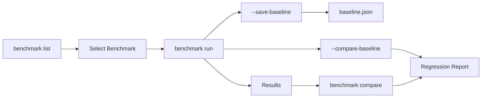

# 벤치마크 명령

CLI 명령 실행에서 Truthound, Performance을(를) 기준으로 데이터 품질 검증, 워크플로우 자동화, 결과 해석 방법을 설명합니다.

!!! note "참고"
CLI 명령 실행에서 HTML, `pip install truthound[reports]`, Jinja2, Install을(를) 기준으로 데이터 품질 검증, 워크플로우 자동화, 결과 해석 방법을 설명합니다.

## 빠른 시작

```bash
# Run quick benchmark suite
truthound benchmark run --suite quick

# Run single 'profile' benchmark
truthound benchmark run profile

# List available benchmarks
truthound benchmark list

# Compare results
truthound benchmark compare baseline.json current.json

# Run the Truthound vs GX parity suite
truthound benchmark parity --suite pr-fast --frameworks truthound
```

## 개요

| CLI 명령 실행에서 Command을(를) 기준으로 데이터 품질 검증, 워크플로우 자동화, 결과 해석 방법을 설명합니다. | CLI 명령 실행에서 Description을(를) 기준으로 데이터 품질 검증, 워크플로우 자동화, 결과 해석 방법을 설명합니다. | CLI 명령 실행에서 Primary, Case을(를) 기준으로 데이터 품질 검증, 워크플로우 자동화, 결과 해석 방법을 설명합니다. |
|---------|-------------|------------------|
| CLI 명령 실행에서 `run`을(를) 기준으로 데이터 품질 검증, 워크플로우 자동화, 결과 해석 방법을 설명합니다. | Run 성능 benchmarks | 성능 testing |
| CLI 명령 실행에서 `list`을(를) 기준으로 데이터 품질 검증, 워크플로우 자동화, 결과 해석 방법을 설명합니다. | CLI 명령 실행에서 List을(를) 기준으로 데이터 품질 검증, 워크플로우 자동화, 결과 해석 방법을 설명합니다. | CLI 명령 실행에서 Discovery을(를) 기준으로 데이터 품질 검증, 워크플로우 자동화, 결과 해석 방법을 설명합니다. |
| CLI 명령 실행에서 `compare`을(를) 기준으로 데이터 품질 검증, 워크플로우 자동화, 결과 해석 방법을 설명합니다. | Compare 벤치마크 결과 | CLI 명령 실행에서 Regression을(를) 기준으로 데이터 품질 검증, 워크플로우 자동화, 결과 해석 방법을 설명합니다. |
| CLI 명령 실행에서 `parity`을(를) 기준으로 데이터 품질 검증, 워크플로우 자동화, 결과 해석 방법을 설명합니다. | CLI 명령 실행에서 Truthound, Run을(를) 기준으로 데이터 품질 검증, 워크플로우 자동화, 결과 해석 방법을 설명합니다. | 릴리스-grade verification |

!!! tip "참고"
CLI 명령 실행에서 `profile`, `check`, `scan`을(를) 기준으로 데이터 품질 검증, 워크플로우 자동화, 결과 해석 방법을 설명합니다.
CLI 명령 실행에서 `benchmark run profile`, `benchmark profile`을(를) 기준으로 데이터 품질 검증, 워크플로우 자동화, 결과 해석 방법을 설명합니다.

## What are 벤치마크?

CLI 명령 실행에서 Truthound, Benchmarks을(를) 다루는 항목입니다:

- CLI 명령 실행에서 Profiling, Measure을(를) 기준으로 데이터 품질 검증, 워크플로우 자동화, 결과 해석 방법을 설명합니다.
- **검증 benchmarks** - Measure 검증 throughput
- CLI 명령 실행에서 I/O, Measure을(를) 기준으로 데이터 품질 검증, 워크플로우 자동화, 결과 해석 방법을 설명합니다.
- CLI 명령 실행에서 Regression, Compare을(를) 기준으로 데이터 품질 검증, 워크플로우 자동화, 결과 해석 방법을 설명합니다.

## 벤치마크 Suites

| CLI 명령 실행에서 Suite을(를) 기준으로 데이터 품질 검증, 워크플로우 자동화, 결과 해석 방법을 설명합니다. | CLI 명령 실행에서 Estimated, Time을(를) 기준으로 데이터 품질 검증, 워크플로우 자동화, 결과 해석 방법을 설명합니다. | CLI 명령 실행에서 Description을(를) 기준으로 데이터 품질 검증, 워크플로우 자동화, 결과 해석 방법을 설명합니다. | CLI 명령 실행에서 Case을(를) 기준으로 데이터 품질 검증, 워크플로우 자동화, 결과 해석 방법을 설명합니다. |
|-------|---------------|-------------|----------|
| CLI 명령 실행에서 `quick`을(를) 기준으로 데이터 품질 검증, 워크플로우 자동화, 결과 해석 방법을 설명합니다. | CLI 명령 실행에서 관련 설정과 실행 흐름을(를) 기준으로 데이터 품질 검증, 워크플로우 자동화, 결과 해석 방법을 설명합니다. | CLI 명령 실행에서 Fast을(를) 기준으로 데이터 품질 검증, 워크플로우 자동화, 결과 해석 방법을 설명합니다. | CLI 명령 실행에서 Quick을(를) 기준으로 데이터 품질 검증, 워크플로우 자동화, 결과 해석 방법을 설명합니다. |
| CLI 명령 실행에서 `ci`을(를) 기준으로 데이터 품질 검증, 워크플로우 자동화, 결과 해석 방법을 설명합니다. | CLI 명령 실행에서 관련 설정과 실행 흐름을(를) 기준으로 데이터 품질 검증, 워크플로우 자동화, 결과 해석 방법을 설명합니다. | CLI 명령 실행에서 CI/CD을(를) 기준으로 데이터 품질 검증, 워크플로우 자동화, 결과 해석 방법을 설명합니다. | Automated 파이프라인 |
| CLI 명령 실행에서 `full`을(를) 기준으로 데이터 품질 검증, 워크플로우 자동화, 결과 해석 방법을 설명합니다. | CLI 명령 실행에서 관련 설정과 실행 흐름을(를) 기준으로 데이터 품질 검증, 워크플로우 자동화, 결과 해석 방법을 설명합니다. | CLI 명령 실행에서 Core을(를) 기준으로 데이터 품질 검증, 워크플로우 자동화, 결과 해석 방법을 설명합니다. | CLI 명령 실행에서 Comprehensive을(를) 기준으로 데이터 품질 검증, 워크플로우 자동화, 결과 해석 방법을 설명합니다. |
| CLI 명령 실행에서 `profiling`을(를) 기준으로 데이터 품질 검증, 워크플로우 자동화, 결과 해석 방법을 설명합니다. | CLI 명령 실행에서 관련 설정과 실행 흐름을(를) 기준으로 데이터 품질 검증, 워크플로우 자동화, 결과 해석 방법을 설명합니다. | 프로파일링-related benchmarks | 프로파일 성능 |
| CLI 명령 실행에서 `validation`을(를) 기준으로 데이터 품질 검증, 워크플로우 자동화, 결과 해석 방법을 설명합니다. | CLI 명령 실행에서 관련 설정과 실행 흐름을(를) 기준으로 데이터 품질 검증, 워크플로우 자동화, 결과 해석 방법을 설명합니다. | 검증-related benchmarks | 검증기 성능 |

## Parity Suites

| CLI 명령 실행에서 Suite을(를) 기준으로 데이터 품질 검증, 워크플로우 자동화, 결과 해석 방법을 설명합니다. | CLI 명령 실행에서 Description을(를) 기준으로 데이터 품질 검증, 워크플로우 자동화, 결과 해석 방법을 설명합니다. |
| --- | --- |
| CLI 명령 실행에서 `pr-fast`을(를) 기준으로 데이터 품질 검증, 워크플로우 자동화, 결과 해석 방법을 설명합니다. | CLI 명령 실행에서 Truthound, Truthound-only을(를) 기준으로 데이터 품질 검증, 워크플로우 자동화, 결과 해석 방법을 설명합니다. |
| CLI 명령 실행에서 `nightly-core`을(를) 기준으로 데이터 품질 검증, 워크플로우 자동화, 결과 해석 방법을 설명합니다. | CLI 명령 실행에서 Truthound, Local을(를) 기준으로 데이터 품질 검증, 워크플로우 자동화, 결과 해석 방법을 설명합니다. |
| CLI 명령 실행에서 `nightly-sql`을(를) 기준으로 데이터 품질 검증, 워크플로우 자동화, 결과 해석 방법을 설명합니다. | CLI 명령 실행에서 SQLite, SQL, DuckDB을(를) 기준으로 데이터 품질 검증, 워크플로우 자동화, 결과 해석 방법을 설명합니다. |
| CLI 명령 실행에서 `release-ga`을(를) 기준으로 데이터 품질 검증, 워크플로우 자동화, 결과 해석 방법을 설명합니다. | CLI 명령 실행에서 SQLite, SQL, Local을(를) 기준으로 데이터 품질 검증, 워크플로우 자동화, 결과 해석 방법을 설명합니다. |

## Data Size Presets

| CLI 명령 실행에서 Size을(를) 기준으로 데이터 품질 검증, 워크플로우 자동화, 결과 해석 방법을 설명합니다. | CLI 명령 실행에서 Description을(를) 기준으로 데이터 품질 검증, 워크플로우 자동화, 결과 해석 방법을 설명합니다. | CLI 명령 실행에서 Approximate, Rows을(를) 기준으로 데이터 품질 검증, 워크플로우 자동화, 결과 해석 방법을 설명합니다. |
|------|-------------|------------------|
| CLI 명령 실행에서 `tiny`을(를) 기준으로 데이터 품질 검증, 워크플로우 자동화, 결과 해석 방법을 설명합니다. | CLI 명령 실행에서 Very을(를) 기준으로 데이터 품질 검증, 워크플로우 자동화, 결과 해석 방법을 설명합니다. | CLI 명령 실행에서 관련 설정과 실행 흐름을(를) 기준으로 데이터 품질 검증, 워크플로우 자동화, 결과 해석 방법을 설명합니다. |
| CLI 명령 실행에서 `small`을(를) 기준으로 데이터 품질 검증, 워크플로우 자동화, 결과 해석 방법을 설명합니다. | CLI 명령 실행에서 Small을(를) 기준으로 데이터 품질 검증, 워크플로우 자동화, 결과 해석 방법을 설명합니다. | CLI 명령 실행에서 관련 설정과 실행 흐름을(를) 기준으로 데이터 품질 검증, 워크플로우 자동화, 결과 해석 방법을 설명합니다. |
| CLI 명령 실행에서 `medium`을(를) 기준으로 데이터 품질 검증, 워크플로우 자동화, 결과 해석 방법을 설명합니다. | CLI 명령 실행에서 Medium을(를) 기준으로 데이터 품질 검증, 워크플로우 자동화, 결과 해석 방법을 설명합니다. | CLI 명령 실행에서 관련 설정과 실행 흐름을(를) 기준으로 데이터 품질 검증, 워크플로우 자동화, 결과 해석 방법을 설명합니다. |
| CLI 명령 실행에서 `large`을(를) 기준으로 데이터 품질 검증, 워크플로우 자동화, 결과 해석 방법을 설명합니다. | CLI 명령 실행에서 Large을(를) 기준으로 데이터 품질 검증, 워크플로우 자동화, 결과 해석 방법을 설명합니다. | CLI 명령 실행에서 관련 설정과 실행 흐름을(를) 기준으로 데이터 품질 검증, 워크플로우 자동화, 결과 해석 방법을 설명합니다. |
| CLI 명령 실행에서 `xlarge`을(를) 기준으로 데이터 품질 검증, 워크플로우 자동화, 결과 해석 방법을 설명합니다. | CLI 명령 실행에서 Very을(를) 기준으로 데이터 품질 검증, 워크플로우 자동화, 결과 해석 방법을 설명합니다. | CLI 명령 실행에서 관련 설정과 실행 흐름을(를) 기준으로 데이터 품질 검증, 워크플로우 자동화, 결과 해석 방법을 설명합니다. |

## 워크플로우



## Quick 예시

### Run 벤치마크

```bash
# Run specific benchmark
truthound benchmark run profile --size small

# Run benchmark suite (~5 seconds)
truthound benchmark run --suite quick

# CI/CD suite (~15 seconds)
truthound benchmark run --suite ci

# Custom row count
truthound benchmark run check --rows 1000000
```

### List 벤치마크

```bash
# List all benchmarks
truthound benchmark list

# JSON output
truthound benchmark list --format json
```

### Compare 결과

```bash
# Compare two benchmark results (JSON format auto-detected from .json extension)
truthound benchmark compare baseline.json current.json

# Custom threshold
truthound benchmark compare old.json new.json --threshold 5.0

# Run the nightly local comparison suite
truthound benchmark parity --suite nightly-core --frameworks both --backend local --strict
```

CLI 명령 실행에서 See, Latest, Verified, Benchmark, Summary을(를) 기준으로 데이터 품질 검증, 워크플로우 자동화, 결과 해석 방법을 설명합니다.

## CI/CD 통합

### GitHub Actions

```yaml
jobs:
  benchmark:
    runs-on: ubuntu-latest
    steps:
      - uses: actions/checkout@v4

      - name: Run Benchmarks
        run: |
          truthound benchmark run --suite ci \
            -o benchmark_results.json \
            --format json

      - name: Compare with Baseline
        run: |
          truthound benchmark compare \
            benchmarks/baseline.json \
            benchmark_results.json \
            --threshold 10.0

      - name: Upload Results
        uses: actions/upload-artifact@v4
        with:
          name: benchmark-results
          path: benchmark_results.json
```

### Baseline Management

```bash
# Save new baseline
truthound benchmark run --suite ci --save-baseline

# Compare against saved baseline
truthound benchmark run --suite ci --compare-baseline
```

## 성능 메트릭

| CLI 명령 실행에서 Metric을(를) 기준으로 데이터 품질 검증, 워크플로우 자동화, 결과 해석 방법을 설명합니다. | CLI 명령 실행에서 Description을(를) 기준으로 데이터 품질 검증, 워크플로우 자동화, 결과 해석 방법을 설명합니다. |
|--------|-------------|
| CLI 명령 실행에서 `execution_time`을(를) 기준으로 데이터 품질 검증, 워크플로우 자동화, 결과 해석 방법을 설명합니다. | CLI 명령 실행에서 Total을(를) 기준으로 데이터 품질 검증, 워크플로우 자동화, 결과 해석 방법을 설명합니다. |
| CLI 명령 실행에서 `throughput`을(를) 기준으로 데이터 품질 검증, 워크플로우 자동화, 결과 해석 방법을 설명합니다. | CLI 명령 실행에서 Records을(를) 기준으로 데이터 품질 검증, 워크플로우 자동화, 결과 해석 방법을 설명합니다. |
| CLI 명령 실행에서 `memory_peak`을(를) 기준으로 데이터 품질 검증, 워크플로우 자동화, 결과 해석 방법을 설명합니다. | CLI 명령 실행에서 Peak을(를) 기준으로 데이터 품질 검증, 워크플로우 자동화, 결과 해석 방법을 설명합니다. |
| CLI 명령 실행에서 `iterations`을(를) 기준으로 데이터 품질 검증, 워크플로우 자동화, 결과 해석 방법을 설명합니다. | Number of 벤치마크 iterations |

## Use Cases

### 1. Quick Development Feedback

```bash
# Fast verification during development (~5 seconds)
truthound benchmark run --suite quick
```

### 2. CI/CD 성능 Testing

```bash
# CI-optimized suite (~15 seconds)
# JSON format auto-detected from .json extension
truthound benchmark run --suite ci -o results.json
```

### 3. Regression Detection

```bash
# Before changes
truthound benchmark run --suite ci --save-baseline

# After changes
truthound benchmark run --suite ci --compare-baseline
```

### 4. Size Scaling Analysis

```bash
# Test different data sizes (JSON format auto-detected)
for size in tiny small medium large; do
  truthound benchmark run profile --size $size -o "results_${size}.json"
done
```

### 5. Comprehensive Testing

```bash
# Full suite for thorough testing (~30 seconds)
truthound benchmark run --suite full --iterations 5
```

## Command 레퍼런스

- CLI 명령 실행에서 Run을(를) 기준으로 데이터 품질 검증, 워크플로우 자동화, 결과 해석 방법을 설명합니다.
- CLI 명령 실행에서 List을(를) 기준으로 데이터 품질 검증, 워크플로우 자동화, 결과 해석 방법을 설명합니다.
- [compare](compare.md) - Compare 벤치마크 결과
- CLI 명령 실행에서 Truthound, Run을(를) 기준으로 데이터 품질 검증, 워크플로우 자동화, 결과 해석 방법을 설명합니다.

## 함께 보기

- [성능 Guide](../../guides/performance.md)
- [CI/CD 통합](../../guides/ci-cd.md)
