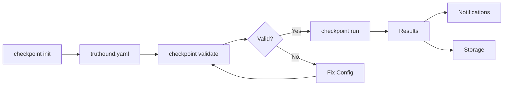

# 체크포인트 Commands

CI/CD 파이프라인 통합 commands for automated 데이터 품질 검증.

## 개요

| CLI 명령 실행에서 Command을(를) 기준으로 데이터 품질 검증, 워크플로우 자동화, 결과 해석 방법을 설명합니다. | CLI 명령 실행에서 Description을(를) 기준으로 데이터 품질 검증, 워크플로우 자동화, 결과 해석 방법을 설명합니다. | CLI 명령 실행에서 Primary, Case을(를) 기준으로 데이터 품질 검증, 워크플로우 자동화, 결과 해석 방법을 설명합니다. |
|---------|-------------|------------------|
| CLI 명령 실행에서 `run`을(를) 기준으로 데이터 품질 검증, 워크플로우 자동화, 결과 해석 방법을 설명합니다. | Run 검증 체크포인트 | CI/CD 파이프라인 execution |
| CLI 명령 실행에서 `list`을(를) 기준으로 데이터 품질 검증, 워크플로우 자동화, 결과 해석 방법을 설명합니다. | List available 체크포인트 | 설정 discovery |
| CLI 명령 실행에서 `validate`을(를) 기준으로 데이터 품질 검증, 워크플로우 자동화, 결과 해석 방법을 설명합니다. | Validate 설정 파일 | 설정 verification |
| CLI 명령 실행에서 `init`을(를) 기준으로 데이터 품질 검증, 워크플로우 자동화, 결과 해석 방법을 설명합니다. | Initialize sample 설정 | CLI 명령 실행에서 Quick을(를) 기준으로 데이터 품질 검증, 워크플로우 자동화, 결과 해석 방법을 설명합니다. |

## What is a 체크포인트?

A 체크포인트 is a reusable 검증 설정 that defines:

- CLI 명령 실행에서 Data, Files을(를) 기준으로 데이터 품질 검증, 워크플로우 자동화, 결과 해석 방법을 설명합니다.
- **검증기**: Rules to apply
- CLI 명령 실행에서 Notifications, Slack, GitHub을(를) 기준으로 데이터 품질 검증, 워크플로우 자동화, 결과 해석 방법을 설명합니다.
- **Storage**: Where to persist 결과

## 워크플로우



### 1. Initialize 설정

```bash
truthound checkpoint init -o truthound.yaml
```

### 2. Validate 설정

```bash
truthound checkpoint validate truthound.yaml --strict
```

### 3. Run 체크포인트

```bash
truthound checkpoint run my_checkpoint --config truthound.yaml --strict
```

## 설정 파일

체크포인트 설정 can be YAML or JSON:

```yaml
# truthound.yaml
checkpoints:
- name: daily_data_validation
  data_source: data/production.csv
  validators:
  - 'null'
  - duplicate
  - range
  - regex
  validator_config:
    regex:
      patterns:
        email: ^[\w.+-]+@[\w-]+\.[\w.-]+$
        product_code: ^[A-Z]{2,4}[-_][0-9]{3,6}$
        phone: ^(\+\d{1,3}[-.\s]?)?\(?\d{3}\)?[-.\s]?\d{3}[-.\s]?\d{4}$
    range:
      columns:
        age:
          min_value: 0
          max_value: 150
        price:
          min_value: 0
  min_severity: medium
  auto_schema: true
  tags:
    environment: production
    team: data-platform
  actions:
  - type: store_result
    store_path: ./truthound_results
    partition_by: date
  - type: update_docs
    site_path: ./truthound_docs
    include_history: true
  - type: slack
    webhook_url: https://hooks.slack.com/services/YOUR/WEBHOOK/URL
    notify_on: failure
    channel: '#data-quality'
  triggers:
  - type: schedule
    interval_hours: 24
    run_on_weekdays: [0, 1, 2, 3, 4]

- name: hourly_metrics_check
  data_source: data/metrics.parquet
  validators:
  - 'null'
  - range
  validator_config:
    range:
      columns:
        value:
          min_value: 0
          max_value: 100
        count:
          min_value: 0
  actions:
  - type: webhook
    url: https://api.example.com/data-quality/events
    auth_type: bearer
    auth_credentials:
      token: ${API_TOKEN}
  triggers:
  - type: cron
    expression: 0 * * * *
```

## 환경 변수

CLI 명령 실행에서 관련 설정과 실행 흐름을(를) 다루는 항목입니다:

```yaml
actions:
- type: slack
  webhook_url: ${SLACK_WEBHOOK_URL}
  notify_on: failure

- type: webhook
  url: ${WEBHOOK_URL}
  auth_type: bearer
  auth_credentials:
    token: ${API_TOKEN}
```

## CI/CD 통합

### GitHub Actions

```yaml
name: Data Quality Check

on:
  push:
    paths:
      - 'data/**'
  schedule:
    - cron: '0 6 * * *'

jobs:
  validate:
    runs-on: ubuntu-latest
    steps:
      - uses: actions/checkout@v4

      - name: Setup Python
        uses: actions/setup-python@v5
        with:
          python-version: '3.11'

      - name: Install Truthound
        run: pip install truthound

      - name: Validate Config
        run: truthound checkpoint validate truthound.yaml --strict

      - name: Run Checkpoint
        run: |
          truthound checkpoint run daily_data_validation \
            --config truthound.yaml \
            --strict \
            --github-summary
        env:
          SLACK_WEBHOOK_URL: ${{ secrets.SLACK_WEBHOOK_URL }}
```

### GitLab CI

```yaml
data-quality:
  stage: test
  script:
    - pip install truthound
    - truthound checkpoint validate truthound.yaml --strict
    - truthound checkpoint run daily_data_validation --config truthound.yaml --strict
  artifacts:
    when: on_failure
    paths:
      - .truthound/results/
```

### Jenkins

```groovy
pipeline {
    agent any
    stages {
        stage('Data Quality') {
            steps {
                sh 'pip install truthound'
                sh 'truthound checkpoint validate truthound.yaml --strict'
                sh 'truthound checkpoint run daily_data_validation --config truthound.yaml --strict'
            }
        }
    }
    post {
        failure {
            archiveArtifacts artifacts: '.truthound/results/**'
        }
    }
}
```

## Notification Providers

| CLI 명령 실행에서 Provider을(를) 기준으로 데이터 품질 검증, 워크플로우 자동화, 결과 해석 방법을 설명합니다. | 설정 | CLI 명령 실행에서 Description을(를) 기준으로 데이터 품질 검증, 워크플로우 자동화, 결과 해석 방법을 설명합니다. |
|----------|---------------|-------------|
| CLI 명령 실행에서 Slack을(를) 기준으로 데이터 품질 검증, 워크플로우 자동화, 결과 해석 방법을 설명합니다. | CLI 명령 실행에서 `webhook_url`을(를) 기준으로 데이터 품질 검증, 워크플로우 자동화, 결과 해석 방법을 설명합니다. | CLI 명령 실행에서 Slack을(를) 기준으로 데이터 품질 검증, 워크플로우 자동화, 결과 해석 방법을 설명합니다. |
| CLI 명령 실행에서 Webhook을(를) 기준으로 데이터 품질 검증, 워크플로우 자동화, 결과 해석 방법을 설명합니다. | CLI 명령 실행에서 `url`, `headers`을(를) 기준으로 데이터 품질 검증, 워크플로우 자동화, 결과 해석 방법을 설명합니다. | CLI 명령 실행에서 Generic, HTTP을(를) 기준으로 데이터 품질 검증, 워크플로우 자동화, 결과 해석 방법을 설명합니다. |
| CLI 명령 실행에서 GitHub을(를) 기준으로 데이터 품질 검증, 워크플로우 자동화, 결과 해석 방법을 설명합니다. | CLI 명령 실행에서 `--github-summary`을(를) 기준으로 데이터 품질 검증, 워크플로우 자동화, 결과 해석 방법을 설명합니다. | GitHub Actions 작업 summary |
| CLI 명령 실행에서 Email을(를) 기준으로 데이터 품질 검증, 워크플로우 자동화, 결과 해석 방법을 설명합니다. | CLI 명령 실행에서 `smtp`, `to`을(를) 기준으로 데이터 품질 검증, 워크플로우 자동화, 결과 해석 방법을 설명합니다. | CLI 명령 실행에서 Email을(를) 기준으로 데이터 품질 검증, 워크플로우 자동화, 결과 해석 방법을 설명합니다. |
| CLI 명령 실행에서 PagerDuty을(를) 기준으로 데이터 품질 검증, 워크플로우 자동화, 결과 해석 방법을 설명합니다. | CLI 명령 실행에서 `routing_key`을(를) 기준으로 데이터 품질 검증, 워크플로우 자동화, 결과 해석 방법을 설명합니다. | PagerDuty 알림 |
| CLI 명령 실행에서 Teams을(를) 기준으로 데이터 품질 검증, 워크플로우 자동화, 결과 해석 방법을 설명합니다. | CLI 명령 실행에서 `webhook_url`을(를) 기준으로 데이터 품질 검증, 워크플로우 자동화, 결과 해석 방법을 설명합니다. | CLI 명령 실행에서 Microsoft, Teams을(를) 기준으로 데이터 품질 검증, 워크플로우 자동화, 결과 해석 방법을 설명합니다. |
| CLI 명령 실행에서 Discord을(를) 기준으로 데이터 품질 검증, 워크플로우 자동화, 결과 해석 방법을 설명합니다. | CLI 명령 실행에서 `webhook_url`을(를) 기준으로 데이터 품질 검증, 워크플로우 자동화, 결과 해석 방법을 설명합니다. | CLI 명령 실행에서 Discord을(를) 기준으로 데이터 품질 검증, 워크플로우 자동화, 결과 해석 방법을 설명합니다. |
| CLI 명령 실행에서 Telegram을(를) 기준으로 데이터 품질 검증, 워크플로우 자동화, 결과 해석 방법을 설명합니다. | CLI 명령 실행에서 `bot_token`, `chat_id`을(를) 기준으로 데이터 품질 검증, 워크플로우 자동화, 결과 해석 방법을 설명합니다. | CLI 명령 실행에서 Telegram을(를) 기준으로 데이터 품질 검증, 워크플로우 자동화, 결과 해석 방법을 설명합니다. |

## Storage Backends

| CLI 명령 실행에서 Backend을(를) 기준으로 데이터 품질 검증, 워크플로우 자동화, 결과 해석 방법을 설명합니다. | 설정 | CLI 명령 실행에서 Description을(를) 기준으로 데이터 품질 검증, 워크플로우 자동화, 결과 해석 방법을 설명합니다. |
|---------|---------------|-------------|
| CLI 명령 실행에서 Filesystem을(를) 기준으로 데이터 품질 검증, 워크플로우 자동화, 결과 해석 방법을 설명합니다. | CLI 명령 실행에서 `path`을(를) 기준으로 데이터 품질 검증, 워크플로우 자동화, 결과 해석 방법을 설명합니다. | CLI 명령 실행에서 Local을(를) 기준으로 데이터 품질 검증, 워크플로우 자동화, 결과 해석 방법을 설명합니다. |
| CLI 명령 실행에서 관련 설정과 실행 흐름을(를) 기준으로 데이터 품질 검증, 워크플로우 자동화, 결과 해석 방법을 설명합니다. | CLI 명령 실행에서 `bucket`, `prefix`을(를) 기준으로 데이터 품질 검증, 워크플로우 자동화, 결과 해석 방법을 설명합니다. | CLI 명령 실행에서 AWS을(를) 기준으로 데이터 품질 검증, 워크플로우 자동화, 결과 해석 방법을 설명합니다. |
| CLI 명령 실행에서 GCS을(를) 기준으로 데이터 품질 검증, 워크플로우 자동화, 결과 해석 방법을 설명합니다. | CLI 명령 실행에서 `bucket`, `prefix`을(를) 기준으로 데이터 품질 검증, 워크플로우 자동화, 결과 해석 방법을 설명합니다. | CLI 명령 실행에서 Google, Cloud, Storage을(를) 기준으로 데이터 품질 검증, 워크플로우 자동화, 결과 해석 방법을 설명합니다. |
| CLI 명령 실행에서 Azure, Blob을(를) 기준으로 데이터 품질 검증, 워크플로우 자동화, 결과 해석 방법을 설명합니다. | CLI 명령 실행에서 `container`, `prefix`을(를) 기준으로 데이터 품질 검증, 워크플로우 자동화, 결과 해석 방법을 설명합니다. | CLI 명령 실행에서 Azure, Blob, Storage을(를) 기준으로 데이터 품질 검증, 워크플로우 자동화, 결과 해석 방법을 설명합니다. |

## 다음 단계

- [run](run.md) - Run 검증 체크포인트
- CLI 명령 실행에서 List을(를) 기준으로 데이터 품질 검증, 워크플로우 자동화, 결과 해석 방법을 설명합니다.
- [validate](validate.md) - Validate 설정
- [init](init.md) - Initialize 설정

## 함께 보기

- [CI/CD 통합 Guide](../../guides/ci-cd.md)
- CLI 명령 실행에서 Storage, Backends을(를) 기준으로 데이터 품질 검증, 워크플로우 자동화, 결과 해석 방법을 설명합니다.
- [Notification 설정](../../guides/notifications.md)
