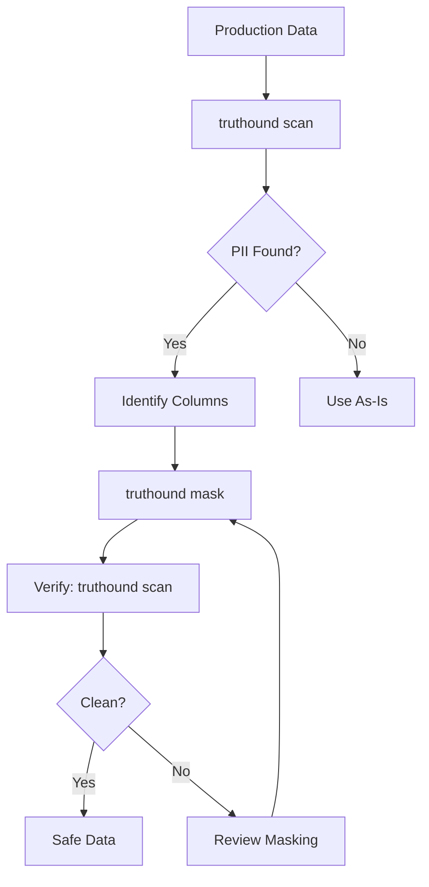

# truthound mask

CLI 명령 실행에서 Mask, PII을(를) 기준으로 데이터 품질 검증, 워크플로우 자동화, 결과 해석 방법을 설명합니다.

## Synopsis

```bash
truthound mask [FILE] -o <output> [OPTIONS]
```

## Arguments

| CLI 명령 실행에서 Argument을(를) 기준으로 데이터 품질 검증, 워크플로우 자동화, 결과 해석 방법을 설명합니다. | CLI 명령 실행에서 Required을(를) 기준으로 데이터 품질 검증, 워크플로우 자동화, 결과 해석 방법을 설명합니다. | CLI 명령 실행에서 Description을(를) 기준으로 데이터 품질 검증, 워크플로우 자동화, 결과 해석 방법을 설명합니다. |
|----------|----------|-------------|
| CLI 명령 실행에서 `file`을(를) 기준으로 데이터 품질 검증, 워크플로우 자동화, 결과 해석 방법을 설명합니다. | CLI 명령 실행에서 관련 설정과 실행 흐름을(를) 기준으로 데이터 품질 검증, 워크플로우 자동화, 결과 해석 방법을 설명합니다. | CLI 명령 실행에서 JSON, Path, CSV, Parquet, NDJSON, JSONL을(를) 기준으로 데이터 품질 검증, 워크플로우 자동화, 결과 해석 방법을 설명합니다. |

## Data 소스 Options

| CLI 명령 실행에서 Option을(를) 기준으로 데이터 품질 검증, 워크플로우 자동화, 결과 해석 방법을 설명합니다. | CLI 명령 실행에서 Short을(를) 기준으로 데이터 품질 검증, 워크플로우 자동화, 결과 해석 방법을 설명합니다. | CLI 명령 실행에서 Default을(를) 기준으로 데이터 품질 검증, 워크플로우 자동화, 결과 해석 방법을 설명합니다. | CLI 명령 실행에서 Description을(를) 기준으로 데이터 품질 검증, 워크플로우 자동화, 결과 해석 방법을 설명합니다. |
|--------|-------|---------|-------------|
| CLI 명령 실행에서 `--connection`을(를) 기준으로 데이터 품질 검증, 워크플로우 자동화, 결과 해석 방법을 설명합니다. | CLI 명령 실행에서 `--conn`을(를) 기준으로 데이터 품질 검증, 워크플로우 자동화, 결과 해석 방법을 설명합니다. | CLI 명령 실행에서 None을(를) 기준으로 데이터 품질 검증, 워크플로우 자동화, 결과 해석 방법을 설명합니다. | 데이터베이스 connection string |
| CLI 명령 실행에서 `--table`을(를) 기준으로 데이터 품질 검증, 워크플로우 자동화, 결과 해석 방법을 설명합니다. | | CLI 명령 실행에서 None을(를) 기준으로 데이터 품질 검증, 워크플로우 자동화, 결과 해석 방법을 설명합니다. | 데이터베이스 테이블 name |
| CLI 명령 실행에서 `--query`을(를) 기준으로 데이터 품질 검증, 워크플로우 자동화, 결과 해석 방법을 설명합니다. | | CLI 명령 실행에서 None을(를) 기준으로 데이터 품질 검증, 워크플로우 자동화, 결과 해석 방법을 설명합니다. | CLI 명령 실행에서 SQL, `--table`을(를) 기준으로 데이터 품질 검증, 워크플로우 자동화, 결과 해석 방법을 설명합니다. |
| CLI 명령 실행에서 `--source-config`을(를) 기준으로 데이터 품질 검증, 워크플로우 자동화, 결과 해석 방법을 설명합니다. | CLI 명령 실행에서 `--sc`을(를) 기준으로 데이터 품질 검증, 워크플로우 자동화, 결과 해석 방법을 설명합니다. | CLI 명령 실행에서 None을(를) 기준으로 데이터 품질 검증, 워크플로우 자동화, 결과 해석 방법을 설명합니다. | CLI 명령 실행에서 JSON, YAML, Path, JSON/YAML을(를) 기준으로 데이터 품질 검증, 워크플로우 자동화, 결과 해석 방법을 설명합니다. |
| CLI 명령 실행에서 `--source-name`을(를) 기준으로 데이터 품질 검증, 워크플로우 자동화, 결과 해석 방법을 설명합니다. | | CLI 명령 실행에서 None을(를) 기준으로 데이터 품질 검증, 워크플로우 자동화, 결과 해석 방법을 설명합니다. | CLI 명령 실행에서 Custom을(를) 기준으로 데이터 품질 검증, 워크플로우 자동화, 결과 해석 방법을 설명합니다. |

## Options

| CLI 명령 실행에서 Option을(를) 기준으로 데이터 품질 검증, 워크플로우 자동화, 결과 해석 방법을 설명합니다. | CLI 명령 실행에서 Short을(를) 기준으로 데이터 품질 검증, 워크플로우 자동화, 결과 해석 방법을 설명합니다. | CLI 명령 실행에서 Default을(를) 기준으로 데이터 품질 검증, 워크플로우 자동화, 결과 해석 방법을 설명합니다. | CLI 명령 실행에서 Description을(를) 기준으로 데이터 품질 검증, 워크플로우 자동화, 결과 해석 방법을 설명합니다. |
|--------|-------|---------|-------------|
| CLI 명령 실행에서 `--output`을(를) 기준으로 데이터 품질 검증, 워크플로우 자동화, 결과 해석 방법을 설명합니다. | CLI 명령 실행에서 `-o`을(를) 기준으로 데이터 품질 검증, 워크플로우 자동화, 결과 해석 방법을 설명합니다. | CLI 명령 실행에서 Required을(를) 기준으로 데이터 품질 검증, 워크플로우 자동화, 결과 해석 방법을 설명합니다. | Output 파일 path |
| CLI 명령 실행에서 `--columns`을(를) 기준으로 데이터 품질 검증, 워크플로우 자동화, 결과 해석 방법을 설명합니다. | CLI 명령 실행에서 `-c`을(를) 기준으로 데이터 품질 검증, 워크플로우 자동화, 결과 해석 방법을 설명합니다. | CLI 명령 실행에서 Auto-detect을(를) 기준으로 데이터 품질 검증, 워크플로우 자동화, 결과 해석 방법을 설명합니다. | Comma-separated 컬럼 to mask |
| CLI 명령 실행에서 `--strategy`을(를) 기준으로 데이터 품질 검증, 워크플로우 자동화, 결과 해석 방법을 설명합니다. | CLI 명령 실행에서 `-s`을(를) 기준으로 데이터 품질 검증, 워크플로우 자동화, 결과 해석 방법을 설명합니다. | CLI 명령 실행에서 `redact`을(를) 기준으로 데이터 품질 검증, 워크플로우 자동화, 결과 해석 방법을 설명합니다. | CLI 명령 실행에서 Masking을(를) 기준으로 데이터 품질 검증, 워크플로우 자동화, 결과 해석 방법을 설명합니다. |
| CLI 명령 실행에서 `--strict`을(를) 기준으로 데이터 품질 검증, 워크플로우 자동화, 결과 해석 방법을 설명합니다. | | CLI 명령 실행에서 `false`을(를) 기준으로 데이터 품질 검증, 워크플로우 자동화, 결과 해석 방법을 설명합니다. | CLI 명령 실행에서 Fail을(를) 기준으로 데이터 품질 검증, 워크플로우 자동화, 결과 해석 방법을 설명합니다. |

## Description

CLI 명령 실행에서 `mask`을(를) 다루는 항목입니다:

1. CLI 명령 실행에서 Auto-Detection, Mode, Automatically, PII을(를) 기준으로 데이터 품질 검증, 워크플로우 자동화, 결과 해석 방법을 설명합니다.
2. CLI 명령 실행에서 Explicit, Mode, Mask을(를) 기준으로 데이터 품질 검증, 워크플로우 자동화, 결과 해석 방법을 설명합니다.
3. CLI 명령 실행에서 Multiple, Strategies, Choose을(를) 기준으로 데이터 품질 검증, 워크플로우 자동화, 결과 해석 방법을 설명합니다.

### Masking Strategies

| CLI 명령 실행에서 Strategy을(를) 기준으로 데이터 품질 검증, 워크플로우 자동화, 결과 해석 방법을 설명합니다. | CLI 명령 실행에서 Description을(를) 기준으로 데이터 품질 검증, 워크플로우 자동화, 결과 해석 방법을 설명합니다. | CLI 명령 실행에서 Reversible을(를) 기준으로 데이터 품질 검증, 워크플로우 자동화, 결과 해석 방법을 설명합니다. | CLI 명령 실행에서 Example을(를) 기준으로 데이터 품질 검증, 워크플로우 자동화, 결과 해석 방법을 설명합니다. |
|----------|-------------|------------|---------|
| CLI 명령 실행에서 `redact`을(를) 기준으로 데이터 품질 검증, 워크플로우 자동화, 결과 해석 방법을 설명합니다. | CLI 명령 실행에서 Replace을(를) 기준으로 데이터 품질 검증, 워크플로우 자동화, 결과 해석 방법을 설명합니다. | CLI 명령 실행에서 관련 설정과 실행 흐름을(를) 기준으로 데이터 품질 검증, 워크플로우 자동화, 결과 해석 방법을 설명합니다. | CLI 명령 실행에서 `john@example.com`, `****`을(를) 기준으로 데이터 품질 검증, 워크플로우 자동화, 결과 해석 방법을 설명합니다. |
| CLI 명령 실행에서 `hash`을(를) 기준으로 데이터 품질 검증, 워크플로우 자동화, 결과 해석 방법을 설명합니다. | CLI 명령 실행에서 SHA-256을(를) 기준으로 데이터 품질 검증, 워크플로우 자동화, 결과 해석 방법을 설명합니다. | CLI 명령 실행에서 관련 설정과 실행 흐름을(를) 기준으로 데이터 품질 검증, 워크플로우 자동화, 결과 해석 방법을 설명합니다. | CLI 명령 실행에서 `john@example.com`, `a8b9c0d1e2f3...`을(를) 기준으로 데이터 품질 검증, 워크플로우 자동화, 결과 해석 방법을 설명합니다. |
| CLI 명령 실행에서 `fake`을(를) 기준으로 데이터 품질 검증, 워크플로우 자동화, 결과 해석 방법을 설명합니다. | CLI 명령 실행에서 Realistic을(를) 기준으로 데이터 품질 검증, 워크플로우 자동화, 결과 해석 방법을 설명합니다. | CLI 명령 실행에서 관련 설정과 실행 흐름을(를) 기준으로 데이터 품질 검증, 워크플로우 자동화, 결과 해석 방법을 설명합니다. | CLI 명령 실행에서 `john@example.com`, `alice@fake.net`을(를) 기준으로 데이터 품질 검증, 워크플로우 자동화, 결과 해석 방법을 설명합니다. |

## 예시

### Basic Masking (Auto-Detection)

CLI 명령 실행에서 Automatically, PII을(를) 다루는 항목입니다:

```bash
truthound mask data.csv -o masked.csv
```

CLI 명령 실행에서 Output을(를) 다루는 항목입니다:
```
Masked data written to masked.csv
```

CLI 명령 실행에서 `--strict`, Note, PII, Warnings을(를) 기준으로 데이터 품질 검증, 워크플로우 자동화, 결과 해석 방법을 설명합니다.

### Mask Specific 컬럼

Explicitly specify 컬럼 to mask:

```bash
truthound mask data.csv -o masked.csv -c email,phone,ssn
```

### Hash Strategy

CLI 명령 실행에서 관련 설정과 실행 흐름을(를) 다루는 항목입니다:

```bash
truthound mask data.csv -o masked.csv --strategy hash
```

CLI 명령 실행에서 Benefits을(를) 다루는 항목입니다:
- CLI 명령 실행에서 Same을(를) 기준으로 데이터 품질 검증, 워크플로우 자동화, 결과 해석 방법을 설명합니다.
- CLI 명령 실행에서 Can을(를) 기준으로 데이터 품질 검증, 워크플로우 자동화, 결과 해석 방법을 설명합니다.
- CLI 명령 실행에서 Cannot을(를) 기준으로 데이터 품질 검증, 워크플로우 자동화, 결과 해석 방법을 설명합니다.

### Fake Data Strategy

CLI 명령 실행에서 Replace을(를) 다루는 항목입니다:

```bash
truthound mask data.csv -o masked.csv --strategy fake
```

CLI 명령 실행에서 Benefits을(를) 다루는 항목입니다:
- CLI 명령 실행에서 Data을(를) 기준으로 데이터 품질 검증, 워크플로우 자동화, 결과 해석 방법을 설명합니다.
- CLI 명령 실행에서 Maintains을(를) 기준으로 데이터 품질 검증, 워크플로우 자동화, 결과 해석 방법을 설명합니다.
- CLI 명령 실행에서 Useful을(를) 기준으로 데이터 품질 검증, 워크플로우 자동화, 결과 해석 방법을 설명합니다.

### Strict Mode

CLI 명령 실행에서 Fail을(를) 다루는 항목입니다:

```bash
# This will fail if 'nonexistent' column doesn't exist
truthound mask data.csv -o masked.csv -c email,nonexistent --strict
```

CLI 명령 실행에서 `--strict`을(를) 다루는 항목입니다:

```bash
# This will warn but continue with existing columns
truthound mask data.csv -o masked.csv -c email,nonexistent
# Warning: Column 'nonexistent' not found. Skipping.
```

## Strategy Comparison

### Redact

```
Original:     john.doe@example.com
Redacted:     ****

Original:     +1-555-123-4567
Redacted:     ****

Original:     123-45-6789
Redacted:     ****
```

CLI 명령 실행에서 Best, Maximum을(를) 기준으로 데이터 품질 검증, 워크플로우 자동화, 결과 해석 방법을 설명합니다.

### Hash

```
Original:     john.doe@example.com
Hashed:       a8b9c0d1e2f34567

Original:     +1-555-123-4567
Hashed:       b2c3d4e5f6a78901

Original:     123-45-6789
Hashed:       c3d4e5f6a7890123
```

CLI 명령 실행에서 Best, Data을(를) 기준으로 데이터 품질 검증, 워크플로우 자동화, 결과 해석 방법을 설명합니다.

### Fake

```
Original:     john.doe@example.com
Fake:         alice.smith@fake.net

Original:     +1-555-123-4567
Fake:         +1-555-987-6543

Original:     123-45-6789
Fake:         987-65-4321
```

CLI 명령 실행에서 Best, Testing을(를) 기준으로 데이터 품질 검증, 워크플로우 자동화, 결과 해석 방법을 설명합니다.

## Output Formats

CLI 명령 실행에서 관련 설정과 실행 흐름을(를) 다루는 항목입니다:

```bash
# CSV output
truthound mask data.csv -o masked.csv

# Parquet output
truthound mask data.csv -o masked.parquet

# JSON output
truthound mask data.csv -o masked.json
```

## Use Cases

### 1. Data Sharing

CLI 명령 실행에서 Prepare을(를) 다루는 항목입니다:

```bash
# Scan to identify PII
truthound scan production.csv

# Mask detected PII
truthound mask production.csv -o shareable.csv --strategy hash
```

### 2. Test Data Generation

CLI 명령 실행에서 Create을(를) 다루는 항목입니다:

```bash
truthound mask production.parquet -o test_data.parquet --strategy fake
```

### 3. Compliance 파이프라인

GDPR/CCPA compliance 워크플로우:

```bash
# Export data with PII masked
truthound mask customer_export.csv -o compliant_export.csv -c email,phone,address
```

### 4. CI/CD 통합

CLI 명령 실행에서 Mask을(를) 다루는 항목입니다:

```yaml
- name: Anonymize Test Data
  run: |
    truthound mask fixtures/users.csv -o fixtures/users_safe.csv --strategy hash
    truthound mask fixtures/orders.csv -o fixtures/orders_safe.csv --strategy hash
```

## 워크플로우 Example



## 성능

CLI 명령 실행에서 관련 설정과 실행 흐름을(를) 다루는 항목입니다:

- CLI 명령 실행에서 Polars, Streaming, Mode, Files을(를) 기준으로 데이터 품질 검증, 워크플로우 자동화, 결과 해석 방법을 설명합니다.
- CLI 명령 실행에서 Polars, Native, Expressions을(를) 기준으로 데이터 품질 검증, 워크플로우 자동화, 결과 해석 방법을 설명합니다.
- CLI 명령 실행에서 Memory, Efficient, Processes을(를) 기준으로 데이터 품질 검증, 워크플로우 자동화, 결과 해석 방법을 설명합니다.

```bash
# Large file masking (handled efficiently)
truthound mask large_file.parquet -o masked_large.parquet --strategy hash
```

## Related Commands

- CLI 명령 실행에서 `scan`, Scan, PII을(를) 기준으로 데이터 품질 검증, 워크플로우 자동화, 결과 해석 방법을 설명합니다.
- [`check`](check.md) - Validate 데이터 품질

## 함께 보기

- CLI 명령 실행에서 API, Python을(를) 기준으로 데이터 품질 검증, 워크플로우 자동화, 결과 해석 방법을 설명합니다.
- CLI 명령 실행에서 Data, Privacy, Guide을(를) 기준으로 데이터 품질 검증, 워크플로우 자동화, 결과 해석 방법을 설명합니다.
- CLI 명령 실행에서 Masking, Strategies을(를) 기준으로 데이터 품질 검증, 워크플로우 자동화, 결과 해석 방법을 설명합니다.
