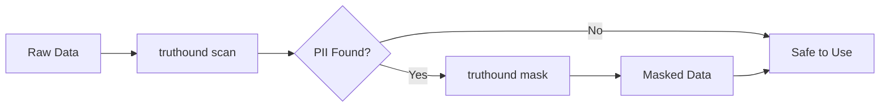

# truthound scan

CLI 명령 실행에서 Scan, PII을(를) 기준으로 데이터 품질 검증, 워크플로우 자동화, 결과 해석 방법을 설명합니다.

## Synopsis

```bash
truthound scan [FILE] [OPTIONS]
```

## Arguments

| CLI 명령 실행에서 Argument을(를) 기준으로 데이터 품질 검증, 워크플로우 자동화, 결과 해석 방법을 설명합니다. | CLI 명령 실행에서 Required을(를) 기준으로 데이터 품질 검증, 워크플로우 자동화, 결과 해석 방법을 설명합니다. | CLI 명령 실행에서 Description을(를) 기준으로 데이터 품질 검증, 워크플로우 자동화, 결과 해석 방법을 설명합니다. |
|----------|----------|-------------|
| CLI 명령 실행에서 `file`을(를) 기준으로 데이터 품질 검증, 워크플로우 자동화, 결과 해석 방법을 설명합니다. | CLI 명령 실행에서 관련 설정과 실행 흐름을(를) 기준으로 데이터 품질 검증, 워크플로우 자동화, 결과 해석 방법을 설명합니다. | CLI 명령 실행에서 JSON, Path, CSV, Parquet, NDJSON, JSONL을(를) 기준으로 데이터 품질 검증, 워크플로우 자동화, 결과 해석 방법을 설명합니다. |

## Data 소스 Options

| CLI 명령 실행에서 Option을(를) 기준으로 데이터 품질 검증, 워크플로우 자동화, 결과 해석 방법을 설명합니다. | CLI 명령 실행에서 Short을(를) 기준으로 데이터 품질 검증, 워크플로우 자동화, 결과 해석 방법을 설명합니다. | CLI 명령 실행에서 Default을(를) 기준으로 데이터 품질 검증, 워크플로우 자동화, 결과 해석 방법을 설명합니다. | CLI 명령 실행에서 Description을(를) 기준으로 데이터 품질 검증, 워크플로우 자동화, 결과 해석 방법을 설명합니다. |
|--------|-------|---------|-------------|
| CLI 명령 실행에서 `--connection`을(를) 기준으로 데이터 품질 검증, 워크플로우 자동화, 결과 해석 방법을 설명합니다. | CLI 명령 실행에서 `--conn`을(를) 기준으로 데이터 품질 검증, 워크플로우 자동화, 결과 해석 방법을 설명합니다. | CLI 명령 실행에서 None을(를) 기준으로 데이터 품질 검증, 워크플로우 자동화, 결과 해석 방법을 설명합니다. | 데이터베이스 connection string |
| CLI 명령 실행에서 `--table`을(를) 기준으로 데이터 품질 검증, 워크플로우 자동화, 결과 해석 방법을 설명합니다. | | CLI 명령 실행에서 None을(를) 기준으로 데이터 품질 검증, 워크플로우 자동화, 결과 해석 방법을 설명합니다. | 데이터베이스 테이블 name |
| CLI 명령 실행에서 `--query`을(를) 기준으로 데이터 품질 검증, 워크플로우 자동화, 결과 해석 방법을 설명합니다. | | CLI 명령 실행에서 None을(를) 기준으로 데이터 품질 검증, 워크플로우 자동화, 결과 해석 방법을 설명합니다. | CLI 명령 실행에서 SQL, `--table`을(를) 기준으로 데이터 품질 검증, 워크플로우 자동화, 결과 해석 방법을 설명합니다. |
| CLI 명령 실행에서 `--source-config`을(를) 기준으로 데이터 품질 검증, 워크플로우 자동화, 결과 해석 방법을 설명합니다. | CLI 명령 실행에서 `--sc`을(를) 기준으로 데이터 품질 검증, 워크플로우 자동화, 결과 해석 방법을 설명합니다. | CLI 명령 실행에서 None을(를) 기준으로 데이터 품질 검증, 워크플로우 자동화, 결과 해석 방법을 설명합니다. | CLI 명령 실행에서 JSON, YAML, Path, JSON/YAML을(를) 기준으로 데이터 품질 검증, 워크플로우 자동화, 결과 해석 방법을 설명합니다. |
| CLI 명령 실행에서 `--source-name`을(를) 기준으로 데이터 품질 검증, 워크플로우 자동화, 결과 해석 방법을 설명합니다. | | CLI 명령 실행에서 None을(를) 기준으로 데이터 품질 검증, 워크플로우 자동화, 결과 해석 방법을 설명합니다. | CLI 명령 실행에서 Custom을(를) 기준으로 데이터 품질 검증, 워크플로우 자동화, 결과 해석 방법을 설명합니다. |

## Options

| CLI 명령 실행에서 Option을(를) 기준으로 데이터 품질 검증, 워크플로우 자동화, 결과 해석 방법을 설명합니다. | CLI 명령 실행에서 Short을(를) 기준으로 데이터 품질 검증, 워크플로우 자동화, 결과 해석 방법을 설명합니다. | CLI 명령 실행에서 Default을(를) 기준으로 데이터 품질 검증, 워크플로우 자동화, 결과 해석 방법을 설명합니다. | CLI 명령 실행에서 Description을(를) 기준으로 데이터 품질 검증, 워크플로우 자동화, 결과 해석 방법을 설명합니다. |
|--------|-------|---------|-------------|
| CLI 명령 실행에서 `--format`을(를) 기준으로 데이터 품질 검증, 워크플로우 자동화, 결과 해석 방법을 설명합니다. | CLI 명령 실행에서 `-f`을(를) 기준으로 데이터 품질 검증, 워크플로우 자동화, 결과 해석 방법을 설명합니다. | CLI 명령 실행에서 `console`을(를) 기준으로 데이터 품질 검증, 워크플로우 자동화, 결과 해석 방법을 설명합니다. | CLI 명령 실행에서 Output을(를) 기준으로 데이터 품질 검증, 워크플로우 자동화, 결과 해석 방법을 설명합니다. |
| CLI 명령 실행에서 `--output`을(를) 기준으로 데이터 품질 검증, 워크플로우 자동화, 결과 해석 방법을 설명합니다. | CLI 명령 실행에서 `-o`을(를) 기준으로 데이터 품질 검증, 워크플로우 자동화, 결과 해석 방법을 설명합니다. | CLI 명령 실행에서 None을(를) 기준으로 데이터 품질 검증, 워크플로우 자동화, 결과 해석 방법을 설명합니다. | CLI 명령 실행에서 Output을(를) 기준으로 데이터 품질 검증, 워크플로우 자동화, 결과 해석 방법을 설명합니다. |

## Description

CLI 명령 실행에서 `scan`, PII을(를) 다루는 항목입니다:

- CLI 명령 실행에서 Contact, Information, Email을(를) 기준으로 데이터 품질 검증, 워크플로우 자동화, 결과 해석 방법을 설명합니다.
- CLI 명령 실행에서 Identity, Documents, SSN, IDs을(를) 기준으로 데이터 품질 검증, 워크플로우 자동화, 결과 해석 방법을 설명합니다.
- CLI 명령 실행에서 Financial, Data, Credit을(를) 기준으로 데이터 품질 검증, 워크플로우 자동화, 결과 해석 방법을 설명합니다.
- CLI 명령 실행에서 Location, Data, Addresses을(를) 기준으로 데이터 품질 검증, 워크플로우 자동화, 결과 해석 방법을 설명합니다.
- CLI 명령 실행에서 Names, Person을(를) 기준으로 데이터 품질 검증, 워크플로우 자동화, 결과 해석 방법을 설명합니다.

CLI 명령 실행에서 PII을(를) 기준으로 데이터 품질 검증, 워크플로우 자동화, 결과 해석 방법을 설명합니다.

## 예시

### Basic PII Scan

```bash
truthound scan customers.csv
```

CLI 명령 실행에서 Output을(를) 다루는 항목입니다:
```
PII Scan Report
===============
File: customers.csv
Rows: 1000
Columns: 8

Potential PII Detected:

  Column          Type              Confidence    Samples
  ──────────────────────────────────────────────────────────
  email           Email             98%           john@example.com, ...
  phone           Phone Number      95%           +1-555-123-4567, ...
  ssn             SSN               99%           123-45-6789, ...
  full_name       Person Name       85%           John Smith, ...

Recommendations:
  - Consider masking 'email', 'phone', 'ssn' columns before sharing
  - Use 'truthound mask' to anonymize sensitive data
```

### JSON Output

```bash
truthound scan data.csv --format json -o pii_report.json
```

Output 파일:
```json
{
  "file": "data.csv",
  "rows": 1000,
  "columns": 8,
  "findings": [
    {
      "column": "email",
      "pii_type": "email",
      "confidence": 0.98,
      "match_count": 950,
      "sample_values": ["john@example.com", "jane@test.org"]
    },
    {
      "column": "ssn",
      "pii_type": "ssn",
      "confidence": 0.99,
      "match_count": 1000,
      "sample_values": ["***-**-****"]
    }
  ],
  "summary": {
    "total_pii_columns": 4,
    "high_confidence": 3,
    "medium_confidence": 1
  }
}
```

### HTML 리포트

```bash
# Requires: pip install truthound[reports]
truthound scan customers.csv --format html -o pii_report.html
```

CLI 명령 실행에서 HTML, Generates을(를) 다루는 항목입니다:

- CLI 명령 실행에서 Visual, PII을(를) 기준으로 데이터 품질 검증, 워크플로우 자동화, 결과 해석 방법을 설명합니다.
- 컬럼-by-컬럼 breakdown
- CLI 명령 실행에서 Confidence을(를) 기준으로 데이터 품질 검증, 워크플로우 자동화, 결과 해석 방법을 설명합니다.
- CLI 명령 실행에서 Remediation을(를) 기준으로 데이터 품질 검증, 워크플로우 자동화, 결과 해석 방법을 설명합니다.

!!! warning "참고"
CLI 명령 실행에서 HTML, Jinja2, Install을(를) 다루는 항목입니다:
    ```bash
    pip install truthound[reports]
    ```

## Detected PII Types

### Contact Information

| CLI 명령 실행에서 Type을(를) 기준으로 데이터 품질 검증, 워크플로우 자동화, 결과 해석 방법을 설명합니다. | CLI 명령 실행에서 Pattern을(를) 기준으로 데이터 품질 검증, 워크플로우 자동화, 결과 해석 방법을 설명합니다. | CLI 명령 실행에서 Example을(를) 기준으로 데이터 품질 검증, 워크플로우 자동화, 결과 해석 방법을 설명합니다. |
|------|---------|---------|
| CLI 명령 실행에서 Email을(를) 기준으로 데이터 품질 검증, 워크플로우 자동화, 결과 해석 방법을 설명합니다. | CLI 명령 실행에서 RFC을(를) 기준으로 데이터 품질 검증, 워크플로우 자동화, 결과 해석 방법을 설명합니다. | CLI 명령 실행에서 `john@example.com`을(를) 기준으로 데이터 품질 검증, 워크플로우 자동화, 결과 해석 방법을 설명합니다. |
| CLI 명령 실행에서 Phone을(를) 기준으로 데이터 품질 검증, 워크플로우 자동화, 결과 해석 방법을 설명합니다. | CLI 명령 실행에서 International을(를) 기준으로 데이터 품질 검증, 워크플로우 자동화, 결과 해석 방법을 설명합니다. | CLI 명령 실행에서 `+1-555-123-4567`을(를) 기준으로 데이터 품질 검증, 워크플로우 자동화, 결과 해석 방법을 설명합니다. |
| CLI 명령 실행에서 Address을(를) 기준으로 데이터 품질 검증, 워크플로우 자동화, 결과 해석 방법을 설명합니다. | CLI 명령 실행에서 Street을(를) 기준으로 데이터 품질 검증, 워크플로우 자동화, 결과 해석 방법을 설명합니다. | CLI 명령 실행에서 `123 Main St, City`, Main, City을(를) 기준으로 데이터 품질 검증, 워크플로우 자동화, 결과 해석 방법을 설명합니다. |

### Identity Documents

| CLI 명령 실행에서 Type을(를) 기준으로 데이터 품질 검증, 워크플로우 자동화, 결과 해석 방법을 설명합니다. | CLI 명령 실행에서 Pattern을(를) 기준으로 데이터 품질 검증, 워크플로우 자동화, 결과 해석 방법을 설명합니다. | CLI 명령 실행에서 Example을(를) 기준으로 데이터 품질 검증, 워크플로우 자동화, 결과 해석 방법을 설명합니다. |
|------|---------|---------|
| CLI 명령 실행에서 SSN을(를) 기준으로 데이터 품질 검증, 워크플로우 자동화, 결과 해석 방법을 설명합니다. | US Social 보안 Number | CLI 명령 실행에서 `123-45-6789`을(를) 기준으로 데이터 품질 검증, 워크플로우 자동화, 결과 해석 방법을 설명합니다. |
| CLI 명령 실행에서 Passport을(를) 기준으로 데이터 품질 검증, 워크플로우 자동화, 결과 해석 방법을 설명합니다. | CLI 명령 실행에서 Passport을(를) 기준으로 데이터 품질 검증, 워크플로우 자동화, 결과 해석 방법을 설명합니다. | CLI 명령 실행에서 `AB1234567`, AB1234567을(를) 기준으로 데이터 품질 검증, 워크플로우 자동화, 결과 해석 방법을 설명합니다. |
| CLI 명령 실행에서 Korean, RRN을(를) 기준으로 데이터 품질 검증, 워크플로우 자동화, 결과 해석 방법을 설명합니다. | CLI 명령 실행에서 Korean, Resident, Registration을(를) 기준으로 데이터 품질 검증, 워크플로우 자동화, 결과 해석 방법을 설명합니다. | CLI 명령 실행에서 `123456-1234567`을(를) 기준으로 데이터 품질 검증, 워크플로우 자동화, 결과 해석 방법을 설명합니다. |
| CLI 명령 실행에서 National을(를) 기준으로 데이터 품질 검증, 워크플로우 자동화, 결과 해석 방법을 설명합니다. | CLI 명령 실행에서 Various을(를) 기준으로 데이터 품질 검증, 워크플로우 자동화, 결과 해석 방법을 설명합니다. | CLI 명령 실행에서 Various을(를) 기준으로 데이터 품질 검증, 워크플로우 자동화, 결과 해석 방법을 설명합니다. |

### Financial Data

| CLI 명령 실행에서 Type을(를) 기준으로 데이터 품질 검증, 워크플로우 자동화, 결과 해석 방법을 설명합니다. | CLI 명령 실행에서 Pattern을(를) 기준으로 데이터 품질 검증, 워크플로우 자동화, 결과 해석 방법을 설명합니다. | CLI 명령 실행에서 Example을(를) 기준으로 데이터 품질 검증, 워크플로우 자동화, 결과 해석 방법을 설명합니다. |
|------|---------|---------|
| CLI 명령 실행에서 Credit, Card을(를) 기준으로 데이터 품질 검증, 워크플로우 자동화, 결과 해석 방법을 설명합니다. | CLI 명령 실행에서 Visa, Amex을(를) 기준으로 데이터 품질 검증, 워크플로우 자동화, 결과 해석 방법을 설명합니다. | CLI 명령 실행에서 `4111-1111-1111-1111`을(를) 기준으로 데이터 품질 검증, 워크플로우 자동화, 결과 해석 방법을 설명합니다. |
| CLI 명령 실행에서 Bank, Account을(를) 기준으로 데이터 품질 검증, 워크플로우 자동화, 결과 해석 방법을 설명합니다. | CLI 명령 실행에서 Bank을(를) 기준으로 데이터 품질 검증, 워크플로우 자동화, 결과 해석 방법을 설명합니다. | CLI 명령 실행에서 `****1234`을(를) 기준으로 데이터 품질 검증, 워크플로우 자동화, 결과 해석 방법을 설명합니다. |
| CLI 명령 실행에서 IBAN을(를) 기준으로 데이터 품질 검증, 워크플로우 자동화, 결과 해석 방법을 설명합니다. | CLI 명령 실행에서 International, Bank, Account을(를) 기준으로 데이터 품질 검증, 워크플로우 자동화, 결과 해석 방법을 설명합니다. | CLI 명령 실행에서 `DE89370400440532013000`, DE89370400440532013000을(를) 기준으로 데이터 품질 검증, 워크플로우 자동화, 결과 해석 방법을 설명합니다. |

### Other

| CLI 명령 실행에서 Type을(를) 기준으로 데이터 품질 검증, 워크플로우 자동화, 결과 해석 방법을 설명합니다. | CLI 명령 실행에서 Pattern을(를) 기준으로 데이터 품질 검증, 워크플로우 자동화, 결과 해석 방법을 설명합니다. | CLI 명령 실행에서 Example을(를) 기준으로 데이터 품질 검증, 워크플로우 자동화, 결과 해석 방법을 설명합니다. |
|------|---------|---------|
| CLI 명령 실행에서 Address을(를) 기준으로 데이터 품질 검증, 워크플로우 자동화, 결과 해석 방법을 설명합니다. | CLI 명령 실행에서 IPv4/IPv6을(를) 기준으로 데이터 품질 검증, 워크플로우 자동화, 결과 해석 방법을 설명합니다. | CLI 명령 실행에서 `192.168.1.1`을(를) 기준으로 데이터 품질 검증, 워크플로우 자동화, 결과 해석 방법을 설명합니다. |
| CLI 명령 실행에서 Date, Birth을(를) 기준으로 데이터 품질 검증, 워크플로우 자동화, 결과 해석 방법을 설명합니다. | CLI 명령 실행에서 Date을(를) 기준으로 데이터 품질 검증, 워크플로우 자동화, 결과 해석 방법을 설명합니다. | CLI 명령 실행에서 `1990-01-15`을(를) 기준으로 데이터 품질 검증, 워크플로우 자동화, 결과 해석 방법을 설명합니다. |
| CLI 명령 실행에서 Person, Name을(를) 기준으로 데이터 품질 검증, 워크플로우 자동화, 결과 해석 방법을 설명합니다. | CLI 명령 실행에서 Name을(를) 기준으로 데이터 품질 검증, 워크플로우 자동화, 결과 해석 방법을 설명합니다. | CLI 명령 실행에서 `John Smith`, John, Smith을(를) 기준으로 데이터 품질 검증, 워크플로우 자동화, 결과 해석 방법을 설명합니다. |

## Confidence Levels

| CLI 명령 실행에서 Level을(를) 기준으로 데이터 품질 검증, 워크플로우 자동화, 결과 해석 방법을 설명합니다. | CLI 명령 실행에서 Score을(를) 기준으로 데이터 품질 검증, 워크플로우 자동화, 결과 해석 방법을 설명합니다. | CLI 명령 실행에서 Interpretation을(를) 기준으로 데이터 품질 검증, 워크플로우 자동화, 결과 해석 방법을 설명합니다. |
|-------|-------|----------------|
| CLI 명령 실행에서 High을(를) 기준으로 데이터 품질 검증, 워크플로우 자동화, 결과 해석 방법을 설명합니다. | CLI 명령 실행에서 관련 설정과 실행 흐름을(를) 기준으로 데이터 품질 검증, 워크플로우 자동화, 결과 해석 방법을 설명합니다. | CLI 명령 실행에서 Very, PII을(를) 기준으로 데이터 품질 검증, 워크플로우 자동화, 결과 해석 방법을 설명합니다. |
| CLI 명령 실행에서 Medium을(를) 기준으로 데이터 품질 검증, 워크플로우 자동화, 결과 해석 방법을 설명합니다. | CLI 명령 실행에서 관련 설정과 실행 흐름을(를) 기준으로 데이터 품질 검증, 워크플로우 자동화, 결과 해석 방법을 설명합니다. | CLI 명령 실행에서 Possible, PII을(를) 기준으로 데이터 품질 검증, 워크플로우 자동화, 결과 해석 방법을 설명합니다. |
| CLI 명령 실행에서 Low을(를) 기준으로 데이터 품질 검증, 워크플로우 자동화, 결과 해석 방법을 설명합니다. | CLI 명령 실행에서 관련 설정과 실행 흐름을(를) 기준으로 데이터 품질 검증, 워크플로우 자동화, 결과 해석 방법을 설명합니다. | CLI 명령 실행에서 May, PII을(를) 기준으로 데이터 품질 검증, 워크플로우 자동화, 결과 해석 방법을 설명합니다. |

## Use Cases

### 1. Pre-Sharing Data Review

CLI 명령 실행에서 관련 설정과 실행 흐름을(를) 다루는 항목입니다:

```bash
# Scan for PII
truthound scan export_data.csv

# If PII found, mask it
truthound mask export_data.csv -o safe_export.csv
```

### 2. Compliance 감사

Generate 감사 리포트 for compliance:

```bash
truthound scan *.csv --format json -o compliance_audit.json
```

### 3. CI/CD 파이프라인

CLI 명령 실행에서 Prevent, PII을(를) 다루는 항목입니다:

```yaml
- name: Check for PII
  run: |
    truthound scan output/*.csv --format json -o pii_scan.json
    if grep -q '"total_pii_columns": [1-9]' pii_scan.json; then
      echo "PII detected! Review required."
      exit 1
    fi
```

### 4. Data Catalog 통합

CLI 명령 실행에서 Automated, PII을(를) 다루는 항목입니다:

```bash
for file in data/*.parquet; do
  truthound scan "$file" --format json -o "scans/$(basename $file .parquet)_pii.json"
done
```

## 워크플로우 with Masking



```bash
# Step 1: Scan for PII
truthound scan customers.csv --format json -o scan_result.json

# Step 2: If PII found, mask the columns
truthound mask customers.csv -o customers_safe.csv -c email,phone,ssn

# Step 3: Verify masking
truthound scan customers_safe.csv
```

## Related Commands

- CLI 명령 실행에서 `mask`, Mask을(를) 기준으로 데이터 품질 검증, 워크플로우 자동화, 결과 해석 방법을 설명합니다.
- [`check`](check.md) - Validate 데이터 품질

## 함께 보기

- CLI 명령 실행에서 API, Python을(를) 기준으로 데이터 품질 검증, 워크플로우 자동화, 결과 해석 방법을 설명합니다.
- CLI 명령 실행에서 Data, Masking, Guide을(를) 기준으로 데이터 품질 검증, 워크플로우 자동화, 결과 해석 방법을 설명합니다.
- [개인정보 Compliance](../../guides/privacy.md)
