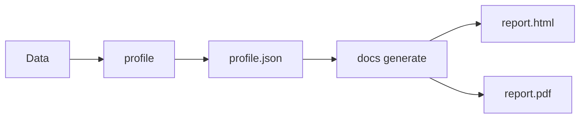

# 문서 명령

CLI 명령 실행에서 Documentation을(를) 기준으로 데이터 품질 검증, 워크플로우 자동화, 결과 해석 방법을 설명합니다.

## 개요

| CLI 명령 실행에서 Command을(를) 기준으로 데이터 품질 검증, 워크플로우 자동화, 결과 해석 방법을 설명합니다. | CLI 명령 실행에서 Description을(를) 기준으로 데이터 품질 검증, 워크플로우 자동화, 결과 해석 방법을 설명합니다. | CLI 명령 실행에서 Primary, Case을(를) 기준으로 데이터 품질 검증, 워크플로우 자동화, 결과 해석 방법을 설명합니다. |
|---------|-------------|------------------|
| CLI 명령 실행에서 `generate`을(를) 기준으로 데이터 품질 검증, 워크플로우 자동화, 결과 해석 방법을 설명합니다. | Generate HTML/PDF 리포트 | Static 리포트 creation |
| CLI 명령 실행에서 `themes`을(를) 기준으로 데이터 품질 검증, 워크플로우 자동화, 결과 해석 방법을 설명합니다. | CLI 명령 실행에서 List을(를) 기준으로 데이터 품질 검증, 워크플로우 자동화, 결과 해석 방법을 설명합니다. | CLI 명령 실행에서 Theme을(를) 기준으로 데이터 품질 검증, 워크플로우 자동화, 결과 해석 방법을 설명합니다. |

## What are Data Docs?

CLI 명령 실행에서 Data Docs, Data, Docs을(를) 다루는 항목입니다:

- CLI 명령 실행에서 HTML, Static, Self-contained을(를) 기준으로 데이터 품질 검증, 워크플로우 자동화, 결과 해석 방법을 설명합니다.
- **PDF 리포트** - Print-ready documentation
- CLI 명령 실행에서 CI/CD, Store을(를) 기준으로 데이터 품질 검증, 워크플로우 자동화, 결과 해석 방법을 설명합니다.
- CLI 명령 실행에서 Shareable, Email, Slack을(를) 기준으로 데이터 품질 검증, 워크플로우 자동화, 결과 해석 방법을 설명합니다.

## 워크플로우



## Quick 예시

### Generate HTML 리포트

```bash
# Basic HTML report
truthound docs generate profile.json -o report.html

# With custom title and theme
truthound docs generate profile.json -o report.html --title "Q4 Data Report" --theme dark
```

### Generate PDF 리포트

```bash
# PDF output
truthound docs generate profile.json -o report.pdf --format pdf
```

!!! warning "참고"
CLI 명령 실행에서 PDF, WeasyPrint, Pango, Cairo을(를) 기준으로 데이터 품질 검증, 워크플로우 자동화, 결과 해석 방법을 설명합니다.

    ```bash
    # macOS
    brew install pango cairo gdk-pixbuf libffi

    # Ubuntu/Debian
    sudo apt-get install libpango-1.0-0 libpangocairo-1.0-0 libgdk-pixbuf2.0-0 libffi-dev

    # Then install Python package
    pip install truthound[pdf]
    ```

CLI 명령 실행에서 Data Docs, See, Data, Docs, Guide을(를) 기준으로 데이터 품질 검증, 워크플로우 자동화, 결과 해석 방법을 설명합니다.

### List Themes

```bash
truthound docs themes
```

## 리포트 Features

### Chart Rendering

CLI 명령 실행에서 Chart을(를) 다루는 항목입니다:

| CLI 명령 실행에서 Output, Format을(를) 기준으로 데이터 품질 검증, 워크플로우 자동화, 결과 해석 방법을 설명합니다. | CLI 명령 실행에서 Chart, Renderer을(를) 기준으로 데이터 품질 검증, 워크플로우 자동화, 결과 해석 방법을 설명합니다. | CLI 명령 실행에서 Description을(를) 기준으로 데이터 품질 검증, 워크플로우 자동화, 결과 해석 방법을 설명합니다. |
|---------------|----------------|-------------|
| CLI 명령 실행에서 HTML을(를) 기준으로 데이터 품질 검증, 워크플로우 자동화, 결과 해석 방법을 설명합니다. | CLI 명령 실행에서 ApexCharts을(를) 기준으로 데이터 품질 검증, 워크플로우 자동화, 결과 해석 방법을 설명합니다. | CLI 명령 실행에서 Modern을(를) 기준으로 데이터 품질 검증, 워크플로우 자동화, 결과 해석 방법을 설명합니다. |
| CLI 명령 실행에서 PDF을(를) 기준으로 데이터 품질 검증, 워크플로우 자동화, 결과 해석 방법을 설명합니다. | CLI 명령 실행에서 SVG을(를) 기준으로 데이터 품질 검증, 워크플로우 자동화, 결과 해석 방법을 설명합니다. | CLI 명령 실행에서 PDF, Zero-dependency을(를) 기준으로 데이터 품질 검증, 워크플로우 자동화, 결과 해석 방법을 설명합니다. |

!!! tip "참고"
CLI 명령 실행에서 Charts, Dark을(를) 기준으로 데이터 품질 검증, 워크플로우 자동화, 결과 해석 방법을 설명합니다.

### Theme Options

| CLI 명령 실행에서 Theme을(를) 기준으로 데이터 품질 검증, 워크플로우 자동화, 결과 해석 방법을 설명합니다. | CLI 명령 실행에서 Description을(를) 기준으로 데이터 품질 검증, 워크플로우 자동화, 결과 해석 방법을 설명합니다. |
|-------|-------------|
| CLI 명령 실행에서 `light`을(를) 기준으로 데이터 품질 검증, 워크플로우 자동화, 결과 해석 방법을 설명합니다. | CLI 명령 실행에서 Clean을(를) 기준으로 데이터 품질 검증, 워크플로우 자동화, 결과 해석 방법을 설명합니다. |
| CLI 명령 실행에서 `dark`을(를) 기준으로 데이터 품질 검증, 워크플로우 자동화, 결과 해석 방법을 설명합니다. | CLI 명령 실행에서 Dark을(를) 기준으로 데이터 품질 검증, 워크플로우 자동화, 결과 해석 방법을 설명합니다. |
| CLI 명령 실행에서 `professional`을(를) 기준으로 데이터 품질 검증, 워크플로우 자동화, 결과 해석 방법을 설명합니다. | CLI 명령 실행에서 Corporate을(를) 기준으로 데이터 품질 검증, 워크플로우 자동화, 결과 해석 방법을 설명합니다. |
| CLI 명령 실행에서 `minimal`을(를) 기준으로 데이터 품질 검증, 워크플로우 자동화, 결과 해석 방법을 설명합니다. | CLI 명령 실행에서 Minimalist을(를) 기준으로 데이터 품질 검증, 워크플로우 자동화, 결과 해석 방법을 설명합니다. |
| CLI 명령 실행에서 `modern`을(를) 기준으로 데이터 품질 검증, 워크플로우 자동화, 결과 해석 방법을 설명합니다. | CLI 명령 실행에서 Vibrant을(를) 기준으로 데이터 품질 검증, 워크플로우 자동화, 결과 해석 방법을 설명합니다. |

## Use Cases

### 1. CI/CD 통합

```yaml
# GitHub Actions
- name: Generate Data Report
  run: |
    truthound profile data.csv --format json -o profile.json
    truthound docs generate profile.json -o report.html --theme professional

- name: Upload Report
  uses: actions/upload-artifact@v4
  with:
    name: data-quality-report
    path: report.html
```

### 2. Scheduled 리포트

```bash
# Daily report generation
truthound profile daily_data.csv --format json -o profile.json
truthound docs generate profile.json -o "report_$(date +%Y%m%d).html" --title "Daily Data Report"
```

### 3. Email Distribution

```bash
# Generate PDF for email
truthound docs generate profile.json -o report.pdf --format pdf --theme professional
```

## 다음 단계

- [generate](generate.md) - Generate 리포트
- CLI 명령 실행에서 List을(를) 기준으로 데이터 품질 검증, 워크플로우 자동화, 결과 해석 방법을 설명합니다.

## 함께 보기

- CLI 명령 실행에서 Data Docs, Data, Docs, Guide을(를) 기준으로 데이터 품질 검증, 워크플로우 자동화, 결과 해석 방법을 설명합니다.
- [프로파일 command](../core/profile.md)
- CLI 명령 실행에서 관련 설정과 실행 흐름을(를) 기준으로 데이터 품질 검증, 워크플로우 자동화, 결과 해석 방법을 설명합니다.
