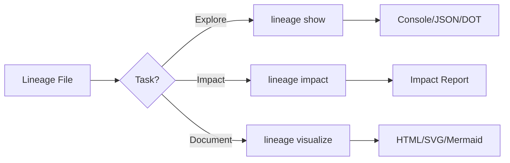

# Lineage Commands

CLI 명령 실행에서 Data을(를) 기준으로 데이터 품질 검증, 워크플로우 자동화, 결과 해석 방법을 설명합니다.

## 개요

| CLI 명령 실행에서 Command을(를) 기준으로 데이터 품질 검증, 워크플로우 자동화, 결과 해석 방법을 설명합니다. | CLI 명령 실행에서 Description을(를) 기준으로 데이터 품질 검증, 워크플로우 자동화, 결과 해석 방법을 설명합니다. | CLI 명령 실행에서 Primary, Case을(를) 기준으로 데이터 품질 검증, 워크플로우 자동화, 결과 해석 방법을 설명합니다. |
|---------|-------------|------------------|
| CLI 명령 실행에서 `show`을(를) 기준으로 데이터 품질 검증, 워크플로우 자동화, 결과 해석 방법을 설명합니다. | CLI 명령 실행에서 Display을(를) 기준으로 데이터 품질 검증, 워크플로우 자동화, 결과 해석 방법을 설명합니다. | CLI 명령 실행에서 Explore을(를) 기준으로 데이터 품질 검증, 워크플로우 자동화, 결과 해석 방법을 설명합니다. |
| CLI 명령 실행에서 `impact`을(를) 기준으로 데이터 품질 검증, 워크플로우 자동화, 결과 해석 방법을 설명합니다. | CLI 명령 실행에서 Analyze을(를) 기준으로 데이터 품질 검증, 워크플로우 자동화, 결과 해석 방법을 설명합니다. | CLI 명령 실행에서 Change을(를) 기준으로 데이터 품질 검증, 워크플로우 자동화, 결과 해석 방법을 설명합니다. |
| CLI 명령 실행에서 `visualize`을(를) 기준으로 데이터 품질 검증, 워크플로우 자동화, 결과 해석 방법을 설명합니다. | CLI 명령 실행에서 Generate을(를) 기준으로 데이터 품질 검증, 워크플로우 자동화, 결과 해석 방법을 설명합니다. | CLI 명령 실행에서 Documentation을(를) 기준으로 데이터 품질 검증, 워크플로우 자동화, 결과 해석 방법을 설명합니다. |

## What is Data Lineage?

CLI 명령 실행에서 Data을(를) 다루는 항목입니다:

- CLI 명령 실행에서 Upstream을(를) 기준으로 데이터 품질 검증, 워크플로우 자동화, 결과 해석 방법을 설명합니다.
- CLI 명령 실행에서 Downstream을(를) 기준으로 데이터 품질 검증, 워크플로우 자동화, 결과 해석 방법을 설명합니다.
- CLI 명령 실행에서 Transformations을(를) 기준으로 데이터 품질 검증, 워크플로우 자동화, 결과 해석 방법을 설명합니다.

## Lineage 파일 Format

CLI 명령 실행에서 JSON, Lineage을(를) 다루는 항목입니다:

```json
{
  "version": "1.0",
  "nodes": [
    {
      "id": "raw_data",
      "type": "source",
      "name": "Raw Data",
      "metadata": {
        "path": "s3://bucket/raw/",
        "format": "parquet"
      }
    },
    {
      "id": "cleaned_data",
      "type": "transformation",
      "name": "Cleaned Data",
      "metadata": {
        "path": "s3://bucket/cleaned/",
        "transformation": "data_cleaning_job"
      }
    },
    {
      "id": "analytics_table",
      "type": "table",
      "name": "Analytics Table",
      "metadata": {
        "database": "analytics",
        "table": "user_metrics"
      }
    }
  ],
  "edges": [
    {
      "source": "raw_data",
      "target": "cleaned_data"
    },
    {
      "source": "cleaned_data",
      "target": "analytics_table"
    }
  ]
}
```

## 워크플로우



## Quick 예시

### Show Lineage

```bash
# Show all lineage
truthound lineage show lineage.json

# Show upstream of a specific node
truthound lineage show lineage.json --node analytics_table --direction upstream

# Export as DOT format
truthound lineage show lineage.json --format dot > lineage.dot
```

### Analyze Impact

```bash
# Analyze impact of changing raw_data
truthound lineage impact lineage.json raw_data

# Limit analysis depth
truthound lineage impact lineage.json raw_data --max-depth 2
```

### Visualize

```bash
# Generate interactive D3 visualization
truthound lineage visualize lineage.json -o graph.html

# Generate Graphviz diagram
truthound lineage visualize lineage.json -o graph.svg --renderer graphviz

# Generate Mermaid diagram
truthound lineage visualize lineage.json -o graph.md --renderer mermaid
```

## Visualization Renderers

| CLI 명령 실행에서 Renderer을(를) 기준으로 데이터 품질 검증, 워크플로우 자동화, 결과 해석 방법을 설명합니다. | CLI 명령 실행에서 Output을(를) 기준으로 데이터 품질 검증, 워크플로우 자동화, 결과 해석 방법을 설명합니다. | CLI 명령 실행에서 Features을(를) 기준으로 데이터 품질 검증, 워크플로우 자동화, 결과 해석 방법을 설명합니다. |
|----------|--------|----------|
| CLI 명령 실행에서 `d3`을(를) 기준으로 데이터 품질 검증, 워크플로우 자동화, 결과 해석 방법을 설명합니다. | CLI 명령 실행에서 HTML을(를) 기준으로 데이터 품질 검증, 워크플로우 자동화, 결과 해석 방법을 설명합니다. | CLI 명령 실행에서 Interactive을(를) 기준으로 데이터 품질 검증, 워크플로우 자동화, 결과 해석 방법을 설명합니다. |
| CLI 명령 실행에서 `cytoscape`을(를) 기준으로 데이터 품질 검증, 워크플로우 자동화, 결과 해석 방법을 설명합니다. | CLI 명령 실행에서 HTML을(를) 기준으로 데이터 품질 검증, 워크플로우 자동화, 결과 해석 방법을 설명합니다. | CLI 명령 실행에서 Interactive을(를) 기준으로 데이터 품질 검증, 워크플로우 자동화, 결과 해석 방법을 설명합니다. |
| CLI 명령 실행에서 `graphviz`을(를) 기준으로 데이터 품질 검증, 워크플로우 자동화, 결과 해석 방법을 설명합니다. | CLI 명령 실행에서 SVG/PNG을(를) 기준으로 데이터 품질 검증, 워크플로우 자동화, 결과 해석 방법을 설명합니다. | CLI 명령 실행에서 Static을(를) 기준으로 데이터 품질 검증, 워크플로우 자동화, 결과 해석 방법을 설명합니다. |
| CLI 명령 실행에서 `mermaid`을(를) 기준으로 데이터 품질 검증, 워크플로우 자동화, 결과 해석 방법을 설명합니다. | CLI 명령 실행에서 Markdown을(를) 기준으로 데이터 품질 검증, 워크플로우 자동화, 결과 해석 방법을 설명합니다. | CLI 명령 실행에서 Embeddable을(를) 기준으로 데이터 품질 검증, 워크플로우 자동화, 결과 해석 방법을 설명합니다. |

## Node Types

| CLI 명령 실행에서 Type을(를) 기준으로 데이터 품질 검증, 워크플로우 자동화, 결과 해석 방법을 설명합니다. | CLI 명령 실행에서 Description을(를) 기준으로 데이터 품질 검증, 워크플로우 자동화, 결과 해석 방법을 설명합니다. | CLI 명령 실행에서 Icon을(를) 기준으로 데이터 품질 검증, 워크플로우 자동화, 결과 해석 방법을 설명합니다. |
|------|-------------|------|
| CLI 명령 실행에서 `source`을(를) 기준으로 데이터 품질 검증, 워크플로우 자동화, 결과 해석 방법을 설명합니다. | Raw data 소스 | CLI 명령 실행에서 관련 설정과 실행 흐름을(를) 기준으로 데이터 품질 검증, 워크플로우 자동화, 결과 해석 방법을 설명합니다. |
| CLI 명령 실행에서 `table`을(를) 기준으로 데이터 품질 검증, 워크플로우 자동화, 결과 해석 방법을 설명합니다. | 데이터베이스 테이블 | CLI 명령 실행에서 관련 설정과 실행 흐름을(를) 기준으로 데이터 품질 검증, 워크플로우 자동화, 결과 해석 방법을 설명합니다. |
| CLI 명령 실행에서 `file`을(를) 기준으로 데이터 품질 검증, 워크플로우 자동화, 결과 해석 방법을 설명합니다. | 파일-based data | CLI 명령 실행에서 관련 설정과 실행 흐름을(를) 기준으로 데이터 품질 검증, 워크플로우 자동화, 결과 해석 방법을 설명합니다. |
| CLI 명령 실행에서 `stream`을(를) 기준으로 데이터 품질 검증, 워크플로우 자동화, 결과 해석 방법을 설명합니다. | Streaming 소스 | CLI 명령 실행에서 관련 설정과 실행 흐름을(를) 기준으로 데이터 품질 검증, 워크플로우 자동화, 결과 해석 방법을 설명합니다. |
| CLI 명령 실행에서 `transformation`을(를) 기준으로 데이터 품질 검증, 워크플로우 자동화, 결과 해석 방법을 설명합니다. | CLI 명령 실행에서 Data을(를) 기준으로 데이터 품질 검증, 워크플로우 자동화, 결과 해석 방법을 설명합니다. | CLI 명령 실행에서 관련 설정과 실행 흐름을(를) 기준으로 데이터 품질 검증, 워크플로우 자동화, 결과 해석 방법을 설명합니다. |
| CLI 명령 실행에서 `validation`을(를) 기준으로 데이터 품질 검증, 워크플로우 자동화, 결과 해석 방법을 설명합니다. | 검증 체크포인트 | CLI 명령 실행에서 관련 설정과 실행 흐름을(를) 기준으로 데이터 품질 검증, 워크플로우 자동화, 결과 해석 방법을 설명합니다. |
| CLI 명령 실행에서 `model`을(를) 기준으로 데이터 품질 검증, 워크플로우 자동화, 결과 해석 방법을 설명합니다. | CLI 명령 실행에서 관련 설정과 실행 흐름을(를) 기준으로 데이터 품질 검증, 워크플로우 자동화, 결과 해석 방법을 설명합니다. | CLI 명령 실행에서 관련 설정과 실행 흐름을(를) 기준으로 데이터 품질 검증, 워크플로우 자동화, 결과 해석 방법을 설명합니다. |
| CLI 명령 실행에서 `report`을(를) 기준으로 데이터 품질 검증, 워크플로우 자동화, 결과 해석 방법을 설명합니다. | Output 리포트 | CLI 명령 실행에서 관련 설정과 실행 흐름을(를) 기준으로 데이터 품질 검증, 워크플로우 자동화, 결과 해석 방법을 설명합니다. |
| CLI 명령 실행에서 `external`을(를) 기준으로 데이터 품질 검증, 워크플로우 자동화, 결과 해석 방법을 설명합니다. | CLI 명령 실행에서 External을(를) 기준으로 데이터 품질 검증, 워크플로우 자동화, 결과 해석 방법을 설명합니다. | CLI 명령 실행에서 관련 설정과 실행 흐름을(를) 기준으로 데이터 품질 검증, 워크플로우 자동화, 결과 해석 방법을 설명합니다. |
| CLI 명령 실행에서 `virtual`을(를) 기준으로 데이터 품질 검증, 워크플로우 자동화, 결과 해석 방법을 설명합니다. | CLI 명령 실행에서 Virtual/computed을(를) 기준으로 데이터 품질 검증, 워크플로우 자동화, 결과 해석 방법을 설명합니다. | CLI 명령 실행에서 관련 설정과 실행 흐름을(를) 기준으로 데이터 품질 검증, 워크플로우 자동화, 결과 해석 방법을 설명합니다. |

## Use Cases

### 1. Data Discovery

```bash
# Explore what feeds into a table
truthound lineage show lineage.json --node my_table --direction upstream
```

### 2. Change Impact Analysis

```bash
# Before changing a source, check what's affected
truthound lineage impact lineage.json source_table -o impact_report.json
```

### 3. Documentation

```bash
# Generate documentation for data catalog
truthound lineage visualize lineage.json -o docs/lineage.html --renderer d3 --theme light
```

### 4. Debugging

```bash
# Trace data flow to find issues
truthound lineage show lineage.json --node failed_table --direction both
```

## 통합 with OpenLineage

CLI 명령 실행에서 OpenLineage, Truthound, API, Python을(를) 다루는 항목입니다:

```python
from truthound.lineage.integrations.openlineage import OpenLineageEmitter

# Create emitter
emitter = OpenLineageEmitter()

# Start a run
run = emitter.start_run("my-job")

# Emit completion
emitter.emit_complete(run, outputs=[...])
```

!!! note "참고"
CLI 명령 실행에서 OpenLineage, API, Python을(를) 기준으로 데이터 품질 검증, 워크플로우 자동화, 결과 해석 방법을 설명합니다.
CLI 명령 실행에서 CLI을(를) 기준으로 데이터 품질 검증, 워크플로우 자동화, 결과 해석 방법을 설명합니다.

## 다음 단계

- CLI 명령 실행에서 Display을(를) 기준으로 데이터 품질 검증, 워크플로우 자동화, 결과 해석 방법을 설명합니다.
- CLI 명령 실행에서 Analyze을(를) 기준으로 데이터 품질 검증, 워크플로우 자동화, 결과 해석 방법을 설명합니다.
- CLI 명령 실행에서 Generate을(를) 기준으로 데이터 품질 검증, 워크플로우 자동화, 결과 해석 방법을 설명합니다.

## 함께 보기

- CLI 명령 실행에서 Advanced, Features을(를) 기준으로 데이터 품질 검증, 워크플로우 자동화, 결과 해석 방법을 설명합니다.
- [OpenLineage 통합](../../concepts/openlineage.md)
