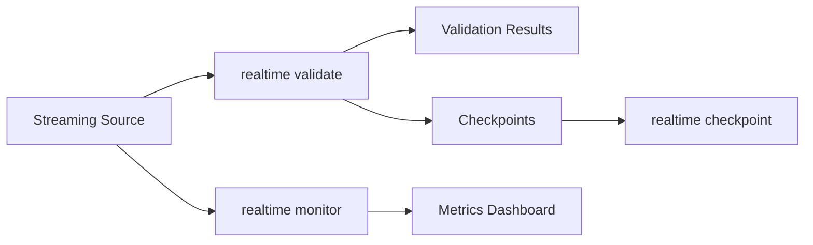

# 실시간 명령

CLI 명령 실행에서 Streaming을(를) 기준으로 데이터 품질 검증, 워크플로우 자동화, 결과 해석 방법을 설명합니다.

## 개요

| CLI 명령 실행에서 Command을(를) 기준으로 데이터 품질 검증, 워크플로우 자동화, 결과 해석 방법을 설명합니다. | CLI 명령 실행에서 Description을(를) 기준으로 데이터 품질 검증, 워크플로우 자동화, 결과 해석 방법을 설명합니다. | CLI 명령 실행에서 Primary, Case을(를) 기준으로 데이터 품질 검증, 워크플로우 자동화, 결과 해석 방법을 설명합니다. |
|---------|-------------|------------------|
| CLI 명령 실행에서 `validate`을(를) 기준으로 데이터 품질 검증, 워크플로우 자동화, 결과 해석 방법을 설명합니다. | CLI 명령 실행에서 Validate을(를) 기준으로 데이터 품질 검증, 워크플로우 자동화, 결과 해석 방법을 설명합니다. | CLI 명령 실행에서 Real-time을(를) 기준으로 데이터 품질 검증, 워크플로우 자동화, 결과 해석 방법을 설명합니다. |
| CLI 명령 실행에서 `monitor`을(를) 기준으로 데이터 품질 검증, 워크플로우 자동화, 결과 해석 방법을 설명합니다. | Monitor 검증 metrics | Continuous 모니터링 |
| CLI 명령 실행에서 `checkpoint`을(를) 기준으로 데이터 품질 검증, 워크플로우 자동화, 결과 해석 방법을 설명합니다. | Manage 검증 체크포인트 | CLI 명령 실행에서 State을(를) 기준으로 데이터 품질 검증, 워크플로우 자동화, 결과 해석 방법을 설명합니다. |

### 체크포인트 Subcommands

| CLI 명령 실행에서 Subcommand을(를) 기준으로 데이터 품질 검증, 워크플로우 자동화, 결과 해석 방법을 설명합니다. | CLI 명령 실행에서 Description을(를) 기준으로 데이터 품질 검증, 워크플로우 자동화, 결과 해석 방법을 설명합니다. |
|------------|-------------|
| CLI 명령 실행에서 `checkpoint list`을(를) 기준으로 데이터 품질 검증, 워크플로우 자동화, 결과 해석 방법을 설명합니다. | List available 체크포인트 |
| CLI 명령 실행에서 `checkpoint show`을(를) 기준으로 데이터 품질 검증, 워크플로우 자동화, 결과 해석 방법을 설명합니다. | Show 체크포인트 details |
| CLI 명령 실행에서 `checkpoint delete`을(를) 기준으로 데이터 품질 검증, 워크플로우 자동화, 결과 해석 방법을 설명합니다. | Delete a 체크포인트 |

## What is Realtime 검증?

CLI 명령 실행에서 Realtime을(를) 다루는 항목입니다:

- CLI 명령 실행에서 Streaming, Check을(를) 기준으로 데이터 품질 검증, 워크플로우 자동화, 결과 해석 방법을 설명합니다.
- CLI 명령 실행에서 Metric, Track을(를) 기준으로 데이터 품질 검증, 워크플로우 자동화, 결과 해석 방법을 설명합니다.
- CLI 명령 실행에서 Checkpoint, Resume을(를) 기준으로 데이터 품질 검증, 워크플로우 자동화, 결과 해석 방법을 설명합니다.
- CLI 명령 실행에서 Multiple, Kafka, Kinesis을(를) 기준으로 데이터 품질 검증, 워크플로우 자동화, 결과 해석 방법을 설명합니다.

## Supported Streaming Sources

| 소스 | CLI 명령 실행에서 Format을(를) 기준으로 데이터 품질 검증, 워크플로우 자동화, 결과 해석 방법을 설명합니다. | CLI 명령 실행에서 Description을(를) 기준으로 데이터 품질 검증, 워크플로우 자동화, 결과 해석 방법을 설명합니다. | CLI 명령 실행에서 Dependency을(를) 기준으로 데이터 품질 검증, 워크플로우 자동화, 결과 해석 방법을 설명합니다. |
|--------|--------|-------------|------------|
| CLI 명령 실행에서 Mock을(를) 기준으로 데이터 품질 검증, 워크플로우 자동화, 결과 해석 방법을 설명합니다. | CLI 명령 실행에서 `mock`을(를) 기준으로 데이터 품질 검증, 워크플로우 자동화, 결과 해석 방법을 설명합니다. | Test mock data 소스 | CLI 명령 실행에서 Built-in을(를) 기준으로 데이터 품질 검증, 워크플로우 자동화, 결과 해석 방법을 설명합니다. |
| CLI 명령 실행에서 Kafka을(를) 기준으로 데이터 품질 검증, 워크플로우 자동화, 결과 해석 방법을 설명합니다. | CLI 명령 실행에서 `kafka:topic_name`을(를) 기준으로 데이터 품질 검증, 워크플로우 자동화, 결과 해석 방법을 설명합니다. | CLI 명령 실행에서 Apache, Kafka을(를) 기준으로 데이터 품질 검증, 워크플로우 자동화, 결과 해석 방법을 설명합니다. | CLI 명령 실행에서 `aiokafka`을(를) 기준으로 데이터 품질 검증, 워크플로우 자동화, 결과 해석 방법을 설명합니다. |
| CLI 명령 실행에서 Kinesis을(를) 기준으로 데이터 품질 검증, 워크플로우 자동화, 결과 해석 방법을 설명합니다. | CLI 명령 실행에서 `kinesis:stream_name`을(를) 기준으로 데이터 품질 검증, 워크플로우 자동화, 결과 해석 방법을 설명합니다. | CLI 명령 실행에서 AWS, Kinesis을(를) 기준으로 데이터 품질 검증, 워크플로우 자동화, 결과 해석 방법을 설명합니다. | CLI 명령 실행에서 `aiobotocore`을(를) 기준으로 데이터 품질 검증, 워크플로우 자동화, 결과 해석 방법을 설명합니다. |

### 설치

```bash
# For Kafka support
pip install truthound[kafka]

# For Kinesis support
pip install truthound[kinesis]

# For all streaming sources
pip install truthound[streaming]
```

## 워크플로우



## Quick 예시

### Validate Streaming Data

```bash
# Mock source for testing
truthound realtime validate mock

# Kafka topic
truthound realtime validate kafka:my_topic --batch-size 500

# Kinesis stream
truthound realtime validate kinesis:my_stream --max-batches 100
```

### Monitor 메트릭

```bash
# Basic monitoring
truthound realtime monitor mock

# Custom interval and duration
truthound realtime monitor kafka:my_topic --interval 10 --duration 300
```

### Manage 체크포인트

```bash
# List checkpoints
truthound realtime checkpoint list

# Show checkpoint details
truthound realtime checkpoint show abc12345

# Delete checkpoint
truthound realtime checkpoint delete abc12345 --force
```

## 아키텍처

### 검증 플로우

1. CLI 명령 실행에서 Connect, Kafka/Kinesis/Mock을(를) 기준으로 데이터 품질 검증, 워크플로우 자동화, 결과 해석 방법을 설명합니다.
2. CLI 명령 실행에서 Batch을(를) 기준으로 데이터 품질 검증, 워크플로우 자동화, 결과 해석 방법을 설명합니다.
3. CLI 명령 실행에서 Validate을(를) 기준으로 데이터 품질 검증, 워크플로우 자동화, 결과 해석 방법을 설명합니다.
4. CLI 명령 실행에서 Save을(를) 기준으로 데이터 품질 검증, 워크플로우 자동화, 결과 해석 방법을 설명합니다.
5. **리포트** 결과 and metrics

### 체크포인트 System

체크포인트 enable:
- CLI 명령 실행에서 Recovery, Resume을(를) 기준으로 데이터 품질 검증, 워크플로우 자동화, 결과 해석 방법을 설명합니다.
- CLI 명령 실행에서 Progress, Know을(를) 기준으로 데이터 품질 검증, 워크플로우 자동화, 결과 해석 방법을 설명합니다.
- CLI 명령 실행에서 State, Survive을(를) 기준으로 데이터 품질 검증, 워크플로우 자동화, 결과 해석 방법을 설명합니다.

```bash
# Checkpoints are saved automatically
./checkpoints/
├── abc12345.json
├── def67890.json
└── ...
```

## Use Cases

### 1. Kafka 파이프라인 모니터링

```bash
# Validate Kafka messages
truthound realtime validate kafka:orders --validators null,range --batch-size 1000

# Monitor continuously
truthound realtime monitor kafka:orders --interval 5 --duration 0
```

### 2. Kinesis Stream 검증

```bash
# Validate Kinesis records
truthound realtime validate kinesis:events --max-batches 50

# Check validation status
truthound realtime checkpoint list --format json
```

### 3. Development Testing

```bash
# Use mock source for testing
truthound realtime validate mock --validators null,unique --batch-size 100

# Monitor mock metrics
truthound realtime monitor mock --interval 2 --duration 30
```

### 4. CI/CD 통합

```yaml
# GitHub Actions
- name: Validate Streaming Pipeline
  run: |
    truthound realtime validate kafka:test_topic \
      --validators null,range \
      --max-batches 10 \
      -o results.json

    # Check results
    python -c "
    import json
    with open('results.json') as f:
        data = json.load(f)
    if data['failed_batches'] > 0:
        exit(1)
    "
```

## 성능 Considerations

| CLI 명령 실행에서 Parameter을(를) 기준으로 데이터 품질 검증, 워크플로우 자동화, 결과 해석 방법을 설명합니다. | CLI 명령 실행에서 Impact을(를) 기준으로 데이터 품질 검증, 워크플로우 자동화, 결과 해석 방법을 설명합니다. | CLI 명령 실행에서 Recommendation을(를) 기준으로 데이터 품질 검증, 워크플로우 자동화, 결과 해석 방법을 설명합니다. |
|-----------|--------|----------------|
| CLI 명령 실행에서 `--batch-size`을(를) 기준으로 데이터 품질 검증, 워크플로우 자동화, 결과 해석 방법을 설명합니다. | CLI 명령 실행에서 Memory을(를) 기준으로 데이터 품질 검증, 워크플로우 자동화, 결과 해석 방법을 설명합니다. | CLI 명령 실행에서 관련 설정과 실행 흐름을(를) 기준으로 데이터 품질 검증, 워크플로우 자동화, 결과 해석 방법을 설명합니다. |
| CLI 명령 실행에서 `--max-batches`을(를) 기준으로 데이터 품질 검증, 워크플로우 자동화, 결과 해석 방법을 설명합니다. | CLI 명령 실행에서 Total을(를) 기준으로 데이터 품질 검증, 워크플로우 자동화, 결과 해석 방법을 설명합니다. | CLI 명령 실행에서 Set을(를) 기준으로 데이터 품질 검증, 워크플로우 자동화, 결과 해석 방법을 설명합니다. |
| CLI 명령 실행에서 `--interval`을(를) 기준으로 데이터 품질 검증, 워크플로우 자동화, 결과 해석 방법을 설명합니다. | 모니터링 overhead | CLI 명령 실행에서 관련 설정과 실행 흐름을(를) 기준으로 데이터 품질 검증, 워크플로우 자동화, 결과 해석 방법을 설명합니다. |

## Command 레퍼런스

- CLI 명령 실행에서 Validate을(를) 기준으로 데이터 품질 검증, 워크플로우 자동화, 결과 해석 방법을 설명합니다.
- CLI 명령 실행에서 Monitor을(를) 기준으로 데이터 품질 검증, 워크플로우 자동화, 결과 해석 방법을 설명합니다.
- [체크포인트](checkpoint/index.md) - Manage 체크포인트

## 함께 보기

- [Kafka 통합](../../guides/datasources.md)
- [CI/CD 통합](../../guides/ci-cd.md)
- CLI 명령 실행에서 Advanced, Features을(를) 기준으로 데이터 품질 검증, 워크플로우 자동화, 결과 해석 방법을 설명합니다.
