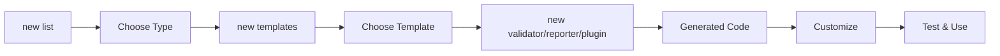

# 스캐폴딩 명령

CLI 명령 실행에서 Code을(를) 기준으로 데이터 품질 검증, 워크플로우 자동화, 결과 해석 방법을 설명합니다.

## 개요

| CLI 명령 실행에서 Command을(를) 기준으로 데이터 품질 검증, 워크플로우 자동화, 결과 해석 방법을 설명합니다. | CLI 명령 실행에서 Description을(를) 기준으로 데이터 품질 검증, 워크플로우 자동화, 결과 해석 방법을 설명합니다. | CLI 명령 실행에서 Primary, Case을(를) 기준으로 데이터 품질 검증, 워크플로우 자동화, 결과 해석 방법을 설명합니다. |
|---------|-------------|------------------|
| CLI 명령 실행에서 `new validator`을(를) 기준으로 데이터 품질 검증, 워크플로우 자동화, 결과 해석 방법을 설명합니다. | Create custom 검증기 | 검증 logic |
| CLI 명령 실행에서 `new reporter`을(를) 기준으로 데이터 품질 검증, 워크플로우 자동화, 결과 해석 방법을 설명합니다. | CLI 명령 실행에서 Create을(를) 기준으로 데이터 품질 검증, 워크플로우 자동화, 결과 해석 방법을 설명합니다. | CLI 명령 실행에서 Output을(를) 기준으로 데이터 품질 검증, 워크플로우 자동화, 결과 해석 방법을 설명합니다. |
| CLI 명령 실행에서 `new plugin`을(를) 기준으로 데이터 품질 검증, 워크플로우 자동화, 결과 해석 방법을 설명합니다. | CLI 명령 실행에서 Create을(를) 기준으로 데이터 품질 검증, 워크플로우 자동화, 결과 해석 방법을 설명합니다. | CLI 명령 실행에서 Extension을(를) 기준으로 데이터 품질 검증, 워크플로우 자동화, 결과 해석 방법을 설명합니다. |
| CLI 명령 실행에서 `new list`을(를) 기준으로 데이터 품질 검증, 워크플로우 자동화, 결과 해석 방법을 설명합니다. | CLI 명령 실행에서 List을(를) 기준으로 데이터 품질 검증, 워크플로우 자동화, 결과 해석 방법을 설명합니다. | CLI 명령 실행에서 Discovery을(를) 기준으로 데이터 품질 검증, 워크플로우 자동화, 결과 해석 방법을 설명합니다. |
| CLI 명령 실행에서 `new templates`을(를) 기준으로 데이터 품질 검증, 워크플로우 자동화, 결과 해석 방법을 설명합니다. | CLI 명령 실행에서 List을(를) 기준으로 데이터 품질 검증, 워크플로우 자동화, 결과 해석 방법을 설명합니다. | CLI 명령 실행에서 Template을(를) 기준으로 데이터 품질 검증, 워크플로우 자동화, 결과 해석 방법을 설명합니다. |

## What is Scaffolding?

CLI 명령 실행에서 Truthound, Scaffolding을(를) 다루는 항목입니다:

- **검증기** - Custom 데이터 품질 checks
- **리포터** - Custom output formats
- CLI 명령 실행에서 Plugins, Packaged을(를) 기준으로 데이터 품질 검증, 워크플로우 자동화, 결과 해석 방법을 설명합니다.

## Quick 예시

### Create a 검증기

```bash
# Basic validator
truthound new validator my_validator

# Pattern validator with regex
truthound new validator email_format --template pattern --pattern "^[a-z@.]+$"

# Range validator
truthound new validator percentage --template range --min 0 --max 100
```

### Create a Reporter

```bash
# Basic reporter
truthound new reporter my_reporter

# JSON reporter
truthound new reporter json_export --extension .json --content-type application/json
```

### Create a Plugin

```bash
# Validator plugin
truthound new plugin my_validators --type validator

# Full plugin with all components
truthound new plugin enterprise --type full
```

### Discover Options

```bash
# List available scaffolds
truthound new list --verbose

# List validator templates
truthound new templates validator
```

## 워크플로우



## Generated Structure

### 검증기

```
my_validator/
├── __init__.py
├── my_validator.py      # Validator implementation
└── tests/
    └── test_my_validator.py
```

### Reporter

```
my_reporter/
├── __init__.py
├── my_reporter.py       # Reporter implementation
└── tests/
    └── test_my_reporter.py
```

### Plugin

```
my_plugin/
├── pyproject.toml       # Package configuration
├── README.md
├── src/
│   └── my_plugin/
│       ├── __init__.py
│       ├── validators/  # (if type=validator)
│       ├── reporters/   # (if type=reporter)
│       └── hooks/       # (if type=hook)
└── tests/
```

## Common Options

| CLI 명령 실행에서 Option을(를) 기준으로 데이터 품질 검증, 워크플로우 자동화, 결과 해석 방법을 설명합니다. | CLI 명령 실행에서 Description을(를) 기준으로 데이터 품질 검증, 워크플로우 자동화, 결과 해석 방법을 설명합니다. | CLI 명령 실행에서 Available을(를) 기준으로 데이터 품질 검증, 워크플로우 자동화, 결과 해석 방법을 설명합니다. |
|--------|-------------|--------------|
| CLI 명령 실행에서 `--output, -o`을(를) 기준으로 데이터 품질 검증, 워크플로우 자동화, 결과 해석 방법을 설명합니다. | CLI 명령 실행에서 Output을(를) 기준으로 데이터 품질 검증, 워크플로우 자동화, 결과 해석 방법을 설명합니다. | CLI 명령 실행에서 관련 설정과 실행 흐름을(를) 기준으로 데이터 품질 검증, 워크플로우 자동화, 결과 해석 방법을 설명합니다. |
| CLI 명령 실행에서 `--author, -a`을(를) 기준으로 데이터 품질 검증, 워크플로우 자동화, 결과 해석 방법을 설명합니다. | CLI 명령 실행에서 Author을(를) 기준으로 데이터 품질 검증, 워크플로우 자동화, 결과 해석 방법을 설명합니다. | CLI 명령 실행에서 관련 설정과 실행 흐름을(를) 기준으로 데이터 품질 검증, 워크플로우 자동화, 결과 해석 방법을 설명합니다. |
| CLI 명령 실행에서 `--description, -d`을(를) 기준으로 데이터 품질 검증, 워크플로우 자동화, 결과 해석 방법을 설명합니다. | CLI 명령 실행에서 Description을(를) 기준으로 데이터 품질 검증, 워크플로우 자동화, 결과 해석 방법을 설명합니다. | CLI 명령 실행에서 관련 설정과 실행 흐름을(를) 기준으로 데이터 품질 검증, 워크플로우 자동화, 결과 해석 방법을 설명합니다. |
| CLI 명령 실행에서 `--tests/--no-tests`을(를) 기준으로 데이터 품질 검증, 워크플로우 자동화, 결과 해석 방법을 설명합니다. | CLI 명령 실행에서 Generate을(를) 기준으로 데이터 품질 검증, 워크플로우 자동화, 결과 해석 방법을 설명합니다. | CLI 명령 실행에서 관련 설정과 실행 흐름을(를) 기준으로 데이터 품질 검증, 워크플로우 자동화, 결과 해석 방법을 설명합니다. |
| CLI 명령 실행에서 `--docs/--no-docs`을(를) 기준으로 데이터 품질 검증, 워크플로우 자동화, 결과 해석 방법을 설명합니다. | CLI 명령 실행에서 Generate을(를) 기준으로 데이터 품질 검증, 워크플로우 자동화, 결과 해석 방법을 설명합니다. | 검증기, reporter |

## Use Cases

### 1. Custom 검증 Logic

```bash
# Create validator for business rules
truthound new validator customer_age \
  --template range \
  --min 18 \
  --max 120 \
  --description "Validate customer age range"
```

### 2. Custom Output Format

```bash
# Create XML reporter
truthound new reporter xml_export \
  --template full \
  --extension .xml \
  --content-type application/xml
```

### 3. Reusable Plugin Package

```bash
# Create distributable plugin
truthound new plugin company_validators \
  --type validator \
  --author "Data Team" \
  --min-version 1.0.0
```

### 4. 통합 Development

```bash
# Create datasource connector
truthound new plugin custom_db \
  --type datasource \
  --description "Custom database connector"
```

## Command 레퍼런스

- CLI 명령 실행에서 Create을(를) 기준으로 데이터 품질 검증, 워크플로우 자동화, 결과 해석 방법을 설명합니다.
- CLI 명령 실행에서 Create을(를) 기준으로 데이터 품질 검증, 워크플로우 자동화, 결과 해석 방법을 설명합니다.
- CLI 명령 실행에서 Create을(를) 기준으로 데이터 품질 검증, 워크플로우 자동화, 결과 해석 방법을 설명합니다.
- CLI 명령 실행에서 List을(를) 기준으로 데이터 품질 검증, 워크플로우 자동화, 결과 해석 방법을 설명합니다.
- CLI 명령 실행에서 List을(를) 기준으로 데이터 품질 검증, 워크플로우 자동화, 결과 해석 방법을 설명합니다.

## 함께 보기

- [사용자 정의 검증기 Tutorial](../../tutorials/custom-validator.md)
- CLI 명령 실행에서 Plugin, System을(를) 기준으로 데이터 품질 검증, 워크플로우 자동화, 결과 해석 방법을 설명합니다.
- [검증기 Guide](../../guides/validators.md)
