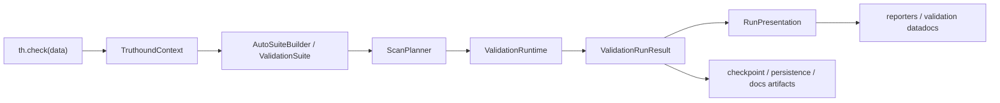

# Truthound 3.x 아키텍처

## Design Goal

핵심 개념과 경계에서 Truthound을(를) 기준으로 데이터 품질 검증, 워크플로우 자동화, 결과 해석 방법을 설명합니다.

핵심 개념과 경계에서 관련 설정과 실행 흐름을(를) 다루는 항목입니다:

- 핵심 개념과 경계에서 Great Expectations, Great, Expectations을(를) 기준으로 데이터 품질 검증, 워크플로우 자동화, 결과 해석 방법을 설명합니다.
- 핵심 개념과 경계에서 Soda을(를) 기준으로 데이터 품질 검증, 워크플로우 자동화, 결과 해석 방법을 설명합니다.
- 핵심 개념과 경계에서 Deequ을(를) 기준으로 데이터 품질 검증, 워크플로우 자동화, 결과 해석 방법을 설명합니다.
- 핵심 개념과 경계에서 Pandera을(를) 기준으로 데이터 품질 검증, 워크플로우 자동화, 결과 해석 방법을 설명합니다.

## Architectural Theme

핵심 개념과 경계에서 Truthound을(를) 다루는 항목입니다:

- 핵심 개념과 경계에서 관련 설정과 실행 흐름을(를) 기준으로 데이터 품질 검증, 워크플로우 자동화, 결과 해석 방법을 설명합니다.
- 핵심 개념과 경계에서 TruthoundContext, Truthound을(를) 기준으로 데이터 품질 검증, 워크플로우 자동화, 결과 해석 방법을 설명합니다.
- 핵심 개념과 경계에서 관련 설정과 실행 흐름을(를) 기준으로 데이터 품질 검증, 워크플로우 자동화, 결과 해석 방법을 설명합니다.
- exact-by-default 검증 semantics
- 핵심 개념과 경계에서 관련 설정과 실행 흐름을(를) 기준으로 데이터 품질 검증, 워크플로우 자동화, 결과 해석 방법을 설명합니다.

핵심 개념과 경계에서 관련 설정과 실행 흐름을(를) 기준으로 데이터 품질 검증, 워크플로우 자동화, 결과 해석 방법을 설명합니다.
핵심 개념과 경계에서 관련 설정과 실행 흐름을(를) 다루는 항목입니다:

| 핵심 개념과 경계에서 Layer을(를) 기준으로 데이터 품질 검증, 워크플로우 자동화, 결과 해석 방법을 설명합니다. | 핵심 개념과 경계에서 Repository을(를) 기준으로 데이터 품질 검증, 워크플로우 자동화, 결과 해석 방법을 설명합니다. | 핵심 개념과 경계에서 Responsibility을(를) 기준으로 데이터 품질 검증, 워크플로우 자동화, 결과 해석 방법을 설명합니다. |
| --- | --- | --- |
| 핵심 개념과 경계에서 Truthound, `Truthound Core`, Core을(를) 기준으로 데이터 품질 검증, 워크플로우 자동화, 결과 해석 방법을 설명합니다. | 핵심 개념과 경계에서 `truthound`을(를) 기준으로 데이터 품질 검증, 워크플로우 자동화, 결과 해석 방법을 설명합니다. | 핵심 개념과 경계에서 관련 설정과 실행 흐름을(를) 기준으로 데이터 품질 검증, 워크플로우 자동화, 결과 해석 방법을 설명합니다. |
| 핵심 개념과 경계에서 Truthound, `Truthound AI`을(를) 기준으로 데이터 품질 검증, 워크플로우 자동화, 결과 해석 방법을 설명합니다. | 핵심 개념과 경계에서 `truthound.ai`을(를) 기준으로 데이터 품질 검증, 워크플로우 자동화, 결과 해석 방법을 설명합니다. | 핵심 개념과 경계에서 API, APIs을(를) 기준으로 데이터 품질 검증, 워크플로우 자동화, 결과 해석 방법을 설명합니다. |
| 핵심 개념과 경계에서 Truthound, `Truthound Orchestration`, Orchestration을(를) 기준으로 데이터 품질 검증, 워크플로우 자동화, 결과 해석 방법을 설명합니다. | 핵심 개념과 경계에서 `truthound-orchestration`을(를) 기준으로 데이터 품질 검증, 워크플로우 자동화, 결과 해석 방법을 설명합니다. | 핵심 개념과 경계에서 Prefect, Dagster, Airflow, Kestra, Mage, dbt을(를) 기준으로 데이터 품질 검증, 워크플로우 자동화, 결과 해석 방법을 설명합니다. |
| 핵심 개념과 경계에서 Truthound을(를) 기준으로 데이터 품질 검증, 워크플로우 자동화, 결과 해석 방법을 설명합니다. | 핵심 개념과 경계에서 `truthound`을(를) 기준으로 데이터 품질 검증, 워크플로우 자동화, 결과 해석 방법을 설명합니다. | 핵심 개념과 경계에서 관련 설정과 실행 흐름을(를) 기준으로 데이터 품질 검증, 워크플로우 자동화, 결과 해석 방법을 설명합니다. |

핵심 개념과 경계에서 관련 설정과 실행 흐름을(를) 기준으로 데이터 품질 검증, 워크플로우 자동화, 결과 해석 방법을 설명합니다.
핵심 개념과 경계에서 관련 설정과 실행 흐름을(를) 기준으로 데이터 품질 검증, 워크플로우 자동화, 결과 해석 방법을 설명합니다.
핵심 개념과 경계에서 관련 설정과 실행 흐름을(를) 기준으로 데이터 품질 검증, 워크플로우 자동화, 결과 해석 방법을 설명합니다.
핵심 개념과 경계에서 Workflow을(를) 기준으로 데이터 품질 검증, 워크플로우 자동화, 결과 해석 방법을 설명합니다.

## Kernel Boundaries

핵심 개념과 경계에서 Truthound을(를) 다루는 항목입니다:

| 핵심 개념과 경계에서 Package을(를) 기준으로 데이터 품질 검증, 워크플로우 자동화, 결과 해석 방법을 설명합니다. | 핵심 개념과 경계에서 Role을(를) 기준으로 데이터 품질 검증, 워크플로우 자동화, 결과 해석 방법을 설명합니다. | 핵심 개념과 경계에서 Representative, Types을(를) 기준으로 데이터 품질 검증, 워크플로우 자동화, 결과 해석 방법을 설명합니다. |
| --- | --- | --- |
| 핵심 개념과 경계에서 `truthound.core.contracts`을(를) 기준으로 데이터 품질 검증, 워크플로우 자동화, 결과 해석 방법을 설명합니다. | 핵심 개념과 경계에서 Stable을(를) 기준으로 데이터 품질 검증, 워크플로우 자동화, 결과 해석 방법을 설명합니다. | 핵심 개념과 경계에서 `DataAsset`, `ExecutionBackend`, `MetricRepository`, `ArtifactStore`, `PluginCapability`, DataAsset, ExecutionBackend, MetricRepository을(를) 기준으로 데이터 품질 검증, 워크플로우 자동화, 결과 해석 방법을 설명합니다. |
| 핵심 개념과 경계에서 `truthound.core.suite`을(를) 기준으로 데이터 품질 검증, 워크플로우 자동화, 결과 해석 방법을 설명합니다. | Declarative 검증 intent | 핵심 개념과 경계에서 `ValidationSuite`, `CheckSpec`, `SchemaSpec`, `EvidencePolicy`, `SeverityPolicy`, ValidationSuite, CheckSpec, SchemaSpec을(를) 기준으로 데이터 품질 검증, 워크플로우 자동화, 결과 해석 방법을 설명합니다. |
| 핵심 개념과 경계에서 `truthound.core.planning`을(를) 기준으로 데이터 품질 검증, 워크플로우 자동화, 결과 해석 방법을 설명합니다. | 핵심 개념과 경계에서 Compilation을(를) 기준으로 데이터 품질 검증, 워크플로우 자동화, 결과 해석 방법을 설명합니다. | 핵심 개념과 경계에서 `ScanPlanner`, `ScanPlan`, `PlanStep`, ScanPlanner, ScanPlan, PlanStep을(를) 기준으로 데이터 품질 검증, 워크플로우 자동화, 결과 해석 방법을 설명합니다. |
| 핵심 개념과 경계에서 `truthound.core.runtime`을(를) 기준으로 데이터 품질 검증, 워크플로우 자동화, 결과 해석 방법을 설명합니다. | 오케스트레이션 and 실패 isolation | 핵심 개념과 경계에서 `ValidationRuntime`, ValidationRuntime을(를) 기준으로 데이터 품질 검증, 워크플로우 자동화, 결과 해석 방법을 설명합니다. |
| 핵심 개념과 경계에서 `truthound.core.results`을(를) 기준으로 데이터 품질 검증, 워크플로우 자동화, 결과 해석 방법을 설명합니다. | Canonical 런타임 결과 model | 핵심 개념과 경계에서 ValidationRunResult, `CheckResult`, `ExecutionIssue`, CheckResult, ExecutionIssue을(를) 기준으로 데이터 품질 검증, 워크플로우 자동화, 결과 해석 방법을 설명합니다. |

핵심 개념과 경계에서 관련 설정과 실행 흐름을(를) 다루는 항목입니다:

- 핵심 개념과 경계에서 `truthound.context`, `.truthound/`을(를) 기준으로 데이터 품질 검증, 워크플로우 자동화, 결과 해석 방법을 설명합니다.
- 핵심 개념과 경계에서 ValidationRunResult, `truthound.checkpoint`을(를) 기준으로 데이터 품질 검증, 워크플로우 자동화, 결과 해석 방법을 설명합니다.

핵심 개념과 경계에서 관련 설정과 실행 흐름을(를) 다루는 항목입니다:

- 핵심 개념과 경계에서 `truthound.ai`을(를) 기준으로 데이터 품질 검증, 워크플로우 자동화, 결과 해석 방법을 설명합니다.
- 핵심 개념과 경계에서 ValidationRunResult, `truthound-orchestration`을(를) 기준으로 데이터 품질 검증, 워크플로우 자동화, 결과 해석 방법을 설명합니다.
- 핵심 개념과 경계에서 Truthound을(를) 기준으로 데이터 품질 검증, 워크플로우 자동화, 결과 해석 방법을 설명합니다.

## 런타임 플로우

핵심 개념과 경계에서 관련 설정과 실행 흐름을(를) 기준으로 데이터 품질 검증, 워크플로우 자동화, 결과 해석 방법을 설명합니다.

## Ports and Adapters

핵심 개념과 경계에서 Truthound을(를) 다루는 항목입니다:

- 핵심 개념과 경계에서 `DataAsset`, `ExecutionBackend`, Ports, DataAsset, ExecutionBackend을(를) 기준으로 데이터 품질 검증, 워크플로우 자동화, 결과 해석 방법을 설명합니다.
- 핵심 개념과 경계에서 Polars, SQL, Adapters, Polars-backed, SQL-backed을(를) 기준으로 데이터 품질 검증, 워크플로우 자동화, 결과 해석 방법을 설명합니다.
- 핵심 개념과 경계에서 SQL, Planning을(를) 기준으로 데이터 품질 검증, 워크플로우 자동화, 결과 해석 방법을 설명합니다.
- 핵심 개념과 경계에서 `ExecutionIssue`, Runtime, ExecutionIssue을(를) 기준으로 데이터 품질 검증, 워크플로우 자동화, 결과 해석 방법을 설명합니다.
- 핵심 개념과 경계에서 Results을(를) 기준으로 데이터 품질 검증, 워크플로우 자동화, 결과 해석 방법을 설명합니다.

핵심 개념과 경계에서 Truthound을(를) 기준으로 데이터 품질 검증, 워크플로우 자동화, 결과 해석 방법을 설명합니다.

## TruthoundContext and Zero-설정 State

핵심 개념과 경계에서 TruthoundContext, Truthound, `.truthound/`을(를) 다루는 항목입니다:

- 핵심 개념과 경계에서 `truthound.yaml`을(를) 기준으로 데이터 품질 검증, 워크플로우 자동화, 결과 해석 방법을 설명합니다.
- 자산 catalog fingerprints
- 핵심 개념과 경계에서 관련 설정과 실행 흐름을(를) 기준으로 데이터 품질 검증, 워크플로우 자동화, 결과 해석 방법을 설명합니다.
- persisted 검증 runs
- 검증-doc 아티팩트
- 핵심 개념과 경계에서 관련 설정과 실행 흐름을(를) 기준으로 데이터 품질 검증, 워크플로우 자동화, 결과 해석 방법을 설명합니다.

핵심 개념과 경계에서 관련 설정과 실행 흐름을(를) 다루는 항목입니다:

- 핵심 개념과 경계에서 `.truthound/config.yaml`을(를) 기준으로 데이터 품질 검증, 워크플로우 자동화, 결과 해석 방법을 설명합니다.
- 핵심 개념과 경계에서 `.truthound/catalog/`을(를) 기준으로 데이터 품질 검증, 워크플로우 자동화, 결과 해석 방법을 설명합니다.
- 핵심 개념과 경계에서 `.truthound/baselines/`을(를) 기준으로 데이터 품질 검증, 워크플로우 자동화, 결과 해석 방법을 설명합니다.
- 핵심 개념과 경계에서 `.truthound/runs/`을(를) 기준으로 데이터 품질 검증, 워크플로우 자동화, 결과 해석 방법을 설명합니다.
- 핵심 개념과 경계에서 `.truthound/docs/`을(를) 기준으로 데이터 품질 검증, 워크플로우 자동화, 결과 해석 방법을 설명합니다.
- 핵심 개념과 경계에서 `.truthound/plugins/`을(를) 기준으로 데이터 품질 검증, 워크플로우 자동화, 결과 해석 방법을 설명합니다.

## Peripheral Boundaries

핵심 개념과 경계에서 Peripheral을(를) 다루는 항목입니다:

- 핵심 개념과 경계에서 `CheckpointResult.validation_run`, CheckpointResult.validation_run을(를) 기준으로 데이터 품질 검증, 워크플로우 자동화, 결과 해석 방법을 설명합니다.
- 핵심 개념과 경계에서 `CheckpointResult.validation_view`, CheckpointResult.validation_view을(를) 기준으로 데이터 품질 검증, 워크플로우 자동화, 결과 해석 방법을 설명합니다.
- 핵심 개념과 경계에서 관련 설정과 실행 흐름을(를) 기준으로 데이터 품질 검증, 워크플로우 자동화, 결과 해석 방법을 설명합니다.
- 핵심 개념과 경계에서 CLI, `truthound.core`을(를) 기준으로 데이터 품질 검증, 워크플로우 자동화, 결과 해석 방법을 설명합니다.
- 핵심 개념과 경계에서 관련 설정과 실행 흐름을(를) 기준으로 데이터 품질 검증, 워크플로우 자동화, 결과 해석 방법을 설명합니다.
- 핵심 개념과 경계에서 `truthound.ai`, `truthound.core`을(를) 기준으로 데이터 품질 검증, 워크플로우 자동화, 결과 해석 방법을 설명합니다.
- 핵심 개념과 경계에서 관련 설정과 실행 흐름을(를) 기준으로 데이터 품질 검증, 워크플로우 자동화, 결과 해석 방법을 설명합니다.

핵심 개념과 경계에서 관련 설정과 실행 흐름을(를) 기준으로 데이터 품질 검증, 워크플로우 자동화, 결과 해석 방법을 설명합니다.

## Public Contract

핵심 개념과 경계에서 Truthound을(를) 다루는 항목입니다:

- 핵심 개념과 경계에서 ValidationRunResult, `th.check()`을(를) 기준으로 데이터 품질 검증, 워크플로우 자동화, 결과 해석 방법을 설명합니다.
- 핵심 개념과 경계에서 `compare`, `truthound.drift.compare`을(를) 기준으로 데이터 품질 검증, 워크플로우 자동화, 결과 해석 방법을 설명합니다.
- 핵심 개념과 경계에서 ValidationRunResult, TruthoundContext, Truthound, `ValidationSuite`, `CheckSpec`, `SchemaSpec`, `CheckResult`, ValidationSuite을(를) 기준으로 데이터 품질 검증, 워크플로우 자동화, 결과 해석 방법을 설명합니다.
- 핵심 개념과 경계에서 `truthound.ml`, `truthound.realtime`을(를) 기준으로 데이터 품질 검증, 워크플로우 자동화, 결과 해석 방법을 설명합니다.

핵심 개념과 경계에서 API을(를) 기준으로 데이터 품질 검증, 워크플로우 자동화, 결과 해석 방법을 설명합니다.

## Auto-Suite and Planner Responsibilities

핵심 개념과 경계에서 Truthound, `validators=None`, `AutoSuiteBuilder`, None, AutoSuiteBuilder을(를) 다루는 항목입니다:

- 핵심 개념과 경계에서 관련 설정과 실행 흐름을(를) 기준으로 데이터 품질 검증, 워크플로우 자동화, 결과 해석 방법을 설명합니다.
- 핵심 개념과 경계에서 관련 설정과 실행 흐름을(를) 기준으로 데이터 품질 검증, 워크플로우 자동화, 결과 해석 방법을 설명합니다.
- 핵심 개념과 경계에서 관련 설정과 실행 흐름을(를) 기준으로 데이터 품질 검증, 워크플로우 자동화, 결과 해석 방법을 설명합니다.
- 핵심 개념과 경계에서 관련 설정과 실행 흐름을(를) 기준으로 데이터 품질 검증, 워크플로우 자동화, 결과 해석 방법을 설명합니다.

핵심 개념과 경계에서 API, `ScanPlanner`, ScanPlanner을(를) 다루는 항목입니다:

- 핵심 개념과 경계에서 관련 설정과 실행 흐름을(를) 기준으로 데이터 품질 검증, 워크플로우 자동화, 결과 해석 방법을 설명합니다.
- 핵심 개념과 경계에서 관련 설정과 실행 흐름을(를) 기준으로 데이터 품질 검증, 워크플로우 자동화, 결과 해석 방법을 설명합니다.
- 핵심 개념과 경계에서 관련 설정과 실행 흐름을(를) 기준으로 데이터 품질 검증, 워크플로우 자동화, 결과 해석 방법을 설명합니다.
- 핵심 개념과 경계에서 관련 설정과 실행 흐름을(를) 기준으로 데이터 품질 검증, 워크플로우 자동화, 결과 해석 방법을 설명합니다.
- 핵심 개념과 경계에서 관련 설정과 실행 흐름을(를) 기준으로 데이터 품질 검증, 워크플로우 자동화, 결과 해석 방법을 설명합니다.
- 핵심 개념과 경계에서 관련 설정과 실행 흐름을(를) 기준으로 데이터 품질 검증, 워크플로우 자동화, 결과 해석 방법을 설명합니다.

핵심 개념과 경계에서 Metric을(를) 기준으로 데이터 품질 검증, 워크플로우 자동화, 결과 해석 방법을 설명합니다.

## 런타임 Responsibilities

핵심 개념과 경계에서 `ValidationRuntime`, ValidationRuntime을(를) 다루는 항목입니다:

- 검증기 construction from `CheckSpec`
- 핵심 개념과 경계에서 관련 설정과 실행 흐름을(를) 기준으로 데이터 품질 검증, 워크플로우 자동화, 결과 해석 방법을 설명합니다.
- sequential and parallel 오케스트레이션
- 핵심 개념과 경계에서 SQL을(를) 기준으로 데이터 품질 검증, 워크플로우 자동화, 결과 해석 방법을 설명합니다.
- conversion of 런타임 실패 into `ExecutionIssue`
- stable 결과 ordering
- 핵심 개념과 경계에서 관련 설정과 실행 흐름을(를) 기준으로 데이터 품질 검증, 워크플로우 자동화, 결과 해석 방법을 설명합니다.

핵심 개념과 경계에서 관련 설정과 실행 흐름을(를) 기준으로 데이터 품질 검증, 워크플로우 자동화, 결과 해석 방법을 설명합니다.

## Backend Strategy

핵심 개념과 경계에서 Truthound, Polars을(를) 다루는 항목입니다:

- 핵심 개념과 경계에서 Polars, `PolarsBackend`, PolarsBackend을(를) 기준으로 데이터 품질 검증, 워크플로우 자동화, 결과 해석 방법을 설명합니다.
- 핵심 개념과 경계에서 SQL을(를) 기준으로 데이터 품질 검증, 워크플로우 자동화, 결과 해석 방법을 설명합니다.
- 핵심 개념과 경계에서 Spark을(를) 기준으로 데이터 품질 검증, 워크플로우 자동화, 결과 해석 방법을 설명합니다.

핵심 개념과 경계에서 Core, Sampling을(를) 기준으로 데이터 품질 검증, 워크플로우 자동화, 결과 해석 방법을 설명합니다.

## 결과 Model

핵심 개념과 경계에서 ValidationRunResult을(를) 다루는 항목입니다:

- 핵심 개념과 경계에서 `CheckResult`, CheckResult을(를) 기준으로 데이터 품질 검증, 워크플로우 자동화, 결과 해석 방법을 설명합니다.
- issue 증거 through `ValidationIssue`
- 런타임 실패 through `ExecutionIssue`
- actual 런타임 behavior through `execution_mode`
- 핵심 개념과 경계에서 `planned_execution_mode`을(를) 기준으로 데이터 품질 검증, 워크플로우 자동화, 결과 해석 방법을 설명합니다.

핵심 개념과 경계에서 `render()`, `write()`, `build_docs()`, Convenience을(를) 기준으로 데이터 품질 검증, 워크플로우 자동화, 결과 해석 방법을 설명합니다.

## Presentation Boundary

핵심 개념과 경계에서 Reporter을(를) 다루는 항목입니다:

- 핵심 개념과 경계에서 ValidationRunResult을(를) 기준으로 데이터 품질 검증, 워크플로우 자동화, 결과 해석 방법을 설명합니다.
- 핵심 개념과 경계에서 `RunPresentation`, RunPresentation을(를) 기준으로 데이터 품질 검증, 워크플로우 자동화, 결과 해석 방법을 설명합니다.
- 핵심 개념과 경계에서 `ReporterContext`, ReporterContext을(를) 기준으로 데이터 품질 검증, 워크플로우 자동화, 결과 해석 방법을 설명합니다.
- 핵심 개념과 경계에서 `truthound.stores.results.ValidationResult`, ValidationResult, DTO을(를) 기준으로 데이터 품질 검증, 워크플로우 자동화, 결과 해석 방법을 설명합니다.

핵심 개념과 경계에서 관련 설정과 실행 흐름을(를) 기준으로 데이터 품질 검증, 워크플로우 자동화, 결과 해석 방법을 설명합니다.

## Plugin 아키텍처

핵심 개념과 경계에서 See, Plugin, Platform을(를) 다루는 항목입니다:

- 핵심 개념과 경계에서 `PluginManager`, PluginManager을(를) 기준으로 데이터 품질 검증, 워크플로우 자동화, 결과 해석 방법을 설명합니다.
- 핵심 개념과 경계에서 `EnterprisePluginManager`, EnterprisePluginManager을(를) 기준으로 데이터 품질 검증, 워크플로우 자동화, 결과 해석 방법을 설명합니다.

핵심 개념과 경계에서 관련 설정과 실행 흐름을(를) 다루는 항목입니다:

- 핵심 개념과 경계에서 `CheckSpecFactory`, CheckSpecFactory을(를) 기준으로 데이터 품질 검증, 워크플로우 자동화, 결과 해석 방법을 설명합니다.
- 핵심 개념과 경계에서 `Reporter.render(run_result, *, context)`, Reporter.render을(를) 기준으로 데이터 품질 검증, 워크플로우 자동화, 결과 해석 방법을 설명합니다.
- 핵심 개념과 경계에서 `DataAssetProvider`, DataAssetProvider을(를) 기준으로 데이터 품질 검증, 워크플로우 자동화, 결과 해석 방법을 설명합니다.
- 핵심 개념과 경계에서 관련 설정과 실행 흐름을(를) 기준으로 데이터 품질 검증, 워크플로우 자동화, 결과 해석 방법을 설명합니다.

핵심 개념과 경계에서 관련 설정과 실행 흐름을(를) 기준으로 데이터 품질 검증, 워크플로우 자동화, 결과 해석 방법을 설명합니다.

## Dependency Rule

핵심 개념과 경계에서 `truthound.core`을(를) 다루는 항목입니다:

- 핵심 개념과 경계에서 `truthound.reporters`을(를) 기준으로 데이터 품질 검증, 워크플로우 자동화, 결과 해석 방법을 설명합니다.
- 핵심 개념과 경계에서 `truthound.plugins`을(를) 기준으로 데이터 품질 검증, 워크플로우 자동화, 결과 해석 방법을 설명합니다.
- 핵심 개념과 경계에서 `truthound.datadocs`을(를) 기준으로 데이터 품질 검증, 워크플로우 자동화, 결과 해석 방법을 설명합니다.
- 핵심 개념과 경계에서 `truthound.cli_modules`을(를) 기준으로 데이터 품질 검증, 워크플로우 자동화, 결과 해석 방법을 설명합니다.

핵심 개념과 경계에서 관련 설정과 실행 흐름을(를) 기준으로 데이터 품질 검증, 워크플로우 자동화, 결과 해석 방법을 설명합니다.

핵심 개념과 경계에서 `truthound.stores.results`, Reporter을(를) 기준으로 데이터 품질 검증, 워크플로우 자동화, 결과 해석 방법을 설명합니다.

핵심 개념과 경계에서 관련 설정과 실행 흐름을(를) 기준으로 데이터 품질 검증, 워크플로우 자동화, 결과 해석 방법을 설명합니다.

## Stability Model

핵심 개념과 경계에서 Stability을(를) 다루는 항목입니다:

- 핵심 개념과 경계에서 관련 설정과 실행 흐름을(를) 기준으로 데이터 품질 검증, 워크플로우 자동화, 결과 해석 방법을 설명합니다.
- 핵심 개념과 경계에서 관련 설정과 실행 흐름을(를) 기준으로 데이터 품질 검증, 워크플로우 자동화, 결과 해석 방법을 설명합니다.
- deterministic 재시도 behavior
- idempotent persistence of run 아티팩트
- corrupted baseline/캐시 quarantine
- 핵심 개념과 경계에서 관련 설정과 실행 흐름을(를) 기준으로 데이터 품질 검증, 워크플로우 자동화, 결과 해석 방법을 설명합니다.

## 마이그레이션 Path

Truthound 3.0 is an intentional breaking 릴리스:

1. 핵심 개념과 경계에서 `Report`, Report을(를) 기준으로 데이터 품질 검증, 워크플로우 자동화, 결과 해석 방법을 설명합니다.
2. 핵심 개념과 경계에서 TruthoundContext, Truthound을(를) 기준으로 데이터 품질 검증, 워크플로우 자동화, 결과 해석 방법을 설명합니다.
3. 핵심 개념과 경계에서 관련 설정과 실행 흐름을(를) 기준으로 데이터 품질 검증, 워크플로우 자동화, 결과 해석 방법을 설명합니다.
4. 핵심 개념과 경계에서 관련 설정과 실행 흐름을(를) 기준으로 데이터 품질 검증, 워크플로우 자동화, 결과 해석 방법을 설명합니다.
5. 핵심 개념과 경계에서 관련 설정과 실행 흐름을(를) 기준으로 데이터 품질 검증, 워크플로우 자동화, 결과 해석 방법을 설명합니다.

핵심 개념과 경계에서 Migration, Guide, ADR을(를) 기준으로 데이터 품질 검증, 워크플로우 자동화, 결과 해석 방법을 설명합니다.

핵심 개념과 경계에서 Canonical, MkDocs, Historical, Legacy, Archive을(를) 기준으로 데이터 품질 검증, 워크플로우 자동화, 결과 해석 방법을 설명합니다.
