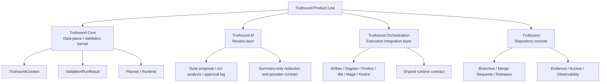

# 개념 & 아키텍처

핵심 개념과 경계에서 Truthound을(를) 기준으로 데이터 품질 검증, 워크플로우 자동화, 결과 해석 방법을 설명합니다.
핵심 개념과 경계에서 Truthound, Core, Orchestration을(를) 기준으로 데이터 품질 검증, 워크플로우 자동화, 결과 해석 방법을 설명합니다.
핵심 개념과 경계에서 Truthound을(를) 기준으로 데이터 품질 검증, 워크플로우 자동화, 결과 해석 방법을 설명합니다.
핵심 개념과 경계에서 관련 설정과 실행 흐름을(를) 기준으로 데이터 품질 검증, 워크플로우 자동화, 결과 해석 방법을 설명합니다.

핵심 개념과 경계에서 관련 설정과 실행 흐름을(를) 다루는 항목입니다:

- 핵심 개념과 경계에서 Truthound, Core을(를) 기준으로 데이터 품질 검증, 워크플로우 자동화, 결과 해석 방법을 설명합니다.
- 핵심 개념과 경계에서 관련 설정과 실행 흐름을(를) 기준으로 데이터 품질 검증, 워크플로우 자동화, 결과 해석 방법을 설명합니다.
- 핵심 개념과 경계에서 관련 설정과 실행 흐름을(를) 기준으로 데이터 품질 검증, 워크플로우 자동화, 결과 해석 방법을 설명합니다.
- 핵심 개념과 경계에서 관련 설정과 실행 흐름을(를) 기준으로 데이터 품질 검증, 워크플로우 자동화, 결과 해석 방법을 설명합니다.
핵심 개념과 경계에서 관련 설정과 실행 흐름을(를) 기준으로 데이터 품질 검증, 워크플로우 자동화, 결과 해석 방법을 설명합니다.
- 핵심 개념과 경계에서 Truthound, Workflow을(를) 기준으로 데이터 품질 검증, 워크플로우 자동화, 결과 해석 방법을 설명합니다.
핵심 개념과 경계에서 Orchestration, Core을(를) 기준으로 데이터 품질 검증, 워크플로우 자동화, 결과 해석 방법을 설명합니다.
핵심 개념과 경계에서 관련 설정과 실행 흐름을(를) 기준으로 데이터 품질 검증, 워크플로우 자동화, 결과 해석 방법을 설명합니다.
- 핵심 개념과 경계에서 관련 설정과 실행 흐름을(를) 기준으로 데이터 품질 검증, 워크플로우 자동화, 결과 해석 방법을 설명합니다.

## Layered System Map

| 핵심 개념과 경계에서 Layer을(를) 기준으로 데이터 품질 검증, 워크플로우 자동화, 결과 해석 방법을 설명합니다. | 핵심 개념과 경계에서 Role을(를) 기준으로 데이터 품질 검증, 워크플로우 자동화, 결과 해석 방법을 설명합니다. | 핵심 개념과 경계에서 Owns을(를) 기준으로 데이터 품질 검증, 워크플로우 자동화, 결과 해석 방법을 설명합니다. | 핵심 개념과 경계에서 Does을(를) 기준으로 데이터 품질 검증, 워크플로우 자동화, 결과 해석 방법을 설명합니다. |
|------|------|------|--------------|
| 핵심 개념과 경계에서 Truthound, Core을(를) 기준으로 데이터 품질 검증, 워크플로우 자동화, 결과 해석 방법을 설명합니다. | Data-plane / 검증 kernel | 핵심 개념과 경계에서 ValidationRunResult, TruthoundContext, Truthound을(를) 기준으로 데이터 품질 검증, 워크플로우 자동화, 결과 해석 방법을 설명합니다. | 핵심 개념과 경계에서 API, APIs, RBAC을(를) 기준으로 데이터 품질 검증, 워크플로우 자동화, 결과 해석 방법을 설명합니다. |
| 핵심 개념과 경계에서 Truthound을(를) 기준으로 데이터 품질 검증, 워크플로우 자동화, 결과 해석 방법을 설명합니다. | 핵심 개념과 경계에서 Review을(를) 기준으로 데이터 품질 검증, 워크플로우 자동화, 결과 해석 방법을 설명합니다. | 핵심 개념과 경계에서 관련 설정과 실행 흐름을(를) 기준으로 데이터 품질 검증, 워크플로우 자동화, 결과 해석 방법을 설명합니다. | 핵심 개념과 경계에서 Workflow을(를) 기준으로 데이터 품질 검증, 워크플로우 자동화, 결과 해석 방법을 설명합니다. |
| **Truthound 오케스트레이션** | Execution 통합 layer | 핵심 개념과 경계에서 Prefect, Dagster, Airflow, Kestra, Mage, dbt을(를) 기준으로 데이터 품질 검증, 워크플로우 자동화, 결과 해석 방법을 설명합니다. | 핵심 개념과 경계에서 Workflow을(를) 기준으로 데이터 품질 검증, 워크플로우 자동화, 결과 해석 방법을 설명합니다. |
| 핵심 개념과 경계에서 Truthound을(를) 기준으로 데이터 품질 검증, 워크플로우 자동화, 결과 해석 방법을 설명합니다. | 핵심 개념과 경계에서 Repository을(를) 기준으로 데이터 품질 검증, 워크플로우 자동화, 결과 해석 방법을 설명합니다. | 핵심 개념과 경계에서 Workflow을(를) 기준으로 데이터 품질 검증, 워크플로우 자동화, 결과 해석 방법을 설명합니다. | 핵심 개념과 경계에서 관련 설정과 실행 흐름을(를) 기준으로 데이터 품질 검증, 워크플로우 자동화, 결과 해석 방법을 설명합니다. |

## Core-Adjoining Namespaces vs First-Party Layers

핵심 개념과 경계에서 Not을(를) 기준으로 데이터 품질 검증, 워크플로우 자동화, 결과 해석 방법을 설명합니다.

| 핵심 개념과 경계에서 Category을(를) 기준으로 데이터 품질 검증, 워크플로우 자동화, 결과 해석 방법을 설명합니다. | 예시 | 핵심 개념과 경계에서 Interpretation을(를) 기준으로 데이터 품질 검증, 워크플로우 자동화, 결과 해석 방법을 설명합니다. |
|---------|----------|----------------|
| 핵심 개념과 경계에서 Core-adjoining을(를) 기준으로 데이터 품질 검증, 워크플로우 자동화, 결과 해석 방법을 설명합니다. | 핵심 개념과 경계에서 `truthound.drift`, `truthound.checkpoint`, `truthound.reporters`, `truthound.datadocs`, `truthound.profiler`을(를) 기준으로 데이터 품질 검증, 워크플로우 자동화, 결과 해석 방법을 설명합니다. | 핵심 개념과 경계에서 `truthound`을(를) 기준으로 데이터 품질 검증, 워크플로우 자동화, 결과 해석 방법을 설명합니다. |
| 핵심 개념과 경계에서 Review-layer을(를) 기준으로 데이터 품질 검증, 워크플로우 자동화, 결과 해석 방법을 설명합니다. | 핵심 개념과 경계에서 `truthound.ai`을(를) 기준으로 데이터 품질 검증, 워크플로우 자동화, 결과 해석 방법을 설명합니다. | 핵심 개념과 경계에서 관련 설정과 실행 흐름을(를) 기준으로 데이터 품질 검증, 워크플로우 자동화, 결과 해석 방법을 설명합니다. |
| **Private 엔진 primitives** | 핵심 개념과 경계에서 `truthound._datasets`을(를) 기준으로 데이터 품질 검증, 워크플로우 자동화, 결과 해석 방법을 설명합니다. | 핵심 개념과 경계에서 API을(를) 기준으로 데이터 품질 검증, 워크플로우 자동화, 결과 해석 방법을 설명합니다. |
| 핵심 개념과 경계에서 Optional을(를) 기준으로 데이터 품질 검증, 워크플로우 자동화, 결과 해석 방법을 설명합니다. | 핵심 개념과 경계에서 `truthound.lineage`, `truthound.realtime`, `truthound.ml`을(를) 기준으로 데이터 품질 검증, 워크플로우 자동화, 결과 해석 방법을 설명합니다. | 핵심 개념과 경계에서 관련 설정과 실행 흐름을(를) 기준으로 데이터 품질 검증, 워크플로우 자동화, 결과 해석 방법을 설명합니다. |
| 핵심 개념과 경계에서 First-party을(를) 기준으로 데이터 품질 검증, 워크플로우 자동화, 결과 해석 방법을 설명합니다. | 핵심 개념과 경계에서 Truthound, `truthound-orchestration`을(를) 기준으로 데이터 품질 검증, 워크플로우 자동화, 결과 해석 방법을 설명합니다. | 핵심 개념과 경계에서 Workflow을(를) 기준으로 데이터 품질 검증, 워크플로우 자동화, 결과 해석 방법을 설명합니다. |

## 핵심 개념과 경계 개요

- 핵심 개념과 경계에서 Core을(를) 기준으로 데이터 품질 검증, 워크플로우 자동화, 결과 해석 방법을 설명합니다.
- 핵심 개념과 경계에서 Move을(를) 기준으로 데이터 품질 검증, 워크플로우 자동화, 결과 해석 방법을 설명합니다.
- 핵심 개념과 경계에서 Truthound, Move, Orchestration을(를) 기준으로 데이터 품질 검증, 워크플로우 자동화, 결과 해석 방법을 설명합니다.
핵심 개념과 경계에서 관련 설정과 실행 흐름을(를) 기준으로 데이터 품질 검증, 워크플로우 자동화, 결과 해석 방법을 설명합니다.
- 핵심 개념과 경계에서 Move, Workflow을(를) 기준으로 데이터 품질 검증, 워크플로우 자동화, 결과 해석 방법을 설명합니다.
핵심 개념과 경계에서 관련 설정과 실행 흐름을(를) 기준으로 데이터 품질 검증, 워크플로우 자동화, 결과 해석 방법을 설명합니다.
- 핵심 개념과 경계에서 Treat을(를) 기준으로 데이터 품질 검증, 워크플로우 자동화, 결과 해석 방법을 설명합니다.
핵심 개념과 경계에서 관련 설정과 실행 흐름을(를) 기준으로 데이터 품질 검증, 워크플로우 자동화, 결과 해석 방법을 설명합니다.

## Recommended Reading Path

1. [Truthound 3.0 아키텍처](architecture.md)
2. [Zero-설정 Context](zero-config.md)
3. [Plugin 플랫폼](plugins.md)
4. [워크플로우 엔진 Primitives](workflow-engine-primitives.md)
5. 핵심 개념과 경계에서 Truthound을(를) 기준으로 데이터 품질 검증, 워크플로우 자동화, 결과 해석 방법을 설명합니다.
6. 핵심 개념과 경계에서 Advanced, Features을(를) 기준으로 데이터 품질 검증, 워크플로우 자동화, 결과 해석 방법을 설명합니다.
7. [Truthound 오케스트레이션](../orchestration/index.md)
8. Truthound 워크플로우 documentation

## Related Reading

- 핵심 개념과 경계에서 Home을(를) 기준으로 데이터 품질 검증, 워크플로우 자동화, 결과 해석 방법을 설명합니다.
- [시작하기](../getting-started/index.md)
- [가이드](../guides/index.md)
- [레퍼런스](../reference/index.md)
- 핵심 개념과 경계에서 Truthound을(를) 기준으로 데이터 품질 검증, 워크플로우 자동화, 결과 해석 방법을 설명합니다.
