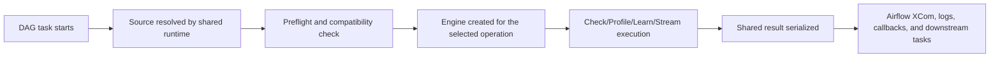

# Airflow

오케스트레이션 실행에서 Truthound, Airflow, DAGs을(를) 기준으로 데이터 품질 검증, 워크플로우 자동화, 결과 해석 방법을 설명합니다.

오케스트레이션 실행에서 Airflow, SLA, Airflow-native을(를) 기준으로 데이터 품질 검증, 워크플로우 자동화, 결과 해석 방법을 설명합니다.

## Who This Is For

- 오케스트레이션 실행에서 DAG-based을(를) 기준으로 데이터 품질 검증, 워크플로우 자동화, 결과 해석 방법을 설명합니다.
- 오케스트레이션 실행에서 Airflow을(를) 기준으로 데이터 품질 검증, 워크플로우 자동화, 결과 해석 방법을 설명합니다.
- 오케스트레이션 실행에서 관련 설정과 실행 흐름을(를) 기준으로 데이터 품질 검증, 워크플로우 자동화, 결과 해석 방법을 설명합니다.
- 오케스트레이션 실행에서 SQL을(를) 기준으로 데이터 품질 검증, 워크플로우 자동화, 결과 해석 방법을 설명합니다.

## When To Use It

오케스트레이션 실행에서 Airflow을(를) 다루는 항목입니다:

- 오케스트레이션 실행에서 DAG을(를) 기준으로 데이터 품질 검증, 워크플로우 자동화, 결과 해석 방법을 설명합니다.
- 오케스트레이션 실행에서 관련 설정과 실행 흐름을(를) 기준으로 데이터 품질 검증, 워크플로우 자동화, 결과 해석 방법을 설명합니다.
- 오케스트레이션 실행에서 Airflow을(를) 기준으로 데이터 품질 검증, 워크플로우 자동화, 결과 해석 방법을 설명합니다.
- 오케스트레이션 실행에서 관련 설정과 실행 흐름을(를) 기준으로 데이터 품질 검증, 워크플로우 자동화, 결과 해석 방법을 설명합니다.

오케스트레이션 실행에서 Prefect, Dagster, dbt, Prefer, Python-first을(를) 기준으로 데이터 품질 검증, 워크플로우 자동화, 결과 해석 방법을 설명합니다.

## Prerequisites

- `truthound-orchestration[airflow]` installed in the Airflow 런타임
- 오케스트레이션 실행에서 Airflow, Airflow/Python을(를) 기준으로 데이터 품질 검증, 워크플로우 자동화, 결과 해석 방법을 설명합니다.
- 오케스트레이션 실행에서 Airflow, SQL, SQL-backed을(를) 기준으로 데이터 품질 검증, 워크플로우 자동화, 결과 해석 방법을 설명합니다.

## Minimal Quickstart

오케스트레이션 실행에서 Airflow, Install을(를) 다루는 항목입니다:

```bash
pip install truthound-orchestration[airflow] "truthound>=3.0,<4.0"
```

Then create a basic 오퍼레이터:

```python
from airflow import DAG
from truthound_airflow import DataQualityCheckOperator

with DAG("quality_pipeline", schedule="@daily", catchup=False) as dag:
    check_users = DataQualityCheckOperator(
        task_id="check_users",
        data_path="/opt/airflow/data/users.parquet",
        rules=[
            {"column": "user_id", "type": "not_null"},
            {"column": "email", "type": "unique"},
        ],
    )
```

오케스트레이션 실행에서 Add을(를) 다루는 항목입니다:

```python
from truthound_airflow import DeferrableDataQualitySensor

wait_for_users = DeferrableDataQualitySensor(
    task_id="wait_for_users_quality",
    data_path="/opt/airflow/data/users.parquet",
    rules=[{"column": "id", "check": "not_null"}],
)
```

## Decision 테이블

| 오케스트레이션 실행에서 Need을(를) 기준으로 데이터 품질 검증, 워크플로우 자동화, 결과 해석 방법을 설명합니다. | 오케스트레이션 실행에서 Airflow, Recommended, Surface을(를) 기준으로 데이터 품질 검증, 워크플로우 자동화, 결과 해석 방법을 설명합니다. | 오케스트레이션 실행에서 관련 설정과 실행 흐름을(를) 기준으로 데이터 품질 검증, 워크플로우 자동화, 결과 해석 방법을 설명합니다. |
|------|-----------------------------|-----|
| 오케스트레이션 실행에서 DAG을(를) 기준으로 데이터 품질 검증, 워크플로우 자동화, 결과 해석 방법을 설명합니다. | 오케스트레이션 실행에서 `DataQualityCheckOperator`, DataQualityCheckOperator을(를) 기준으로 데이터 품질 검증, 워크플로우 자동화, 결과 해석 방법을 설명합니다. | 오케스트레이션 실행에서 관련 설정과 실행 흐름을(를) 기준으로 데이터 품질 검증, 워크플로우 자동화, 결과 해석 방법을 설명합니다. |
| 오케스트레이션 실행에서 관련 설정과 실행 흐름을(를) 기준으로 데이터 품질 검증, 워크플로우 자동화, 결과 해석 방법을 설명합니다. | 오케스트레이션 실행에서 `DataQualitySensor`, `DeferrableDataQualitySensor`, DataQualitySensor, DeferrableDataQualitySensor을(를) 기준으로 데이터 품질 검증, 워크플로우 자동화, 결과 해석 방법을 설명합니다. | 오케스트레이션 실행에서 관련 설정과 실행 흐름을(를) 기준으로 데이터 품질 검증, 워크플로우 자동화, 결과 해석 방법을 설명합니다. |
| 오케스트레이션 실행에서 관련 설정과 실행 흐름을(를) 기준으로 데이터 품질 검증, 워크플로우 자동화, 결과 해석 방법을 설명합니다. | 오케스트레이션 실행에서 `DataQualityHook`, DataQualityHook을(를) 기준으로 데이터 품질 검증, 워크플로우 자동화, 결과 해석 방법을 설명합니다. | 오케스트레이션 실행에서 Airflow을(를) 기준으로 데이터 품질 검증, 워크플로우 자동화, 결과 해석 방법을 설명합니다. |
| 오케스트레이션 실행에서 관련 설정과 실행 흐름을(를) 기준으로 데이터 품질 검증, 워크플로우 자동화, 결과 해석 방법을 설명합니다. | 오케스트레이션 실행에서 SLA을(를) 기준으로 데이터 품질 검증, 워크플로우 자동화, 결과 해석 방법을 설명합니다. | 오케스트레이션 실행에서 관련 설정과 실행 흐름을(를) 기준으로 데이터 품질 검증, 워크플로우 자동화, 결과 해석 방법을 설명합니다. |
| 오케스트레이션 실행에서 관련 설정과 실행 흐름을(를) 기준으로 데이터 품질 검증, 워크플로우 자동화, 결과 해석 방법을 설명합니다. | 오케스트레이션 실행에서 `DataQualityStreamOperator`, DataQualityStreamOperator을(를) 기준으로 데이터 품질 검증, 워크플로우 자동화, 결과 해석 방법을 설명합니다. | 오케스트레이션 실행에서 관련 설정과 실행 흐름을(를) 기준으로 데이터 품질 검증, 워크플로우 자동화, 결과 해석 방법을 설명합니다. |

## Execution Lifecycle



## 결과 Surface

- 오케스트레이션 실행에서 Truthound, Airflow, Airflow-native, XCom을(를) 기준으로 데이터 품질 검증, 워크플로우 자동화, 결과 해석 방법을 설명합니다.
- 오케스트레이션 실행에서 `data_quality_result`, XCom을(를) 기준으로 데이터 품질 검증, 워크플로우 자동화, 결과 해석 방법을 설명합니다.
- 오케스트레이션 실행에서 관련 설정과 실행 흐름을(를) 기준으로 데이터 품질 검증, 워크플로우 자동화, 결과 해석 방법을 설명합니다.
- 오케스트레이션 실행에서 관련 설정과 실행 흐름을(를) 기준으로 데이터 품질 검증, 워크플로우 자동화, 결과 해석 방법을 설명합니다.

## 설정 Surface

| 설정 Area | 오케스트레이션 실행에서 Airflow, Boundary을(를) 기준으로 데이터 품질 검증, 워크플로우 자동화, 결과 해석 방법을 설명합니다. |
|-------------|------------------|
| 소스 location | `data_path=` or `sql=` on the 오퍼레이터/센서 |
| 오케스트레이션 실행에서 관련 설정과 실행 흐름을(를) 기준으로 데이터 품질 검증, 워크플로우 자동화, 결과 해석 방법을 설명합니다. | 오케스트레이션 실행에서 Airflow, `connection_id=`을(를) 기준으로 데이터 품질 검증, 워크플로우 자동화, 결과 해석 방법을 설명합니다. |
| execution 엔진 | 오케스트레이션 실행에서 Truthound, `engine_name=`을(를) 기준으로 데이터 품질 검증, 워크플로우 자동화, 결과 해석 방법을 설명합니다. |
| 오케스트레이션 실행에서 관련 설정과 실행 흐름을(를) 기준으로 데이터 품질 검증, 워크플로우 자동화, 결과 해석 방법을 설명합니다. | 오케스트레이션 실행에서 `timeout_seconds`을(를) 기준으로 데이터 품질 검증, 워크플로우 자동화, 결과 해석 방법을 설명합니다. |
| 결과 transport | 오케스트레이션 실행에서 `xcom_push_key=`을(를) 기준으로 데이터 품질 검증, 워크플로우 자동화, 결과 해석 방법을 설명합니다. |

## What Zero-설정 Covers

- 오케스트레이션 실행에서 Airflow을(를) 기준으로 데이터 품질 검증, 워크플로우 자동화, 결과 해석 방법을 설명합니다.
- 오케스트레이션 실행에서 Truthound을(를) 기준으로 데이터 품질 검증, 워크플로우 자동화, 결과 해석 방법을 설명합니다.
- 오케스트레이션 실행에서 관련 설정과 실행 흐름을(를) 기준으로 데이터 품질 검증, 워크플로우 자동화, 결과 해석 방법을 설명합니다.
- 오케스트레이션 실행에서 관련 설정과 실행 흐름을(를) 기준으로 데이터 품질 검증, 워크플로우 자동화, 결과 해석 방법을 설명합니다.

오케스트레이션 실행에서 관련 설정과 실행 흐름을(를) 다루는 항목입니다:

- 오케스트레이션 실행에서 Airflow, SQL을(를) 기준으로 데이터 품질 검증, 워크플로우 자동화, 결과 해석 방법을 설명합니다.
- 오케스트레이션 실행에서 Airflow을(를) 기준으로 데이터 품질 검증, 워크플로우 자동화, 결과 해석 방법을 설명합니다.
- 오케스트레이션 실행에서 Truthound을(를) 기준으로 데이터 품질 검증, 워크플로우 자동화, 결과 해석 방법을 설명합니다.

## Primary Components

| 오케스트레이션 실행에서 Component을(를) 기준으로 데이터 품질 검증, 워크플로우 자동화, 결과 해석 방법을 설명합니다. | 오케스트레이션 실행에서 관련 설정과 실행 흐름을(를) 기준으로 데이터 품질 검증, 워크플로우 자동화, 결과 해석 방법을 설명합니다. |
|-----------|------------|
| 오케스트레이션 실행에서 `DataQualityCheckOperator`, DataQualityCheckOperator을(를) 기준으로 데이터 품질 검증, 워크플로우 자동화, 결과 해석 방법을 설명합니다. | 오케스트레이션 실행에서 관련 설정과 실행 흐름을(를) 기준으로 데이터 품질 검증, 워크플로우 자동화, 결과 해석 방법을 설명합니다. |
| 오케스트레이션 실행에서 `DataQualityProfileOperator`, DataQualityProfileOperator을(를) 기준으로 데이터 품질 검증, 워크플로우 자동화, 결과 해석 방법을 설명합니다. | 프로파일링 and shape inspection |
| 오케스트레이션 실행에서 `DataQualityLearnOperator`, DataQualityLearnOperator을(를) 기준으로 데이터 품질 검증, 워크플로우 자동화, 결과 해석 방법을 설명합니다. | 오케스트레이션 실행에서 관련 설정과 실행 흐름을(를) 기준으로 데이터 품질 검증, 워크플로우 자동화, 결과 해석 방법을 설명합니다. |
| 오케스트레이션 실행에서 `DataQualityStreamOperator`, DataQualityStreamOperator을(를) 기준으로 데이터 품질 검증, 워크플로우 자동화, 결과 해석 방법을 설명합니다. | 오케스트레이션 실행에서 관련 설정과 실행 흐름을(를) 기준으로 데이터 품질 검증, 워크플로우 자동화, 결과 해석 방법을 설명합니다. |
| 오케스트레이션 실행에서 `DataQualitySensor`, `DeferrableDataQualitySensor`, DataQualitySensor, DeferrableDataQualitySensor을(를) 기준으로 데이터 품질 검증, 워크플로우 자동화, 결과 해석 방법을 설명합니다. | 오케스트레이션 실행에서 관련 설정과 실행 흐름을(를) 기준으로 데이터 품질 검증, 워크플로우 자동화, 결과 해석 방법을 설명합니다. |
| 오케스트레이션 실행에서 Truthound, `DataQualityHook`, `TruthoundHook`, DataQualityHook, TruthoundHook을(를) 기준으로 데이터 품질 검증, 워크플로우 자동화, 결과 해석 방법을 설명합니다. | 오케스트레이션 실행에서 관련 설정과 실행 흐름을(를) 기준으로 데이터 품질 검증, 워크플로우 자동화, 결과 해석 방법을 설명합니다. |
| 오케스트레이션 실행에서 SLA을(를) 기준으로 데이터 품질 검증, 워크플로우 자동화, 결과 해석 방법을 설명합니다. | 오케스트레이션 실행에서 관련 설정과 실행 흐름을(를) 기준으로 데이터 품질 검증, 워크플로우 자동화, 결과 해석 방법을 설명합니다. |

## Production Pattern

- 오케스트레이션 실행에서 관련 설정과 실행 흐름을(를) 기준으로 데이터 품질 검증, 워크플로우 자동화, 결과 해석 방법을 설명합니다.
- 오케스트레이션 실행에서 Prefer을(를) 기준으로 데이터 품질 검증, 워크플로우 자동화, 결과 해석 방법을 설명합니다.
- 오케스트레이션 실행에서 Keep, XCom을(를) 기준으로 데이터 품질 검증, 워크플로우 자동화, 결과 해석 방법을 설명합니다.
- 오케스트레이션 실행에서 Treat을(를) 기준으로 데이터 품질 검증, 워크플로우 자동화, 결과 해석 방법을 설명합니다.
- 오케스트레이션 실행에서 Keep을(를) 기준으로 데이터 품질 검증, 워크플로우 자동화, 결과 해석 방법을 설명합니다.

## Production Checklist

- 오케스트레이션 실행에서 Airflow, Airflow/Python을(를) 기준으로 데이터 품질 검증, 워크플로우 자동화, 결과 해석 방법을 설명합니다.
- 오케스트레이션 실행에서 Airflow을(를) 기준으로 데이터 품질 검증, 워크플로우 자동화, 결과 해석 방법을 설명합니다.
- 오케스트레이션 실행에서 DAG을(를) 기준으로 데이터 품질 검증, 워크플로우 자동화, 결과 해석 방법을 설명합니다.
- 오케스트레이션 실행에서 XCom을(를) 기준으로 데이터 품질 검증, 워크플로우 자동화, 결과 해석 방법을 설명합니다.
- 오케스트레이션 실행에서 관련 설정과 실행 흐름을(를) 기준으로 데이터 품질 검증, 워크플로우 자동화, 결과 해석 방법을 설명합니다.
- 오케스트레이션 실행에서 SLA을(를) 기준으로 데이터 품질 검증, 워크플로우 자동화, 결과 해석 방법을 설명합니다.

## 실패 Modes and 문제 해결

| 오케스트레이션 실행에서 Symptom을(를) 기준으로 데이터 품질 검증, 워크플로우 자동화, 결과 해석 방법을 설명합니다. | 오케스트레이션 실행에서 Likely, Cause을(를) 기준으로 데이터 품질 검증, 워크플로우 자동화, 결과 해석 방법을 설명합니다. | 오케스트레이션 실행에서 관련 설정과 실행 흐름을(를) 기준으로 데이터 품질 검증, 워크플로우 자동화, 결과 해석 방법을 설명합니다. |
|--------|--------------|------------|
| 오케스트레이션 실행에서 SQL을(를) 기준으로 데이터 품질 검증, 워크플로우 자동화, 결과 해석 방법을 설명합니다. | 오케스트레이션 실행에서 `connection_id`을(를) 기준으로 데이터 품질 검증, 워크플로우 자동화, 결과 해석 방법을 설명합니다. | 오케스트레이션 실행에서 Airflow을(를) 기준으로 데이터 품질 검증, 워크플로우 자동화, 결과 해석 방법을 설명합니다. |
| 오케스트레이션 실행에서 관련 설정과 실행 흐름을(를) 기준으로 데이터 품질 검증, 워크플로우 자동화, 결과 해석 방법을 설명합니다. | 오케스트레이션 실행에서 `xcom_push_key`을(를) 기준으로 데이터 품질 검증, 워크플로우 자동화, 결과 해석 방법을 설명합니다. | 오케스트레이션 실행에서 관련 설정과 실행 흐름을(를) 기준으로 데이터 품질 검증, 워크플로우 자동화, 결과 해석 방법을 설명합니다. |
| 센서 ties up workers | 오케스트레이션 실행에서 관련 설정과 실행 흐름을(를) 기준으로 데이터 품질 검증, 워크플로우 자동화, 결과 해석 방법을 설명합니다. | 오케스트레이션 실행에서 관련 설정과 실행 흐름을(를) 기준으로 데이터 품질 검증, 워크플로우 자동화, 결과 해석 방법을 설명합니다. |
| 오케스트레이션 실행에서 DAGs을(를) 기준으로 데이터 품질 검증, 워크플로우 자동화, 결과 해석 방법을 설명합니다. | 오케스트레이션 실행에서 관련 설정과 실행 흐름을(를) 기준으로 데이터 품질 검증, 워크플로우 자동화, 결과 해석 방법을 설명합니다. | 오케스트레이션 실행에서 관련 설정과 실행 흐름을(를) 기준으로 데이터 품질 검증, 워크플로우 자동화, 결과 해석 방법을 설명합니다. |

## Read Next

- [Install and 호환성](install-compatibility.md)
- [Connections and 시크릿](connections-secrets.md)
- 오케스트레이션 실행에서 DAG, Patterns을(를) 기준으로 데이터 품질 검증, 워크플로우 자동화, 결과 해석 방법을 설명합니다.
- 오케스트레이션 실행에서 Operators을(를) 기준으로 데이터 품질 검증, 워크플로우 자동화, 결과 해석 방법을 설명합니다.
- 오케스트레이션 실행에서 Hooks을(를) 기준으로 데이터 품질 검증, 워크플로우 자동화, 결과 해석 방법을 설명합니다.
- 오케스트레이션 실행에서 Sensors, Triggers을(를) 기준으로 데이터 품질 검증, 워크플로우 자동화, 결과 해석 방법을 설명합니다.
- 오케스트레이션 실행에서 XCom, Result, Payloads을(를) 기준으로 데이터 품질 검증, 워크플로우 자동화, 결과 해석 방법을 설명합니다.
- 오케스트레이션 실행에서 SLA, Callbacks을(를) 기준으로 데이터 품질 검증, 워크플로우 자동화, 결과 해석 방법을 설명합니다.
- [관측성 and Alerting](observability-alerting.md)
- [레시피](recipes.md)
- [문제 해결](troubleshooting.md)
