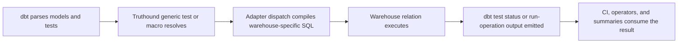

# Truthound for dbt

오케스트레이션 실행에서 Truthound, SQL, dbt, `truthound-orchestration 3.x`, SQL-first을(를) 기준으로 데이터 품질 검증, 워크플로우 자동화, 결과 해석 방법을 설명합니다.
오케스트레이션 실행에서 dbt, `schema.yml`을(를) 기준으로 데이터 품질 검증, 워크플로우 자동화, 결과 해석 방법을 설명합니다.
오케스트레이션 실행에서 SQL, `run-operation`을(를) 기준으로 데이터 품질 검증, 워크플로우 자동화, 결과 해석 방법을 설명합니다.
오케스트레이션 실행에서 관련 설정과 실행 흐름을(를) 기준으로 데이터 품질 검증, 워크플로우 자동화, 결과 해석 방법을 설명합니다.

## Who This Is For

- 오케스트레이션 실행에서 dbt을(를) 기준으로 데이터 품질 검증, 워크플로우 자동화, 결과 해석 방법을 설명합니다.
오케스트레이션 런타임 inside the project
- 오케스트레이션 실행에서 YAML, Python을(를) 기준으로 데이터 품질 검증, 워크플로우 자동화, 결과 해석 방법을 설명합니다.
- 오케스트레이션 실행에서 관련 설정과 실행 흐름을(를) 기준으로 데이터 품질 검증, 워크플로우 자동화, 결과 해석 방법을 설명합니다.

## When To Use The dbt 어댑터

오케스트레이션 실행에서 dbt을(를) 다루는 항목입니다:

- 오케스트레이션 실행에서 관련 설정과 실행 흐름을(를) 기준으로 데이터 품질 검증, 워크플로우 자동화, 결과 해석 방법을 설명합니다.
- 오케스트레이션 실행에서 dbt을(를) 기준으로 데이터 품질 검증, 워크플로우 자동화, 결과 해석 방법을 설명합니다.
- 오케스트레이션 실행에서 SQL, `adapter.dispatch`을(를) 기준으로 데이터 품질 검증, 워크플로우 자동화, 결과 해석 방법을 설명합니다.
- 오케스트레이션 실행에서 Truthound을(를) 기준으로 데이터 품질 검증, 워크플로우 자동화, 결과 해석 방법을 설명합니다.
오케스트레이션 실행에서 관련 설정과 실행 흐름을(를) 기준으로 데이터 품질 검증, 워크플로우 자동화, 결과 해석 방법을 설명합니다.

오케스트레이션 실행에서 Prefect, Dagster, Airflow, Prefer을(를) 기준으로 데이터 품질 검증, 워크플로우 자동화, 결과 해석 방법을 설명합니다.
오케스트레이션 실행에서 dbt을(를) 기준으로 데이터 품질 검증, 워크플로우 자동화, 결과 해석 방법을 설명합니다.

## Prerequisites

- `dbt-core` installed with a supported 어댑터
- 오케스트레이션 실행에서 Truthound, dbt, `packages.yml`, `dbt deps`을(를) 기준으로 데이터 품질 검증, 워크플로우 자동화, 결과 해석 방법을 설명합니다.
- 오케스트레이션 실행에서 dbt을(를) 기준으로 데이터 품질 검증, 워크플로우 자동화, 결과 해석 방법을 설명합니다.

## What The Package Provides

- 오케스트레이션 실행에서 `truthound.truthound_check`을(를) 기준으로 데이터 품질 검증, 워크플로우 자동화, 결과 해석 방법을 설명합니다.
- convenience 컬럼 tests such as `truthound.truthound_not_null`
- 오케스트레이션 실행에서 관련 설정과 실행 흐름을(를) 기준으로 데이터 품질 검증, 워크플로우 자동화, 결과 해석 방법을 설명합니다.
- 오케스트레이션 실행에서 SQL을(를) 기준으로 데이터 품질 검증, 워크플로우 자동화, 결과 해석 방법을 설명합니다.
- 오케스트레이션 실행에서 관련 설정과 실행 흐름을(를) 기준으로 데이터 품질 검증, 워크플로우 자동화, 결과 해석 방법을 설명합니다.

## Minimal Quickstart

1. 오케스트레이션 실행에서 `packages.yml`, Add을(를) 기준으로 데이터 품질 검증, 워크플로우 자동화, 결과 해석 방법을 설명합니다.
2. 오케스트레이션 실행에서 dbt, `dbt deps`, Run을(를) 기준으로 데이터 품질 검증, 워크플로우 자동화, 결과 해석 방법을 설명합니다.
3. 오케스트레이션 실행에서 Truthound, Attach을(를) 기준으로 데이터 품질 검증, 워크플로우 자동화, 결과 해석 방법을 설명합니다.
4. 오케스트레이션 실행에서 dbt, `dbt test`, Run을(를) 기준으로 데이터 품질 검증, 워크플로우 자동화, 결과 해석 방법을 설명합니다.

```yaml
# packages.yml
packages:
  - package: truthound/truthound
    version: ">=3.0.0,<4.0.0"
```

```yaml
# models/marts/schema.yml
version: 2

models:
  - name: dim_users
    tests:
      - truthound.truthound_check:
          arguments:
            rules:
              - column: id
                check: not_null
              - column: id
                check: unique
              - column: email
                check: email_format
              - column: status
                check: in_set
                values: ["active", "inactive", "pending"]
```

오케스트레이션 실행에서 `run-operation`을(를) 다루는 항목입니다:

```bash
dbt run-operation run_truthound_check --args '{
  "model_name": "test_model_valid",
  "rules": [{"column": "id", "check": "not_null"}],
  "options": {"limit": 50}
}'
```

## Decision 테이블

| 오케스트레이션 실행에서 Need을(를) 기준으로 데이터 품질 검증, 워크플로우 자동화, 결과 해석 방법을 설명합니다. | 오케스트레이션 실행에서 dbt, Recommended, Surface을(를) 기준으로 데이터 품질 검증, 워크플로우 자동화, 결과 해석 방법을 설명합니다. | 오케스트레이션 실행에서 관련 설정과 실행 흐름을(를) 기준으로 데이터 품질 검증, 워크플로우 자동화, 결과 해석 방법을 설명합니다. |
|------|-------------------------|-----|
| 오케스트레이션 실행에서 관련 설정과 실행 흐름을(를) 기준으로 데이터 품질 검증, 워크플로우 자동화, 결과 해석 방법을 설명합니다. | 오케스트레이션 실행에서 `truthound.truthound_check`을(를) 기준으로 데이터 품질 검증, 워크플로우 자동화, 결과 해석 방법을 설명합니다. | 오케스트레이션 실행에서 관련 설정과 실행 흐름을(를) 기준으로 데이터 품질 검증, 워크플로우 자동화, 결과 해석 방법을 설명합니다. |
| simple 컬럼 rule | 오케스트레이션 실행에서 `truthound.truthound_not_null`을(를) 기준으로 데이터 품질 검증, 워크플로우 자동화, 결과 해석 방법을 설명합니다. | 오케스트레이션 실행에서 YAML을(를) 기준으로 데이터 품질 검증, 워크플로우 자동화, 결과 해석 방법을 설명합니다. |
| ad hoc 오퍼레이터 summary | 오케스트레이션 실행에서 `run_truthound_summary`을(를) 기준으로 데이터 품질 검증, 워크플로우 자동화, 결과 해석 방법을 설명합니다. | 오케스트레이션 실행에서 관련 설정과 실행 흐름을(를) 기준으로 데이터 품질 검증, 워크플로우 자동화, 결과 해석 방법을 설명합니다. |
| 오케스트레이션 실행에서 관련 설정과 실행 흐름을(를) 기준으로 데이터 품질 검증, 워크플로우 자동화, 결과 해석 방법을 설명합니다. | 오케스트레이션 실행에서 관련 설정과 실행 흐름을(를) 기준으로 데이터 품질 검증, 워크플로우 자동화, 결과 해석 방법을 설명합니다. | 오케스트레이션 실행에서 관련 설정과 실행 흐름을(를) 기준으로 데이터 품질 검증, 워크플로우 자동화, 결과 해석 방법을 설명합니다. |

## Execution Lifecycle



## 결과 Surface

- 오케스트레이션 실행에서 dbt, `dbt test`을(를) 기준으로 데이터 품질 검증, 워크플로우 자동화, 결과 해석 방법을 설명합니다.
- 오케스트레이션 실행에서 `run_truthound_check`, `run_truthound_summary`을(를) 기준으로 데이터 품질 검증, 워크플로우 자동화, 결과 해석 방법을 설명합니다.
- 오케스트레이션 실행에서 DataFrame을(를) 기준으로 데이터 품질 검증, 워크플로우 자동화, 결과 해석 방법을 설명합니다.

## 설정 Surface

| 설정 Area | 오케스트레이션 실행에서 dbt, Boundary을(를) 기준으로 데이터 품질 검증, 워크플로우 자동화, 결과 해석 방법을 설명합니다. |
|-------------|--------------|
| 오케스트레이션 실행에서 관련 설정과 실행 흐름을(를) 기준으로 데이터 품질 검증, 워크플로우 자동화, 결과 해석 방법을 설명합니다. | 오케스트레이션 실행에서 dbt, `packages.yml`, `dbt deps`을(를) 기준으로 데이터 품질 검증, 워크플로우 자동화, 결과 해석 방법을 설명합니다. |
| 검증 intent | 오케스트레이션 실행에서 `schema.yml`을(를) 기준으로 데이터 품질 검증, 워크플로우 자동화, 결과 해석 방법을 설명합니다. |
| 런타임 target | 오케스트레이션 실행에서 dbt을(를) 기준으로 데이터 품질 검증, 워크플로우 자동화, 결과 해석 방법을 설명합니다. |
| 오케스트레이션 실행에서 관련 설정과 실행 흐름을(를) 기준으로 데이터 품질 검증, 워크플로우 자동화, 결과 해석 방법을 설명합니다. | 오케스트레이션 실행에서 `run-operation`을(를) 기준으로 데이터 품질 검증, 워크플로우 자동화, 결과 해석 방법을 설명합니다. |
| 오케스트레이션 실행에서 관련 설정과 실행 흐름을(를) 기준으로 데이터 품질 검증, 워크플로우 자동화, 결과 해석 방법을 설명합니다. | dbt test 설정 such as `severity: warn` |

## Production Pattern

오케스트레이션 실행에서 관련 설정과 실행 흐름을(를) 다루는 항목입니다:

- 오케스트레이션 실행에서 관련 설정과 실행 흐름을(를) 기준으로 데이터 품질 검증, 워크플로우 자동화, 결과 해석 방법을 설명합니다.
- 오케스트레이션 실행에서 `truthound_check`을(를) 기준으로 데이터 품질 검증, 워크플로우 자동화, 결과 해석 방법을 설명합니다.
- 오케스트레이션 실행에서 관련 설정과 실행 흐름을(를) 기준으로 데이터 품질 검증, 워크플로우 자동화, 결과 해석 방법을 설명합니다.
- 오케스트레이션 실행에서 `severity: warn`을(를) 기준으로 데이터 품질 검증, 워크플로우 자동화, 결과 해석 방법을 설명합니다.
- 오케스트레이션 실행에서 dbt, `dbt test`, `run-operation`을(를) 기준으로 데이터 품질 검증, 워크플로우 자동화, 결과 해석 방법을 설명합니다.

## 오케스트레이션 실행 개요

오케스트레이션 실행에서 SQL, dbt을(를) 다루는 항목입니다:

- 오케스트레이션 실행에서 dbt을(를) 기준으로 데이터 품질 검증, 워크플로우 자동화, 결과 해석 방법을 설명합니다.
- 오케스트레이션 실행에서 dbt을(를) 기준으로 데이터 품질 검증, 워크플로우 자동화, 결과 해석 방법을 설명합니다.
- 오케스트레이션 실행에서 `ref()`, `source()`을(를) 기준으로 데이터 품질 검증, 워크플로우 자동화, 결과 해석 방법을 설명합니다.

오케스트레이션 실행에서 dbt, Unlike, Python을(를) 기준으로 데이터 품질 검증, 워크플로우 자동화, 결과 해석 방법을 설명합니다.
오케스트레이션 실행에서 dbt을(를) 기준으로 데이터 품질 검증, 워크플로우 자동화, 결과 해석 방법을 설명합니다.

## 오케스트레이션 실행 개요

오케스트레이션 실행에서 Truthound, dbt, Python을(를) 기준으로 데이터 품질 검증, 워크플로우 자동화, 결과 해석 방법을 설명합니다.
오케스트레이션 실행에서 관련 설정과 실행 흐름을(를) 기준으로 데이터 품질 검증, 워크플로우 자동화, 결과 해석 방법을 설명합니다.
오케스트레이션 실행에서 관련 설정과 실행 흐름을(를) 기준으로 데이터 품질 검증, 워크플로우 자동화, 결과 해석 방법을 설명합니다.

오케스트레이션 실행에서 관련 설정과 실행 흐름을(를) 다루는 항목입니다:

- [Shared 런타임 개요](../common/index.md)
- 오케스트레이션 실행에서 Preflight, Compatibility을(를) 기준으로 데이터 품질 검증, 워크플로우 자동화, 결과 해석 방법을 설명합니다.
- [결과 Serialization](../common/result-serialization.md)

## Production Checklist

- 오케스트레이션 실행에서 관련 설정과 실행 흐름을(를) 기준으로 데이터 품질 검증, 워크플로우 자동화, 결과 해석 방법을 설명합니다.
- 오케스트레이션 실행에서 dbt, `dbt deps`을(를) 기준으로 데이터 품질 검증, 워크플로우 자동화, 결과 해석 방법을 설명합니다.
- 오케스트레이션 실행에서 관련 설정과 실행 흐름을(를) 기준으로 데이터 품질 검증, 워크플로우 자동화, 결과 해석 방법을 설명합니다.
- 오케스트레이션 실행에서 `severity: warn`을(를) 기준으로 데이터 품질 검증, 워크플로우 자동화, 결과 해석 방법을 설명합니다.
- 오케스트레이션 실행에서 `run_truthound_check`, `run_truthound_summary`을(를) 기준으로 데이터 품질 검증, 워크플로우 자동화, 결과 해석 방법을 설명합니다.

## 실패 Modes and 문제 해결

| 오케스트레이션 실행에서 Symptom을(를) 기준으로 데이터 품질 검증, 워크플로우 자동화, 결과 해석 방법을 설명합니다. | 오케스트레이션 실행에서 Likely, Cause을(를) 기준으로 데이터 품질 검증, 워크플로우 자동화, 결과 해석 방법을 설명합니다. | 오케스트레이션 실행에서 관련 설정과 실행 흐름을(를) 기준으로 데이터 품질 검증, 워크플로우 자동화, 결과 해석 방법을 설명합니다. |
|--------|--------------|------------|
| 오케스트레이션 실행에서 관련 설정과 실행 흐름을(를) 기준으로 데이터 품질 검증, 워크플로우 자동화, 결과 해석 방법을 설명합니다. | 오케스트레이션 실행에서 dbt, `dbt deps`을(를) 기준으로 데이터 품질 검증, 워크플로우 자동화, 결과 해석 방법을 설명합니다. | 오케스트레이션 실행에서 `truthound.truthound_*`을(를) 기준으로 데이터 품질 검증, 워크플로우 자동화, 결과 해석 방법을 설명합니다. |
| 오케스트레이션 실행에서 Python-adapter을(를) 기준으로 데이터 품질 검증, 워크플로우 자동화, 결과 해석 방법을 설명합니다. | 오케스트레이션 실행에서 dbt을(를) 기준으로 데이터 품질 검증, 워크플로우 자동화, 결과 해석 방법을 설명합니다. | 오케스트레이션 실행에서 Python을(를) 기준으로 데이터 품질 검증, 워크플로우 자동화, 결과 해석 방법을 설명합니다. |
| 오케스트레이션 실행에서 관련 설정과 실행 흐름을(를) 기준으로 데이터 품질 검증, 워크플로우 자동화, 결과 해석 방법을 설명합니다. | 웨어하우스-specific 런타임 behavior changed | 오케스트레이션 실행에서 관련 설정과 실행 흐름을(를) 기준으로 데이터 품질 검증, 워크플로우 자동화, 결과 해석 방법을 설명합니다. |

## Recommended Reading Order

- 오케스트레이션 실행에서 Package, Setup을(를) 기준으로 데이터 품질 검증, 워크플로우 자동화, 결과 해석 방법을 설명합니다.
- 오케스트레이션 실행에서 Singular, Generic, Tests을(를) 기준으로 데이터 품질 검증, 워크플로우 자동화, 결과 해석 방법을 설명합니다.
- 오케스트레이션 실행에서 Generic, Tests을(를) 기준으로 데이터 품질 검증, 워크플로우 자동화, 결과 해석 방법을 설명합니다.
- 오케스트레이션 실행에서 Macros, Operations을(를) 기준으로 데이터 품질 검증, 워크플로우 자동화, 결과 해석 방법을 설명합니다.
- [어댑터 Behavior](adapter-behavior.md)
- [웨어하우스 런타임 Behavior](warehouse-runtime-behavior.md)
- [결과 Materialization](result-materialization.md)
- 오케스트레이션 실행에서 First-Party, Suite을(를) 기준으로 데이터 품질 검증, 워크플로우 자동화, 결과 해석 방법을 설명합니다.
- 오케스트레이션 실행에서 Package, Upgrade, Guidance을(를) 기준으로 데이터 품질 검증, 워크플로우 자동화, 결과 해석 방법을 설명합니다.
- [문제 해결](troubleshooting.md)
