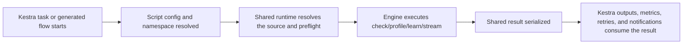

# Truthound for Kestra

오케스트레이션 실행에서 Truthound, Kestra, YAML, YAML-first, Python을(를) 기준으로 데이터 품질 검증, 워크플로우 자동화, 결과 해석 방법을 설명합니다.
오케스트레이션 실행에서 SLA-aware을(를) 기준으로 데이터 품질 검증, 워크플로우 자동화, 결과 해석 방법을 설명합니다.
오케스트레이션 실행에서 Kestra을(를) 기준으로 데이터 품질 검증, 워크플로우 자동화, 결과 해석 방법을 설명합니다.

## Who This Is For

- 오케스트레이션 실행에서 Kestra, YAML을(를) 기준으로 데이터 품질 검증, 워크플로우 자동화, 결과 해석 방법을 설명합니다.
- 오케스트레이션 실행에서 관련 설정과 실행 흐름을(를) 기준으로 데이터 품질 검증, 워크플로우 자동화, 결과 해석 방법을 설명합니다.
- 오케스트레이션 실행에서 관련 설정과 실행 흐름을(를) 기준으로 데이터 품질 검증, 워크플로우 자동화, 결과 해석 방법을 설명합니다.

## When To Use It

오케스트레이션 실행에서 Kestra, Choose을(를) 다루는 항목입니다:

- 오케스트레이션 실행에서 YAML을(를) 기준으로 데이터 품질 검증, 워크플로우 자동화, 결과 해석 방법을 설명합니다.
- 오케스트레이션 실행에서 Python을(를) 기준으로 데이터 품질 검증, 워크플로우 자동화, 결과 해석 방법을 설명합니다.
- 오케스트레이션 실행에서 관련 설정과 실행 흐름을(를) 기준으로 데이터 품질 검증, 워크플로우 자동화, 결과 해석 방법을 설명합니다.

## Prerequisites

- 오케스트레이션 실행에서 `truthound-orchestration[kestra]`을(를) 기준으로 데이터 품질 검증, 워크플로우 자동화, 결과 해석 방법을 설명합니다.
- 오케스트레이션 실행에서 Kestra을(를) 기준으로 데이터 품질 검증, 워크플로우 자동화, 결과 해석 방법을 설명합니다.
- a supported URI, 파일, or relation-oriented 검증 소스

## What The Package Provides

- 오케스트레이션 실행에서 `check_quality_script`을(를) 기준으로 데이터 품질 검증, 워크플로우 자동화, 결과 해석 방법을 설명합니다.
- 오케스트레이션 실행에서 관련 설정과 실행 흐름을(를) 기준으로 데이터 품질 검증, 워크플로우 자동화, 결과 해석 방법을 설명합니다.
- 플로우 generation helpers such as `generate_check_flow`
- 오케스트레이션 실행에서 Kestra, Kestra-friendly을(를) 기준으로 데이터 품질 검증, 워크플로우 자동화, 결과 해석 방법을 설명합니다.
- 오케스트레이션 실행에서 SLA을(를) 기준으로 데이터 품질 검증, 워크플로우 자동화, 결과 해석 방법을 설명합니다.

## Minimal Quickstart

```python
from truthound_kestra import check_quality_script

result = check_quality_script(
    data_uri="s3://warehouse/curated/users.parquet",
    rules=[
        {"column": "id", "check": "not_null"},
        {"column": "email", "check": "email_format"},
    ],
)
```

오케스트레이션 실행에서 Generate을(를) 다루는 항목입니다:

```python
from truthound_kestra import generate_check_flow, RetryConfig

yaml_content = generate_check_flow(
    flow_id="users_quality",
    namespace="production",
    retry=RetryConfig(max_attempts=3),
)
```

## Decision 테이블

| 오케스트레이션 실행에서 Need을(를) 기준으로 데이터 품질 검증, 워크플로우 자동화, 결과 해석 방법을 설명합니다. | 오케스트레이션 실행에서 Kestra, Recommended, Surface을(를) 기준으로 데이터 품질 검증, 워크플로우 자동화, 결과 해석 방법을 설명합니다. | 오케스트레이션 실행에서 관련 설정과 실행 흐름을(를) 기준으로 데이터 품질 검증, 워크플로우 자동화, 결과 해석 방법을 설명합니다. |
|------|----------------------------|-----|
| 오케스트레이션 실행에서 관련 설정과 실행 흐름을(를) 기준으로 데이터 품질 검증, 워크플로우 자동화, 결과 해석 방법을 설명합니다. | 오케스트레이션 실행에서 `check_quality_script`을(를) 기준으로 데이터 품질 검증, 워크플로우 자동화, 결과 해석 방법을 설명합니다. | 오케스트레이션 실행에서 관련 설정과 실행 흐름을(를) 기준으로 데이터 품질 검증, 워크플로우 자동화, 결과 해석 방법을 설명합니다. |
| standardize repeated 플로우 structure | 오케스트레이션 실행에서 `generate_check_flow`을(를) 기준으로 데이터 품질 검증, 워크플로우 자동화, 결과 해석 방법을 설명합니다. | 오케스트레이션 실행에서 YAML을(를) 기준으로 데이터 품질 검증, 워크플로우 자동화, 결과 해석 방법을 설명합니다. |
| 오케스트레이션 실행에서 관련 설정과 실행 흐름을(를) 기준으로 데이터 품질 검증, 워크플로우 자동화, 결과 해석 방법을 설명합니다. | 오케스트레이션 실행에서 Kestra, `KestraOutputHandler`, `send_check_result`, KestraOutputHandler을(를) 기준으로 데이터 품질 검증, 워크플로우 자동화, 결과 해석 방법을 설명합니다. | 오케스트레이션 실행에서 Kestra을(를) 기준으로 데이터 품질 검증, 워크플로우 자동화, 결과 해석 방법을 설명합니다. |
| 오케스트레이션 실행에서 관련 설정과 실행 흐름을(를) 기준으로 데이터 품질 검증, 워크플로우 자동화, 결과 해석 방법을 설명합니다. | namespace-aware 플로우 설정 | 오케스트레이션 실행에서 관련 설정과 실행 흐름을(를) 기준으로 데이터 품질 검증, 워크플로우 자동화, 결과 해석 방법을 설명합니다. |

## Execution Lifecycle



## 결과 Surface

- 오케스트레이션 실행에서 Truthound을(를) 기준으로 데이터 품질 검증, 워크플로우 자동화, 결과 해석 방법을 설명합니다.
- 오케스트레이션 실행에서 Kestra을(를) 기준으로 데이터 품질 검증, 워크플로우 자동화, 결과 해석 방법을 설명합니다.
- 오케스트레이션 실행에서 관련 설정과 실행 흐름을(를) 기준으로 데이터 품질 검증, 워크플로우 자동화, 결과 해석 방법을 설명합니다.

## 설정 Surface

| 설정 Area | 오케스트레이션 실행에서 Kestra, Boundary을(를) 기준으로 데이터 품질 검증, 워크플로우 자동화, 결과 해석 방법을 설명합니다. |
|-------------|-----------------|
| 검증 input | 오케스트레이션 실행에서 URI을(를) 기준으로 데이터 품질 검증, 워크플로우 자동화, 결과 해석 방법을 설명합니다. |
| 런타임 behavior | script 설정 and 재시도 설정 |
| 오케스트레이션 실행에서 관련 설정과 실행 흐름을(를) 기준으로 데이터 품질 검증, 워크플로우 자동화, 결과 해석 방법을 설명합니다. | 오케스트레이션 실행에서 Kestra을(를) 기준으로 데이터 품질 검증, 워크플로우 자동화, 결과 해석 방법을 설명합니다. |
| 오케스트레이션 실행에서 관련 설정과 실행 흐름을(를) 기준으로 데이터 품질 검증, 워크플로우 자동화, 결과 해석 방법을 설명합니다. | 오케스트레이션 실행에서 관련 설정과 실행 흐름을(를) 기준으로 데이터 품질 검증, 워크플로우 자동화, 결과 해석 방법을 설명합니다. |

## Recommended Reading Order

- 오케스트레이션 실행에서 Scripts, Flow, Templates을(를) 기준으로 데이터 품질 검증, 워크플로우 자동화, 결과 해석 방법을 설명합니다.
- [Outputs and 메트릭](outputs-metrics.md)
- 오케스트레이션 실행에서 Input, Output, Files을(를) 기준으로 데이터 품질 검증, 워크플로우 자동화, 결과 해석 방법을 설명합니다.
- 오케스트레이션 실행에서 Task, Runners, Retries을(를) 기준으로 데이터 품질 검증, 워크플로우 자동화, 결과 해석 방법을 설명합니다.
- [Namespaces and 시크릿](namespace-secrets.md)
- [레시피](recipes.md)
- [문제 해결](troubleshooting.md)
