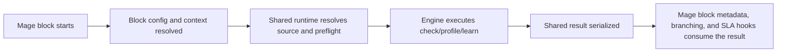

# Truthound for Mage

오케스트레이션 실행에서 Truthound, Mage을(를) 기준으로 데이터 품질 검증, 워크플로우 자동화, 결과 해석 방법을 설명합니다.
오케스트레이션 실행에서 관련 설정과 실행 흐름을(를) 기준으로 데이터 품질 검증, 워크플로우 자동화, 결과 해석 방법을 설명합니다.
오케스트레이션 실행에서 Mage, `io_config`을(를) 기준으로 데이터 품질 검증, 워크플로우 자동화, 결과 해석 방법을 설명합니다.
오케스트레이션 실행에서 관련 설정과 실행 흐름을(를) 기준으로 데이터 품질 검증, 워크플로우 자동화, 결과 해석 방법을 설명합니다.

## Who This Is For

- 오케스트레이션 실행에서 Mage을(를) 기준으로 데이터 품질 검증, 워크플로우 자동화, 결과 해석 방법을 설명합니다.
- 오케스트레이션 실행에서 관련 설정과 실행 흐름을(를) 기준으로 데이터 품질 검증, 워크플로우 자동화, 결과 해석 방법을 설명합니다.
- 오케스트레이션 실행에서 Mage, SLA-aware을(를) 기준으로 데이터 품질 검증, 워크플로우 자동화, 결과 해석 방법을 설명합니다.

## When To Use Mage

오케스트레이션 실행에서 Mage, Choose을(를) 다루는 항목입니다:

- 검증 belongs directly in 파이프라인 blocks
- 오케스트레이션 실행에서 Mage, `io_config.yaml`을(를) 기준으로 데이터 품질 검증, 워크플로우 자동화, 결과 해석 방법을 설명합니다.
- 오케스트레이션 실행에서 관련 설정과 실행 흐름을(를) 기준으로 데이터 품질 검증, 워크플로우 자동화, 결과 해석 방법을 설명합니다.

오케스트레이션 실행에서 Prefect, Dagster, Airflow, Choose을(를) 기준으로 데이터 품질 검증, 워크플로우 자동화, 결과 해석 방법을 설명합니다.
오케스트레이션 실행에서 관련 설정과 실행 흐름을(를) 기준으로 데이터 품질 검증, 워크플로우 자동화, 결과 해석 방법을 설명합니다.

## Prerequisites

- 오케스트레이션 실행에서 `truthound-orchestration[mage]`을(를) 기준으로 데이터 품질 검증, 워크플로우 자동화, 결과 해석 방법을 설명합니다.
- 오케스트레이션 실행에서 Mage을(를) 기준으로 데이터 품질 검증, 워크플로우 자동화, 결과 해석 방법을 설명합니다.
- 오케스트레이션 실행에서 관련 설정과 실행 흐름을(를) 기준으로 데이터 품질 검증, 워크플로우 자동화, 결과 해석 방법을 설명합니다.

## What The Package Provides

- 오케스트레이션 실행에서 관련 설정과 실행 흐름을(를) 기준으로 데이터 품질 검증, 워크플로우 자동화, 결과 해석 방법을 설명합니다.
- 오케스트레이션 실행에서 관련 설정과 실행 흐름을(를) 기준으로 데이터 품질 검증, 워크플로우 자동화, 결과 해석 방법을 설명합니다.
- `io_config.yaml` discovery and 소스 normalization
- 오케스트레이션 실행에서 관련 설정과 실행 흐름을(를) 기준으로 데이터 품질 검증, 워크플로우 자동화, 결과 해석 방법을 설명합니다.
- 오케스트레이션 실행에서 SLA을(를) 기준으로 데이터 품질 검증, 워크플로우 자동화, 결과 해석 방법을 설명합니다.

## Minimal Quickstart

```python
from truthound_mage import CheckBlockConfig, CheckTransformer

transformer = CheckTransformer(
    config=CheckBlockConfig(
        rules=[
            {"column": "id", "check": "not_null"},
            {"column": "email", "check": "email_format"},
        ]
    )
)

result = transformer.execute(dataframe)
```

오케스트레이션 실행에서 Gate을(를) 다루는 항목입니다:

```python
from truthound_mage import DataQualityCondition
```

## Decision 테이블

| 오케스트레이션 실행에서 Need을(를) 기준으로 데이터 품질 검증, 워크플로우 자동화, 결과 해석 방법을 설명합니다. | 오케스트레이션 실행에서 Mage, Recommended, Surface을(를) 기준으로 데이터 품질 검증, 워크플로우 자동화, 결과 해석 방법을 설명합니다. | 오케스트레이션 실행에서 관련 설정과 실행 흐름을(를) 기준으로 데이터 품질 검증, 워크플로우 자동화, 결과 해석 방법을 설명합니다. |
|------|--------------------------|-----|
| active 검증 step | 오케스트레이션 실행에서 관련 설정과 실행 흐름을(를) 기준으로 데이터 품질 검증, 워크플로우 자동화, 결과 해석 방법을 설명합니다. | 오케스트레이션 실행에서 관련 설정과 실행 흐름을(를) 기준으로 데이터 품질 검증, 워크플로우 자동화, 결과 해석 방법을 설명합니다. |
| 오케스트레이션 실행에서 관련 설정과 실행 흐름을(를) 기준으로 데이터 품질 검증, 워크플로우 자동화, 결과 해석 방법을 설명합니다. | 오케스트레이션 실행에서 관련 설정과 실행 흐름을(를) 기준으로 데이터 품질 검증, 워크플로우 자동화, 결과 해석 방법을 설명합니다. | 오케스트레이션 실행에서 관련 설정과 실행 흐름을(를) 기준으로 데이터 품질 검증, 워크플로우 자동화, 결과 해석 방법을 설명합니다. |
| 오케스트레이션 실행에서 관련 설정과 실행 흐름을(를) 기준으로 데이터 품질 검증, 워크플로우 자동화, 결과 해석 방법을 설명합니다. | 센서 block | 오케스트레이션 실행에서 관련 설정과 실행 흐름을(를) 기준으로 데이터 품질 검증, 워크플로우 자동화, 결과 해석 방법을 설명합니다. |
| project-scoped 소스 discovery | 오케스트레이션 실행에서 `io_config.yaml`을(를) 기준으로 데이터 품질 검증, 워크플로우 자동화, 결과 해석 방법을 설명합니다. | 오케스트레이션 실행에서 Mage을(를) 기준으로 데이터 품질 검증, 워크플로우 자동화, 결과 해석 방법을 설명합니다. |

## Execution Lifecycle



## 결과 Surface

- 오케스트레이션 실행에서 관련 설정과 실행 흐름을(를) 기준으로 데이터 품질 검증, 워크플로우 자동화, 결과 해석 방법을 설명합니다.
- 오케스트레이션 실행에서 Mage, Mage-specific을(를) 기준으로 데이터 품질 검증, 워크플로우 자동화, 결과 해석 방법을 설명합니다.
- 오케스트레이션 실행에서 관련 설정과 실행 흐름을(를) 기준으로 데이터 품질 검증, 워크플로우 자동화, 결과 해석 방법을 설명합니다.

## 설정 Surface

| 설정 Area | 오케스트레이션 실행에서 Mage, Boundary을(를) 기준으로 데이터 품질 검증, 워크플로우 자동화, 결과 해석 방법을 설명합니다. |
|-------------|---------------|
| 검증 rules | block 설정 |
| 런타임 metadata | 오케스트레이션 실행에서 `BlockExecutionContext`, BlockExecutionContext을(를) 기준으로 데이터 품질 검증, 워크플로우 자동화, 결과 해석 방법을 설명합니다. |
| 소스 설정 | `io_config.yaml` and project 프로파일 selection |
| 오케스트레이션 실행에서 SLA을(를) 기준으로 데이터 품질 검증, 워크플로우 자동화, 결과 해석 방법을 설명합니다. | 오케스트레이션 실행에서 Mage을(를) 기준으로 데이터 품질 검증, 워크플로우 자동화, 결과 해석 방법을 설명합니다. |

## Production Pattern

오케스트레이션 실행에서 Mage을(를) 다루는 항목입니다:

- 오케스트레이션 실행에서 Mage을(를) 기준으로 데이터 품질 검증, 워크플로우 자동화, 결과 해석 방법을 설명합니다.
- 오케스트레이션 실행에서 `CheckTransformer`, `ProfileTransformer`, CheckTransformer, ProfileTransformer을(를) 기준으로 데이터 품질 검증, 워크플로우 자동화, 결과 해석 방법을 설명합니다.
- 오케스트레이션 실행에서 `DataQualitySensor`, `DataQualityCondition`, DataQualitySensor, DataQualityCondition을(를) 기준으로 데이터 품질 검증, 워크플로우 자동화, 결과 해석 방법을 설명합니다.
- 오케스트레이션 실행에서 `io_config.yaml`을(를) 기준으로 데이터 품질 검증, 워크플로우 자동화, 결과 해석 방법을 설명합니다.
- 오케스트레이션 실행에서 SLA을(를) 기준으로 데이터 품질 검증, 워크플로우 자동화, 결과 해석 방법을 설명합니다.

## Shared 런타임 Behavior

오케스트레이션 실행에서 Mage을(를) 다루는 항목입니다:

- 소스 resolution rules
- 오케스트레이션 실행에서 관련 설정과 실행 흐름을(를) 기준으로 데이터 품질 검증, 워크플로우 자동화, 결과 해석 방법을 설명합니다.
- normalized 결과 serialization
- 관측성 and 복원력 helpers

오케스트레이션 실행에서 관련 설정과 실행 흐름을(를) 다루는 항목입니다:

- [Shared 런타임 개요](../common/index.md)
- [소스 Resolution](../common/source-resolution.md)
- [관측성 and 복원력](../common/observability-resilience.md)

## Production Checklist

- 오케스트레이션 실행에서 관련 설정과 실행 흐름을(를) 기준으로 데이터 품질 검증, 워크플로우 자동화, 결과 해석 방법을 설명합니다.
- 오케스트레이션 실행에서 관련 설정과 실행 흐름을(를) 기준으로 데이터 품질 검증, 워크플로우 자동화, 결과 해석 방법을 설명합니다.
- 오케스트레이션 실행에서 `io_config.yaml`을(를) 기준으로 데이터 품질 검증, 워크플로우 자동화, 결과 해석 방법을 설명합니다.
- 오케스트레이션 실행에서 SLA을(를) 기준으로 데이터 품질 검증, 워크플로우 자동화, 결과 해석 방법을 설명합니다.

## 실패 Modes and 문제 해결

| 오케스트레이션 실행에서 Symptom을(를) 기준으로 데이터 품질 검증, 워크플로우 자동화, 결과 해석 방법을 설명합니다. | 오케스트레이션 실행에서 Likely, Cause을(를) 기준으로 데이터 품질 검증, 워크플로우 자동화, 결과 해석 방법을 설명합니다. | 오케스트레이션 실행에서 관련 설정과 실행 흐름을(를) 기준으로 데이터 품질 검증, 워크플로우 자동화, 결과 해석 방법을 설명합니다. |
|--------|--------------|------------|
| quality behavior differs by 파이프라인 | 오케스트레이션 실행에서 관련 설정과 실행 흐름을(를) 기준으로 데이터 품질 검증, 워크플로우 자동화, 결과 해석 방법을 설명합니다. | 오케스트레이션 실행에서 관련 설정과 실행 흐름을(를) 기준으로 데이터 품질 검증, 워크플로우 자동화, 결과 해석 방법을 설명합니다. |
| 오케스트레이션 실행에서 관련 설정과 실행 흐름을(를) 기준으로 데이터 품질 검증, 워크플로우 자동화, 결과 해석 방법을 설명합니다. | 오케스트레이션 실행에서 `io_config.yaml`을(를) 기준으로 데이터 품질 검증, 워크플로우 자동화, 결과 해석 방법을 설명합니다. | move 시크릿 out of committed 설정 |
| 오케스트레이션 실행에서 관련 설정과 실행 흐름을(를) 기준으로 데이터 품질 검증, 워크플로우 자동화, 결과 해석 방법을 설명합니다. | 오케스트레이션 실행에서 관련 설정과 실행 흐름을(를) 기준으로 데이터 품질 검증, 워크플로우 자동화, 결과 해석 방법을 설명합니다. | 오케스트레이션 실행에서 SLA을(를) 기준으로 데이터 품질 검증, 워크플로우 자동화, 결과 해석 방법을 설명합니다. |

## Recommended Reading Order

- 오케스트레이션 실행에서 Project, Layout을(를) 기준으로 데이터 품질 검증, 워크플로우 자동화, 결과 해석 방법을 설명합니다.
- 오케스트레이션 실행에서 Block, Types, Runtime, Context을(를) 기준으로 데이터 품질 검증, 워크플로우 자동화, 결과 해석 방법을 설명합니다.
- 오케스트레이션 실행에서 `io_config.yaml`을(를) 기준으로 데이터 품질 검증, 워크플로우 자동화, 결과 해석 방법을 설명합니다.
- 오케스트레이션 실행에서 Variables, Secrets, Profiles을(를) 기준으로 데이터 품질 검증, 워크플로우 자동화, 결과 해석 방법을 설명합니다.
- [레시피](recipes.md)
- 오케스트레이션 실행에서 Production, Rollout을(를) 기준으로 데이터 품질 검증, 워크플로우 자동화, 결과 해석 방법을 설명합니다.
- [문제 해결](troubleshooting.md)
