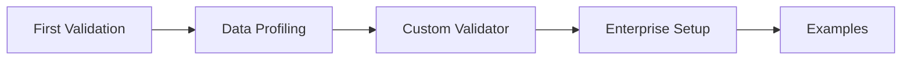

# 튜토리얼

튜토리얼에서 Truthound, Tutorials을(를) 기준으로 데이터 품질 검증, 워크플로우 자동화, 결과 해석 방법을 설명합니다.

## Learning Path

## Available 튜토리얼

-   :material-chart-bar: **Data Profiling**

    ---

    Learn to profile data, generate statistics, and auto-create validation rules

    [:octicons-arrow-right-24: Data Profiling](data-profiling.md)

-   :material-play-circle: **First Validation**

    ---

    Validate your first dataset, inspect `ValidationRunResult`, and understand `.truthound/`

    [:octicons-arrow-right-24: First Validation](first-validation.md)

-   :material-puzzle: **Custom Validator**

    ---

    Create custom validators using decorators, class-based approach, or fluent builder

    [:octicons-arrow-right-24: Custom Validator](custom-validator.md)

-   :material-server: **Enterprise Setup**

    ---

    CI/CD integration, checkpoints, notifications, and production configuration

    [:octicons-arrow-right-24: Enterprise Setup](enterprise-setup.md)

-   :material-code-tags: **Usage Examples**

    ---

    Comprehensive examples for drift detection, anomaly detection, PII masking, and more

    [:octicons-arrow-right-24: Examples](examples.md)

## Tutorial 개요

| 튜토리얼에서 Tutorial을(를) 기준으로 데이터 품질 검증, 워크플로우 자동화, 결과 해석 방법을 설명합니다. | 튜토리얼에서 Level을(를) 기준으로 데이터 품질 검증, 워크플로우 자동화, 결과 해석 방법을 설명합니다. | 튜토리얼에서 Time을(를) 기준으로 데이터 품질 검증, 워크플로우 자동화, 결과 해석 방법을 설명합니다. | 튜토리얼에서 Topics을(를) 기준으로 데이터 품질 검증, 워크플로우 자동화, 결과 해석 방법을 설명합니다. |
|----------|-------|------|--------|
| 첫 검증 | 튜토리얼에서 Beginner을(를) 기준으로 데이터 품질 검증, 워크플로우 자동화, 결과 해석 방법을 설명합니다. | 튜토리얼에서 관련 설정과 실행 흐름을(를) 기준으로 데이터 품질 검증, 워크플로우 자동화, 결과 해석 방법을 설명합니다. | 튜토리얼에서 Zero-config을(를) 기준으로 데이터 품질 검증, 워크플로우 자동화, 결과 해석 방법을 설명합니다. |
| 데이터 프로파일링 | 튜토리얼에서 Beginner을(를) 기준으로 데이터 품질 검증, 워크플로우 자동화, 결과 해석 방법을 설명합니다. | 튜토리얼에서 관련 설정과 실행 흐름을(를) 기준으로 데이터 품질 검증, 워크플로우 자동화, 결과 해석 방법을 설명합니다. | 튜토리얼에서 API, Profile, Schema, Rule을(를) 기준으로 데이터 품질 검증, 워크플로우 자동화, 결과 해석 방법을 설명합니다. |
| 사용자 정의 검증기 | 튜토리얼에서 Intermediate을(를) 기준으로 데이터 품질 검증, 워크플로우 자동화, 결과 해석 방법을 설명합니다. | 튜토리얼에서 관련 설정과 실행 흐름을(를) 기준으로 데이터 품질 검증, 워크플로우 자동화, 결과 해석 방법을 설명합니다. | 튜토리얼에서 Decorators, Builder, Testing을(를) 기준으로 데이터 품질 검증, 워크플로우 자동화, 결과 해석 방법을 설명합니다. |
| 엔터프라이즈 설정 | 튜토리얼에서 Advanced을(를) 기준으로 데이터 품질 검증, 워크플로우 자동화, 결과 해석 방법을 설명합니다. | 튜토리얼에서 관련 설정과 실행 흐름을(를) 기준으로 데이터 품질 검증, 워크플로우 자동화, 결과 해석 방법을 설명합니다. | CI/CD, 체크포인트, 알림, 모니터링 |
| 사용 예시 | 튜토리얼에서 관련 설정과 실행 흐름을(를) 기준으로 데이터 품질 검증, 워크플로우 자동화, 결과 해석 방법을 설명합니다. | 튜토리얼에서 관련 설정과 실행 흐름을(를) 기준으로 데이터 품질 검증, 워크플로우 자동화, 결과 해석 방법을 설명합니다. | 튜토리얼에서 Drift, Anomaly, PII, Cross-table, Time을(를) 기준으로 데이터 품질 검증, 워크플로우 자동화, 결과 해석 방법을 설명합니다. |

## 빠른 시작

튜토리얼에서 Truthound을(를) 다루는 항목입니다:

1. 튜토리얼에서 First, Validation을(를) 기준으로 데이터 품질 검증, 워크플로우 자동화, 결과 해석 방법을 설명합니다.
2. 튜토리얼에서 Data, Profiling을(를) 기준으로 데이터 품질 검증, 워크플로우 자동화, 결과 해석 방법을 설명합니다.
3. 튜토리얼에서 Custom, Validator을(를) 기준으로 데이터 품질 검증, 워크플로우 자동화, 결과 해석 방법을 설명합니다.
4. 튜토리얼에서 Enterprise, Setup을(를) 기준으로 데이터 품질 검증, 워크플로우 자동화, 결과 해석 방법을 설명합니다.
5. 튜토리얼에서 Examples을(를) 기준으로 데이터 품질 검증, 워크플로우 자동화, 결과 해석 방법을 설명합니다.

## Related Documentation

튜토리얼에서 관련 설정과 실행 흐름을(를) 다루는 항목입니다:

- 튜토리얼에서 Getting, Started, Installation을(를) 기준으로 데이터 품질 검증, 워크플로우 자동화, 결과 해석 방법을 설명합니다.
- 튜토리얼에서 CLI, Reference, Command-line을(를) 기준으로 데이터 품질 검증, 워크플로우 자동화, 결과 해석 방법을 설명합니다.
- 튜토리얼에서 API, Python, Complete을(를) 기준으로 데이터 품질 검증, 워크플로우 자동화, 결과 해석 방법을 설명합니다.
- 튜토리얼에서 Guides, In-depth을(를) 기준으로 데이터 품질 검증, 워크플로우 자동화, 결과 해석 방법을 설명합니다.
