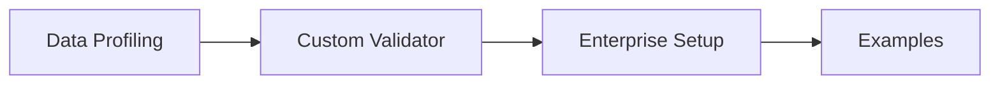

# Tutorials

Step-by-step tutorials for common Truthound use cases. Start from the basics and progress to enterprise-grade configurations.

## Learning Path

## Available Tutorials

-   :material-chart-bar: **Data Profiling**

    ---

    Learn to profile data, generate statistics, and auto-create validation rules

    [:octicons-arrow-right-24: Data Profiling](data-profiling.md)

-   :material-puzzle: **Custom Validator**

    ---

    Create custom validators using decorators, class-based approach, or fluent builder

    [:octicons-arrow-right-24: Custom Validator](custom-validator.md)

-   :material-server: **Enterprise Setup**

    ---

    CI/CD integration, checkpoints, notifications, and production configuration

    [:octicons-arrow-right-24: Enterprise Setup](enterprise-setup.md)

-   :material-code-tags: **Usage Examples**

    ---

    Comprehensive examples for drift detection, anomaly detection, PII masking, and more

    [:octicons-arrow-right-24: Examples](examples.md)

## Tutorial Overview

| Tutorial | Level | Time | Topics |
|----------|-------|------|--------|
| Data Profiling | Beginner | 20 min | Profile API, Schema learning, Rule generation |
| Custom Validator | Intermediate | 30 min | Decorators, Builder pattern, Testing utilities |
| Enterprise Setup | Advanced | 45 min | CI/CD, Checkpoints, Notifications, Monitoring |
| Usage Examples | All levels | 45 min | Drift, Anomaly, PII, Cross-table, Time series |

## Quick Start

If you're new to Truthound, we recommend this order:

1. **[Data Profiling](data-profiling.md)** - Understand your data first
2. **[Custom Validator](custom-validator.md)** - Build domain-specific validation
3. **[Enterprise Setup](enterprise-setup.md)** - Deploy to production
4. **[Examples](examples.md)** - Reference for specific use cases

## Related Documentation

For detailed reference documentation:

- [Getting Started](../getting-started/index.md) - Installation and first steps
- [CLI Reference](../cli/index.md) - Command-line interface
- [Python API](../python-api/index.md) - Complete API documentation
- [Guides](../guides/index.md) - In-depth feature guides
