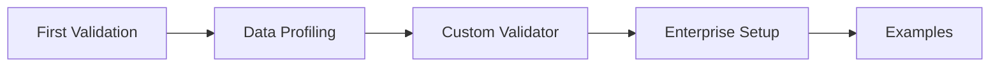

# Tutorials

Tutorials are the sequential, outcome-driven part of the Truthound docs. Use them when you want to build something real from start to finish instead of reading reference material first.

## Learning Path

```mermaid
graph LR
    A[First Validation] --> B[Data Profiling]
    B --> C[Custom Validator]
    C --> D[Enterprise Setup]
    D --> E[Examples]
```

## Available Tutorials

-   :material-chart-bar: **Data Profiling**

    ---

    Learn to profile data, generate statistics, and auto-create validation rules

    [:octicons-arrow-right-24: Data Profiling](data-profiling.md)

-   :material-play-circle: **First Validation**

    ---

    Validate your first dataset, inspect `ValidationRunResult`, and understand `.truthound/`

    [:octicons-arrow-right-24: First Validation](first-validation.md)

-   :material-puzzle: **Custom Validator**

    ---

    Create custom validators using decorators, class-based approach, or fluent builder

    [:octicons-arrow-right-24: Custom Validator](custom-validator.md)

-   :material-server: **Enterprise Setup**

    ---

    CI/CD integration, checkpoints, notifications, and production configuration

    [:octicons-arrow-right-24: Enterprise Setup](enterprise-setup.md)

-   :material-code-tags: **Usage Examples**

    ---

    Comprehensive examples for drift detection, anomaly detection, PII masking, and more

    [:octicons-arrow-right-24: Examples](examples.md)

## Tutorial Overview

| Tutorial | Level | Time | Topics |
|----------|-------|------|--------|
| First Validation | Beginner | 15 min | Zero-config flow, context, canonical result model |
| Data Profiling | Beginner | 20 min | Profile API, Schema learning, Rule generation |
| Custom Validator | Intermediate | 30 min | Decorators, Builder pattern, Testing utilities |
| Enterprise Setup | Advanced | 45 min | CI/CD, Checkpoints, Notifications, Monitoring |
| Usage Examples | All levels | 45 min | Drift, Anomaly, PII, Cross-table, Time series |

## Quick Start

If you're new to Truthound, we recommend this order:

1. **[First Validation](first-validation.md)** for the smallest end-to-end win
2. **[Data Profiling](data-profiling.md)** to understand your data and bootstrap suites
3. **[Custom Validator](custom-validator.md)** to add domain-specific logic
4. **[Enterprise Setup](enterprise-setup.md)** to move into automation and operations
5. **[Examples](examples.md)** to branch into specific workloads

## Related Documentation

For detailed reference documentation:

- [Getting Started](../getting-started/index.md) - Installation and first steps
- [CLI Reference](../cli/index.md) - Command-line interface
- [Python API](../python-api/index.md) - Complete API documentation
- [Guides](../guides/index.md) - In-depth feature guides
